# ensureStudy

An AI-first learning platform combining intelligent multi-agent tutoring, real-time proctoring, and soft skills evaluation. Built with LangGraph orchestration, RAG-powered conversations, Kafka streaming, PyTorch ML models, and PySpark data pipelines.

---

## Platform Overview

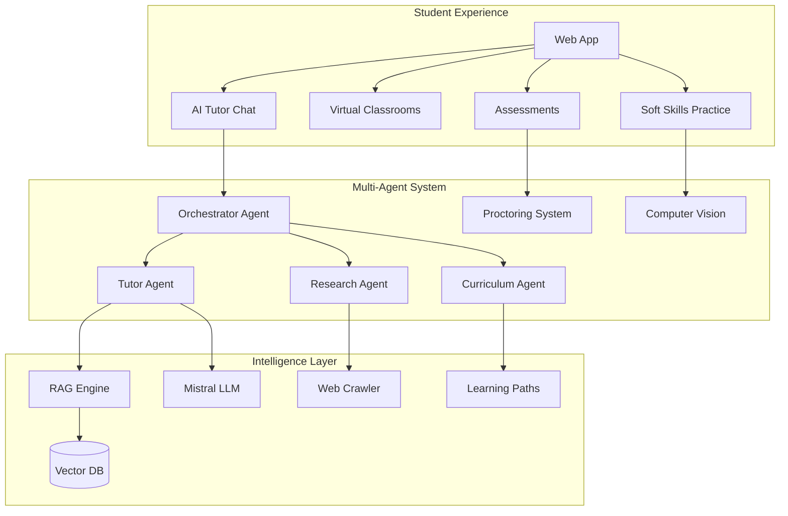

---

## Key Features

| Feature | Description | Technology |
|---------|-------------|------------|
| Multi-Agent Tutoring | Orchestrated AI agents for learning, research, and content creation | LangGraph, Mistral, RAG |
| Smart Proctoring | Real-time exam monitoring with violation detection | YOLO, MediaPipe, PyTorch |
| Soft Skills | Fluency, grammar, eye contact, and posture analysis | Whisper, FaceMesh, NLP |
| Virtual Classrooms | Live meetings with recordings and transcripts | WebRTC, MongoDB |
| Learning Analytics | Progress tracking and personalized recommendations | PySpark, Cassandra |
| Document Processing | PDF/image ingestion with OCR and chunking | PyMuPDF, Qdrant |

---

## Multi-Agent Architecture

The platform uses a **Supervisor Pattern** orchestration where a central Orchestrator Agent routes requests to specialized sub-agents based on user intent.

### Agent System Overview

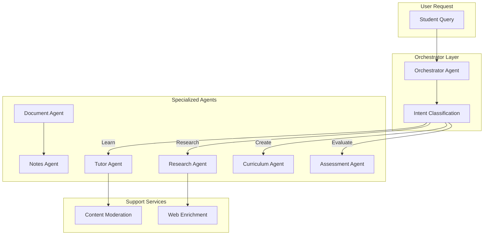

---

## Agent Descriptions

### 1. Orchestrator Agent (Supervisor Pattern)

The central coordinator that receives all user queries and routes them to appropriate sub-agents.

**Capabilities:**
- Intent classification (Learn, Research, Create, Evaluate, Mixed)
- Multi-agent coordination and parallel execution
- Response synthesis from multiple agent outputs
- Session state management

**Intent Classification Flow:**

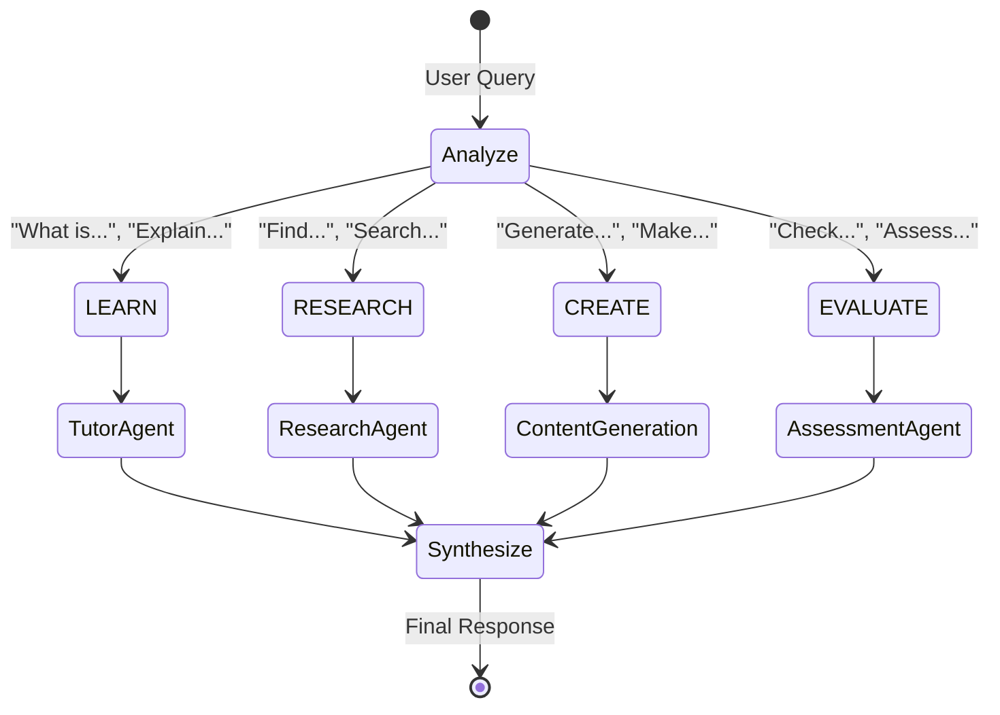

---

### 2. Tutor Agent (ABCR + TAL + MCP)

The primary learning assistant with advanced context management.

**Core Components:**

| Component | Full Name | Function |
|-----------|-----------|----------|
| ABCR | Attention-Based Context Routing | Detects follow-up vs new topic queries |
| TAL | Topic Anchor Layer | Maintains topic continuity across turns |
| MCP | Memory Context Processor | Isolates web vs classroom content |

**Processing Flow:**

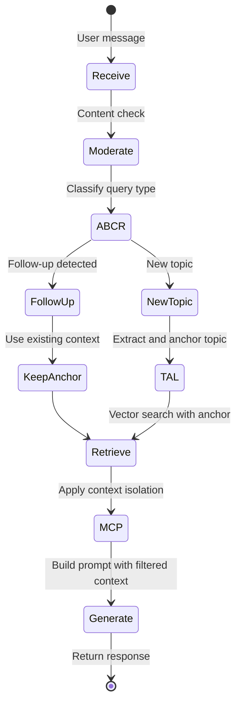

**Features:**
- Session-aware conversation memory
- Topic anchoring for multi-turn coherence
- Web content isolation (MCP rules)
- Confidence scoring for answers
- Source attribution with page numbers

---

### 3. Research Agent (Web + PDF + YouTube)

Discovers and indexes educational content from multiple sources.

**Capabilities:**
- Web search for educational articles
- PDF discovery and download
- YouTube video search
- Automatic content indexing into Qdrant

**Research Pipeline:**

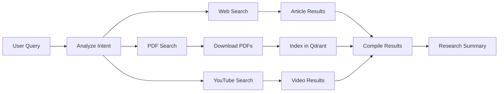

---

### 4. Curriculum Agent (Personalized Learning Paths)

Creates adaptive learning schedules from syllabus documents.

**Pipeline:**

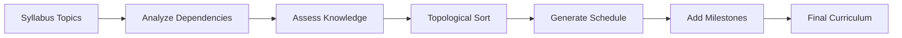

**Features:**
- Topic dependency analysis using LLM
- Prerequisite chain detection
- Adaptive scheduling based on hours/day
- Milestone generation for progress tracking
- Integration with knowledge assessment service

---

### 5. Document Processing Agent (7-Stage Pipeline)

Ingests and indexes documents for RAG retrieval.

**Pipeline Stages:**

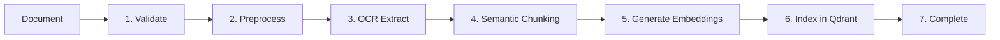

**Supported Formats:**
- PDF (text and scanned with OCR)
- Images (PNG, JPG with OCR)
- Word documents (DOCX)
- PowerPoint (PPTX)

---

### 6. Notes Agent

Generates study notes from classroom materials.

**Output Types:**
- Summary notes
- Key concepts extraction
- Q&A generation
- Flashcard creation

---

### 7. Assessment Agent

Handles evaluation and grading tasks.

**Capabilities:**
- Question generation from content
- Answer evaluation with rubrics
- Feedback generation
- Score calculation

---

### 8. Web Enrichment Agent

Enhances responses with web content.

**Features:**
- Article crawling and summarization
- Image search (Brave API)
- YouTube video discovery
- Trust score calculation for sources

---

## Base Agent Architecture

All agents inherit from `BaseAgent` with Model Context Protocol (MCP) support:

**Standard Agent Interface:**
- `execute(input_data)` - Main execution method
- `validate_input()` - Input validation
- `format_output()` - Standardized MCP output format
- `log_execution()` - Monitoring and logging

**Agent Contexts:**
- TUTOR - Q&A and explanations
- STUDY_PLANNER - Learning paths
- ASSESSMENT - Evaluation
- NOTES_GENERATOR - Content creation
- MODERATION - Safety checks
- SCRAPER - Web content

---

## LangGraph State Machines

Each agent uses LangGraph's StateGraph for workflow orchestration:

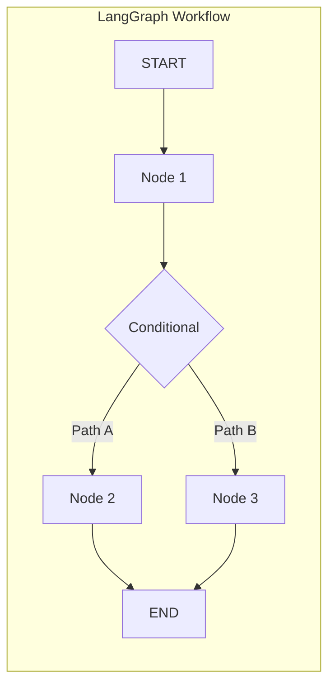

**Benefits:**
- Visual workflow definition
- Conditional routing
- Parallel execution
- Checkpointing and recovery
- State persistence

---

## System Architecture

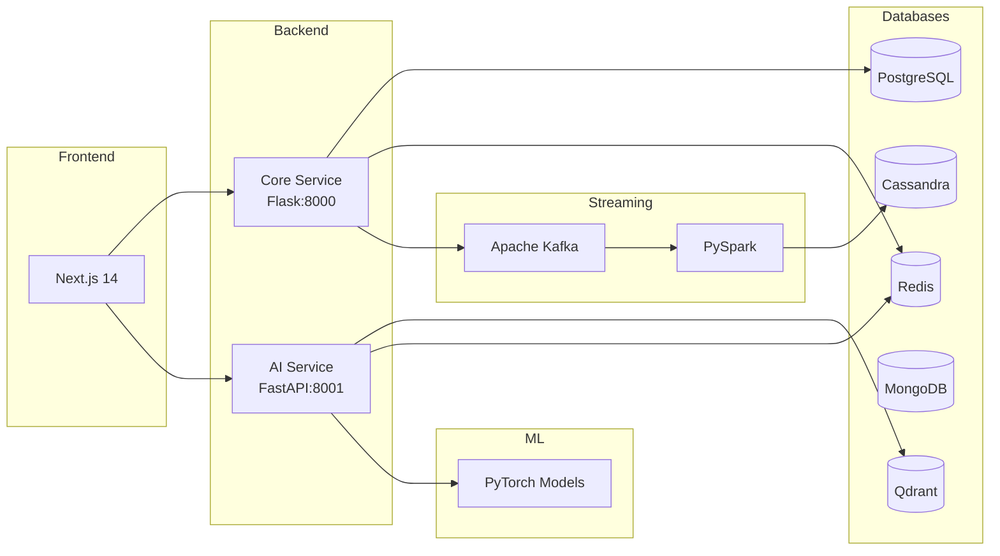

---

## Technology Stack

### Application Layer

| Component | Technology | Purpose |
|-----------|------------|---------|
| Frontend | Next.js 14, TypeScript, TailwindCSS | Web application |
| Core API | Flask, SQLAlchemy, JWT | Auth, users, classrooms |
| AI API | FastAPI, LangGraph, LangChain | Agents, RAG, inference |
| Real-time | WebSocket, WebRTC | Live features |

### AI and ML Layer

| Component | Technology | Purpose |
|-----------|------------|---------|
| LLM | Mistral 7B via HuggingFace | Text generation |
| Embeddings | all-MiniLM-L6-v2 | Semantic search |
| Object Detection | YOLOv11 | Proctoring objects |
| Face Analysis | MediaPipe FaceMesh | Gaze, expressions |
| Agent Framework | LangGraph | Workflow orchestration |

### Data Layer

| Database | Type | Use Case |
|----------|------|----------|
| PostgreSQL | Relational | Users, classrooms, assessments |
| Qdrant | Vector | Document embeddings, RAG |
| Redis | Key-Value | Sessions, cache, rate limits |
| MongoDB | Document | Transcripts, logs, reports |
| Cassandra | Time-Series | Analytics, event streams |
| Kafka | Message Queue | Event streaming |

---

## Proctoring System

Real-time monitoring during assessments:

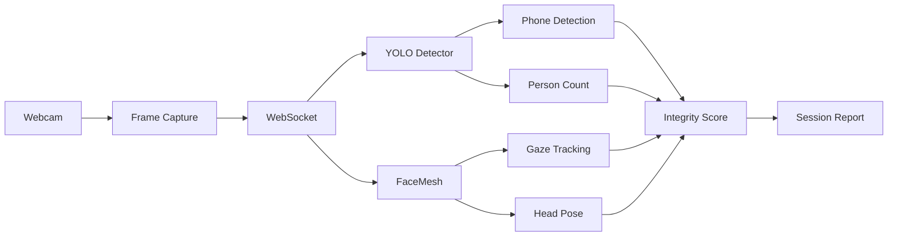

| Detection | Model | Threshold |
|-----------|-------|-----------|
| Multiple faces | YOLO person class | > 1 person |
| Mobile phone | YOLO cell phone | confidence > 0.5 |
| Gaze deviation | Eye landmarks | > 30 degrees |
| Face absence | FaceLandmarker | > 3 seconds |

---

## Soft Skills Evaluation

| Metric | Weight | Analysis Method |
|--------|--------|-----------------|
| Fluency | 25% | Speech rate, filler words, pauses |
| Grammar | 20% | Language tool analysis |
| Vocabulary | 15% | Type-token ratio, word diversity |
| Eye Contact | 15% | Iris tracking vs camera |
| Expression | 10% | Facial emotion detection |
| Posture | 10% | Body position stability |
| Confidence | 5% | Combined delivery metrics |

---

## Data Pipeline

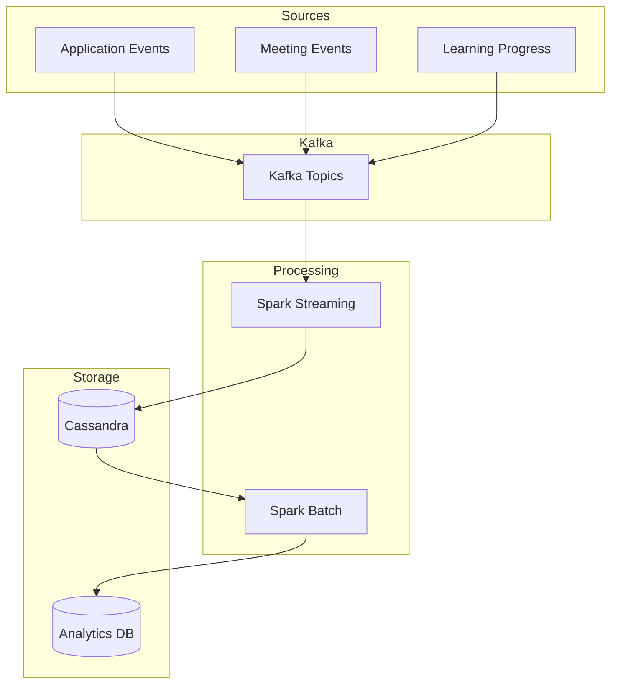

---

## Quick Start

Prerequisites: Docker, Node.js 20+, Python 3.11+

| Step | Action |
|------|--------|
| 1 | Copy `.env.example` to `.env` |
| 2 | Add HuggingFace API key |
| 3 | Configure database passwords |
| 4 | Run `docker-compose up -d` |
| 5 | Run `make dev` |

| Service | Port | URL |
|---------|------|-----|
| Frontend | 3000 | http://localhost:3000 |
| Core API | 8000 | http://localhost:8000 |
| AI API | 8001 | http://localhost:8001 |
| Qdrant | 6333 | http://localhost:6333 |

---

## Documentation

| Document | Contents |
|----------|----------|
| architecture.md | System design and patterns |
| ai-service.md | Tutor agent and RAG pipeline |
| agent-possibilities.md | Future agent capabilities |
| proctoring.md | Computer vision detection |
| softskills.md | Communication evaluation |
| data-pipelines.md | Kafka and Spark processing |
| databases.md | Schema definitions |
| api-reference.md | Complete API documentation |

---

## License

MIT

---

## Contributing

1. Fork the repository
2. Create a feature branch
3. Submit a pull request

For major changes, please open an issue first.
