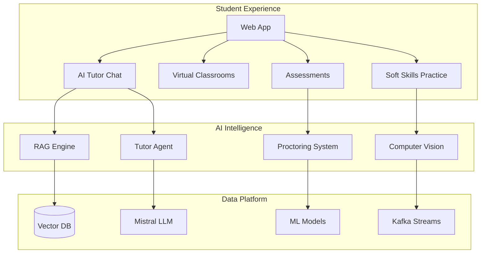
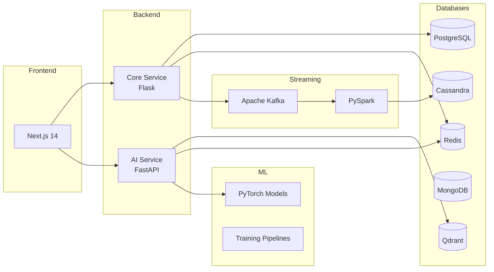
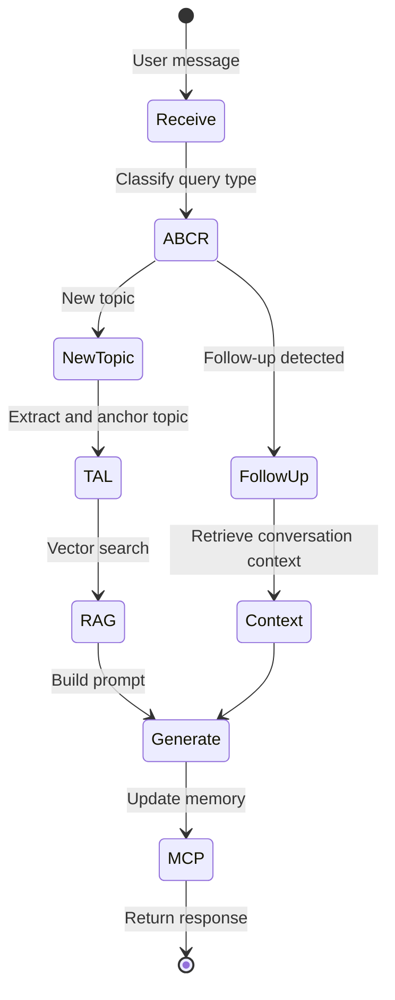
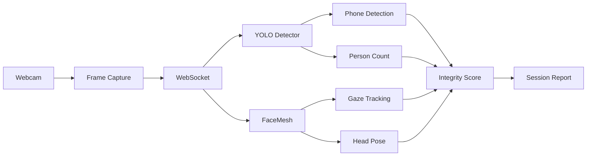
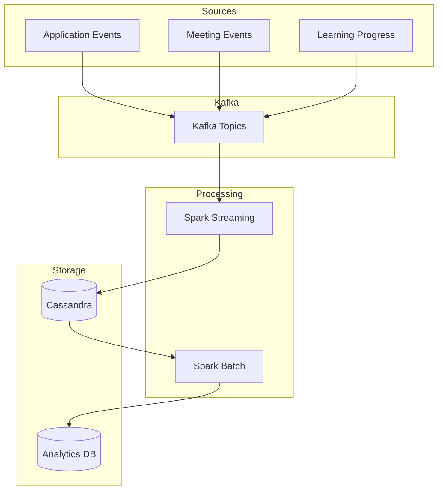

# ensureStudy

An AI-first learning platform that combines intelligent tutoring, real-time proctoring, and soft skills evaluation. Built with RAG-powered conversations, Kafka streaming, PyTorch ML models, and PySpark data pipelines.

---

## Platform Overview



---

## Key Features

| Feature | Description | Technology |
|---------|-------------|------------|
| AI Tutoring | Context-aware conversations with document understanding | LangGraph, Mistral, RAG |
| Smart Proctoring | Real-time exam monitoring with violation detection | YOLO, MediaPipe, PyTorch |
| Soft Skills | Fluency, grammar, eye contact, and posture analysis | Whisper, FaceMesh, NLP |
| Virtual Classrooms | Live meetings with recordings and transcripts | WebRTC, MongoDB |
| Learning Analytics | Progress tracking and personalized recommendations | PySpark, Cassandra |
| Document Processing | PDF/image ingestion with OCR and chunking | PyMuPDF, Qdrant |

---

## System Architecture



---

## Technology Stack

### Application Layer

| Component | Technology | Purpose |
|-----------|------------|---------|
| Frontend | Next.js 14, TypeScript, TailwindCSS | Web application |
| Core API | Flask, SQLAlchemy, JWT | Auth, users, classrooms |
| AI API | FastAPI, LangChain, LangGraph | RAG, agents, inference |
| Real-time | WebSocket, WebRTC | Live features |

### AI and ML Layer

| Component | Technology | Purpose |
|-----------|------------|---------|
| LLM | Mistral 7B via HuggingFace | Text generation |
| Embeddings | all-MiniLM-L6-v2 | Semantic search |
| Object Detection | YOLOv11 | Proctoring objects |
| Face Analysis | MediaPipe FaceMesh | Gaze, expressions |
| Temporal Models | LSTM, GRU | Behavior patterns |

### Data Layer

| Database | Type | Use Case |
|----------|------|----------|
| PostgreSQL | Relational | Users, classrooms, assessments |
| Qdrant | Vector | Document embeddings, RAG |
| Redis | Key-Value | Sessions, cache, rate limits |
| MongoDB | Document | Transcripts, logs, reports |
| Cassandra | Time-Series | Analytics, event streams |
| Kafka | Message Queue | Event streaming |

---

## Project Structure

```
ensureStudy/
├── frontend/                    # Next.js web application
│   ├── app/                     # App router pages
│   │   ├── (dashboard)/         # Student routes
│   │   ├── (teacher)/           # Teacher routes
│   │   └── (admin)/             # Admin routes
│   └── components/              # React components
│
├── backend/
│   ├── ai-service/              # FastAPI AI service
│   │   ├── agents/              # LangGraph agents
│   │   ├── rag/                 # Retrieval system
│   │   ├── proctor/             # Proctoring logic
│   │   └── services/            # Business services
│   │
│   ├── core-service/            # Flask core service
│   │   ├── models/              # SQLAlchemy models
│   │   ├── routes/              # API endpoints
│   │   └── services/            # Business logic
│   │
│   ├── data-pipelines/          # PySpark ETL
│   │   ├── etl/                 # Batch processing
│   │   └── streaming/           # Kafka consumers
│   │
│   └── kafka/                   # Event streaming
│       ├── producers/           # Event publishers
│       └── consumers/           # Event processors
│
├── ml/                          # Machine learning
│   ├── models/                  # Trained weights
│   ├── training/                # Training scripts
│   ├── notebooks/               # Jupyter experiments
│   └── softskills/              # Soft skills ML
│
├── data/                        # Unified datasets
│   ├── models-pretrained/       # Model weights
│   ├── proctoring-features/     # Proctoring data
│   ├── softskills-fluency/      # Audio datasets
│   └── softskills-gestures/     # Gesture datasets
│
├── datadir/                     # Database schemas
│   ├── postgresql/              # SQL migrations
│   ├── qdrant/                  # Vector collections
│   ├── mongodb/                 # Document schemas
│   └── cassandra/               # Time-series tables
│
├── docs/                        # Documentation
│   ├── architecture.md
│   ├── ai-service.md
│   ├── proctoring.md
│   └── ...
│
└── scripts/                     # Utility scripts
```

---

## AI Tutor Architecture

The tutor uses a multi-component approach for context-aware conversations:



| Component | Full Name | Function |
|-----------|-----------|----------|
| ABCR | Attention-Based Context Routing | Detects follow-up vs new queries |
| TAL | Topic Anchor Layer | Maintains topic continuity |
| MCP | Memory Context Processor | Long-term conversation memory |
| RAG | Retrieval Augmented Generation | Document-grounded answers |

---

## Proctoring System

Real-time monitoring during assessments:



| Detection | Model | Threshold |
|-----------|-------|-----------|
| Multiple faces | YOLO person class | > 1 person |
| Mobile phone | YOLO cell phone | confidence > 0.5 |
| Gaze deviation | Eye landmarks | > 30 degrees |
| Face absence | FaceLandmarker | > 3 seconds |
| Head rotation | Face mesh | > 45 degrees |

---

## Soft Skills Evaluation

Communication assessment for interview preparation:

| Metric | Weight | Analysis Method |
|--------|--------|-----------------|
| Fluency | 25% | Speech rate, filler words, pauses |
| Grammar | 20% | Language tool analysis |
| Vocabulary | 15% | Type-token ratio, word diversity |
| Eye Contact | 15% | Iris tracking vs camera |
| Expression | 10% | Facial emotion detection |
| Posture | 10% | Body position stability |
| Confidence | 5% | Combined delivery metrics |

---

## Data Pipeline

Event-driven analytics with Kafka and Spark:



| Kafka Topic | Partitions | Retention | Purpose |
|-------------|------------|-----------|---------|
| user.events | 6 | 7 days | Activity tracking |
| meeting.events | 4 | 30 days | Meeting lifecycle |
| assessment.events | 4 | 30 days | Submissions |
| proctoring.violations | 4 | 90 days | Integrity alerts |

---

## Database Schema Overview

### PostgreSQL (Core Data)

| Table | Description |
|-------|-------------|
| users | User accounts and profiles |
| classrooms | Virtual classroom definitions |
| classroom_members | Student-classroom relationships |
| meetings | Scheduled and completed meetings |
| assessments | Tests and assignments |
| submissions | Student responses |
| progress | Learning progress tracking |

### Qdrant (Vectors)

| Collection | Vectors | Purpose |
|------------|---------|---------|
| documents | 384-dim | Classroom materials |
| web_content | 384-dim | Web-crawled content |

### Cassandra (Time-Series)

| Table | Partition Key | Purpose |
|-------|---------------|---------|
| page_view_stats | date | Page analytics |
| user_engagement | user_id | Engagement metrics |
| learning_progress | user_id, subject | Progress over time |

---

## ML Models

| Model | Architecture | Input | Output |
|-------|--------------|-------|--------|
| Proctoring YOLO | YOLOv11n | Video frame | Object boxes |
| Temporal Proctor | LSTM | Feature sequence | Cheating probability |
| Engagement | MLP | Session features | Engagement score |
| Fluency | Whisper + Custom | Audio | Filler word timestamps |
| Gesture | MobileNetV3 | Hand image | Gesture class |

---

## API Endpoints Summary

### Core Service (Flask)

| Group | Base Path | Endpoints |
|-------|-----------|-----------|
| Auth | /api/auth | login, register, refresh, logout |
| Users | /api/users | profile, preferences |
| Classrooms | /api/classrooms | CRUD, join, members |
| Meetings | /api/meetings | schedule, start, end |
| Assessments | /api/assessments | create, submit, grade |

### AI Service (FastAPI)

| Group | Base Path | Endpoints |
|-------|-----------|-----------|
| Tutor | /api/tutor | chat, history |
| Indexing | /api/indexing | upload, status |
| Grading | /api/grading | grade, feedback |
| Proctor | /api/proctor | start, stream, end |
| Softskills | /api/softskills | evaluate, results |

---

## Quick Start

Prerequisites: Docker, Node.js 20+, Python 3.11+

| Step | Action |
|------|--------|
| 1 | Copy `.env.example` to `.env` |
| 2 | Add HuggingFace API key |
| 3 | Configure database passwords |
| 4 | Run `docker-compose up -d` |
| 5 | Wait 30 seconds for services |
| 6 | Run `make db-init` |
| 7 | Run `make dev` |

| Service | Port | URL |
|---------|------|-----|
| Frontend | 3000 | http://localhost:3000 |
| Core API | 8000 | http://localhost:8000 |
| AI API | 8001 | http://localhost:8001 |
| Qdrant | 6333 | http://localhost:6333 |
| PostgreSQL | 5432 | localhost:5432 |

---

## Environment Variables

| Variable | Description |
|----------|-------------|
| HUGGINGFACE_API_KEY | HuggingFace inference API key |
| LLM_MODEL | Mistral model identifier |
| EMBEDDING_MODEL | Sentence transformer model |
| DATABASE_URL | PostgreSQL connection string |
| QDRANT_HOST | Qdrant vector database host |
| REDIS_URL | Redis connection string |
| KAFKA_BOOTSTRAP_SERVERS | Kafka broker addresses |

---

## User Roles

| Role | Capabilities |
|------|--------------|
| Student | Join classrooms, take assessments, chat with tutor |
| Teacher | Create classrooms, schedule meetings, grade work |
| Admin | Manage users, view analytics, system configuration |
| Parent | View child progress, receive notifications |

---

## Deployment

| Environment | Infrastructure |
|-------------|----------------|
| Development | Docker Compose, local services |
| Staging | Kubernetes, managed databases |
| Production | Kubernetes, auto-scaling, CDN |

---

## Documentation

Detailed documentation available in the `docs/` directory:

| Document | Contents |
|----------|----------|
| architecture.md | System design and patterns |
| ai-service.md | Tutor agent and RAG pipeline |
| proctoring.md | Computer vision detection system |
| softskills.md | Communication evaluation |
| data-pipelines.md | Kafka and Spark processing |
| databases.md | Schema definitions |
| deployment.md | Docker and Kubernetes configs |
| api-reference.md | Complete API documentation |

---

## License

MIT

---

## Contributing

1. Fork the repository
2. Create a feature branch
3. Submit a pull request

For major changes, please open an issue first to discuss the proposed changes.
