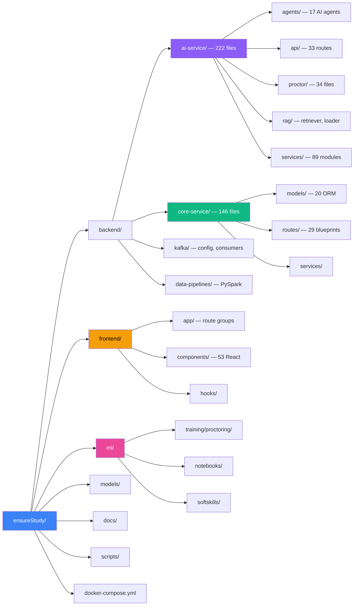

# Page 1: Project Overview & Executive Summary

> **ensureStudy** — AI-First Learning Platform with Multi-Agent Tutoring & Real-Time Proctoring

---

## 1.1 What is ensureStudy?

ensureStudy is a production-grade, AI-first educational platform that combines **intelligent multi-agent tutoring**, **real-time exam proctoring**, **soft skills evaluation**, and **personalized curriculum generation** into a unified learning experience. The platform is designed for academic institutions, with distinct user roles (students, teachers, parents, administrators) and a sophisticated backend powered by LangGraph-orchestrated AI agents, Retrieval-Augmented Generation (RAG), and computer vision models.

The system is architecturally decomposed into **three core services** communicating over HTTP:

| Service | Framework | Port | Responsibility |
|---------|-----------|------|----------------|
| **Core Service** | Flask + SQLAlchemy | 8000 | Authentication, user management, classrooms, assessments, CRUD operations |
| **AI Service** | FastAPI + LangGraph | 8001 | AI agents, RAG pipeline, proctoring, soft skills, LLM inference |
| **Frontend** | Next.js 14 + TypeScript | 3000 | Role-based web application with real-time features |

Supporting infrastructure includes **5 databases**, **2 message brokers**, **1 ML tracking server**, and **1 object storage system** — all containerized via Docker Compose.

---

## 1.2 Technology Stack

### Application Layer

| Component | Technology | Version/Details |
|-----------|-----------|-----------------|
| Core API | Flask, Flask-SQLAlchemy, Flask-Migrate | Python 3.11+ |
| AI API | FastAPI, Pydantic, Uvicorn | Python 3.11+ |
| Frontend | Next.js 14, TypeScript, TailwindCSS | Node.js 20+ |
| State Management | Zustand | v4.4.7 |
| Auth | NextAuth.js + JWT | Session + token-based |
| Real-time Comms | LiveKit (WebRTC) | Cloud-hosted |
| 3D Avatar | Three.js + @react-three/fiber | Talking head avatar |

### AI & ML Layer

| Component | Technology | Purpose |
|-----------|-----------|---------|
| LLM | Mistral-7B-Instruct-v0.2 | Primary text generation via HuggingFace API |
| Secondary LLMs | Gemini, Groq | Flowchart generation, topic extraction |
| Embeddings | sentence-transformers/all-mpnet-base-v2 | Semantic search (768 dimensions) |
| Alt. Embeddings | sentence-transformers/all-MiniLM-L6-v2 | Lightweight alternative |
| Object Detection | YOLOv11 | Proctoring — phone, person detection |
| Face Analysis | MediaPipe FaceMesh/FaceLandmarker | Gaze tracking, head pose, blink detection |
| Speech-to-Text | OpenAI Whisper (medium) | Audio transcription |
| Text-to-Speech | AWS Polly | Viseme-supported speech synthesis |
| NLP | LanguageTool, custom analyzers | Grammar, fluency, vocabulary analysis |
| Classification | facebook/bart-large-mnli | Zero-shot text classification |
| Agent Framework | LangGraph + LangChain | Stateful agent workflow orchestration |

### Data Layer

| Database | Type | Use Case | Container |
|----------|------|----------|-----------|
| PostgreSQL 15 | Relational | Users, classrooms, assessments, curriculum, progress | `ensure-study-postgres` |
| Qdrant | Vector | Document embeddings, semantic search, RAG retrieval | `ensure-study-qdrant` |
| Redis 7 | Key-Value | Session cache, response cache, rate limiting | `ensure-study-redis` |
| MongoDB 7 | Document | Meeting transcripts, summaries, logs | `ensure-study-mongodb` |
| Cassandra 4 | Wide-Column | Real-time analytics, event time-series | `ensure-study-cassandra` |
| Apache Kafka | Event Streaming | Student events, chat messages, assessment submissions | `ensure-study-kafka` |
| MinIO | Object Storage | Large file uploads (S3-compatible) | `ensure-study-minio` |
| MLflow | ML Tracking | Experiment tracking, model versioning | `ensure-study-mlflow` |

---

## 1.3 Key Capabilities

### Multi-Agent AI Tutoring
- **17 specialized AI agents** orchestrated via LangGraph's supervisor pattern
- Central orchestrator routes queries based on intent classification (learn, research, create, evaluate)
- Tutor agent with ABCR (Attention-Based Context Routing), TAL (Topic Anchor Layer), and MCP (Memory Context Processor)
- RAG-powered answers with source attribution and confidence scoring
- Self-improving Learning Agent (Type 5) that adapts question generation from student performance

### Real-Time Proctoring
- **8 computer vision detectors**: face, gaze, head pose, blink, hand, object (phone), audio, face verification
- YOLO-based object detection for prohibited items
- MediaPipe FaceMesh for gaze and head pose estimation
- Temporal prediction for anticipating violations
- Weighted integrity scoring with configurable thresholds

### Soft Skills Evaluation
- Audio fluency analysis (speech rate, filler words, pauses) via Whisper
- Grammar checking with LanguageTool integration
- Eye contact analysis via iris tracking
- Posture stability analysis via body landmark detection
- Weighted composite scoring across 7 metrics

### Virtual Classrooms & Meetings
- LiveKit-powered WebRTC video conferencing
- Recording pipeline with transcription via Whisper
- Meeting Q&A with RAG over transcripts
- Embedding service for meeting content indexing

### Curriculum & Assessment
- AI-generated personalized learning paths from syllabus documents
- Topological sort-based topic dependency analysis
- Spaced repetition scheduling
- Automated question generation with multi-layer deduplication
- Answer evaluation with rubric-based grading

### Document Processing
- 7-stage pipeline: Validate → Preprocess → OCR → Chunk → Embed → Index → Complete
- Multi-format support: PDF (text + scanned), images (OCR), DOCX, PPTX
- Hybrid OCR with multiple backends (Tesseract, Nanonets, SageMaker)
- Semantic chunking with overlap for retrieval quality

---

## 1.4 System Metrics at a Glance

| Metric | Count |
|--------|-------|
| AI Agent files | 17 |
| AI Service modules | 89 |
| Core Service routes | 29 blueprints |
| Core Service data models | 20 ORM models |
| Frontend components | 53+ |
| Frontend pages/routes | 15+ route groups |
| Proctoring detectors | 8 |
| Kafka consumers | 4 |
| Docker services | 13 (dev), 14 (prod) |
| API endpoints | 200+ estimated |
| Total backend Python files | ~190 |
| Total frontend TypeScript files | ~130 |

---

## 1.5 Repository Structure

---

## 1.6 Design Philosophy

The ensureStudy platform follows several key design principles:

1. **AI-First Architecture**: Every learning feature is powered by AI — from tutoring to assessment to proctoring. The AI service is not an add-on but the core of the platform.

2. **Agent-Oriented Design**: Complex tasks are decomposed into specialized agents using LangGraph's StateGraph, enabling modular development, independent testing, and flexible orchestration.

3. **Context Isolation (MCP)**: The Model Context Protocol ensures agents operate within bounded contexts, preventing cross-contamination of web-sourced vs. classroom content.

4. **Polyglot Persistence**: Different data types use purpose-built databases — relational for users, vector for embeddings, document for transcripts, time-series for analytics.

5. **Event-Driven Processing**: Kafka enables asynchronous processing of student events, assessment submissions, and learning agent triggers without blocking the request path.

6. **Open-Source ML Stack**: The platform uses exclusively open-source models (Mistral, sentence-transformers, YOLO, MediaPipe, Whisper) via HuggingFace, eliminating dependency on proprietary APIs for core functionality.

7. **Multi-Provider LLM Strategy**: While defaulting to Mistral-7B via HuggingFace, the system supports Gemini, Groq, and other providers through an API key manager with rotation support.
