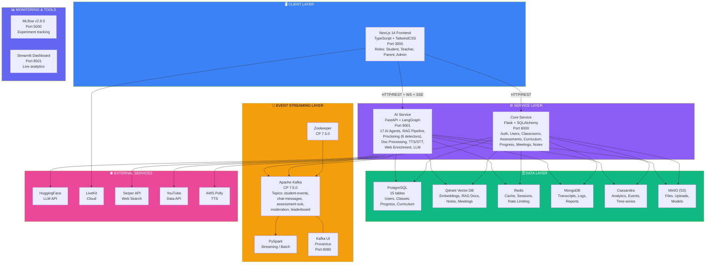
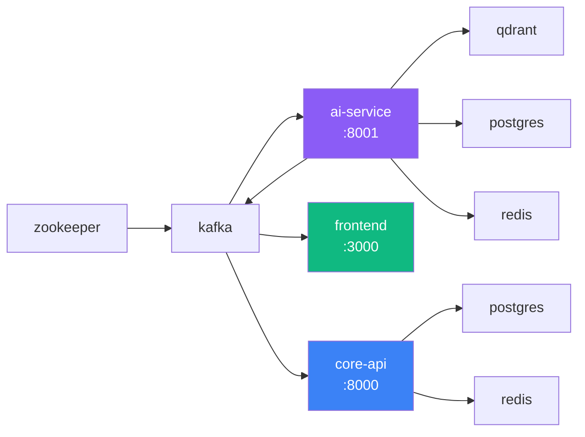
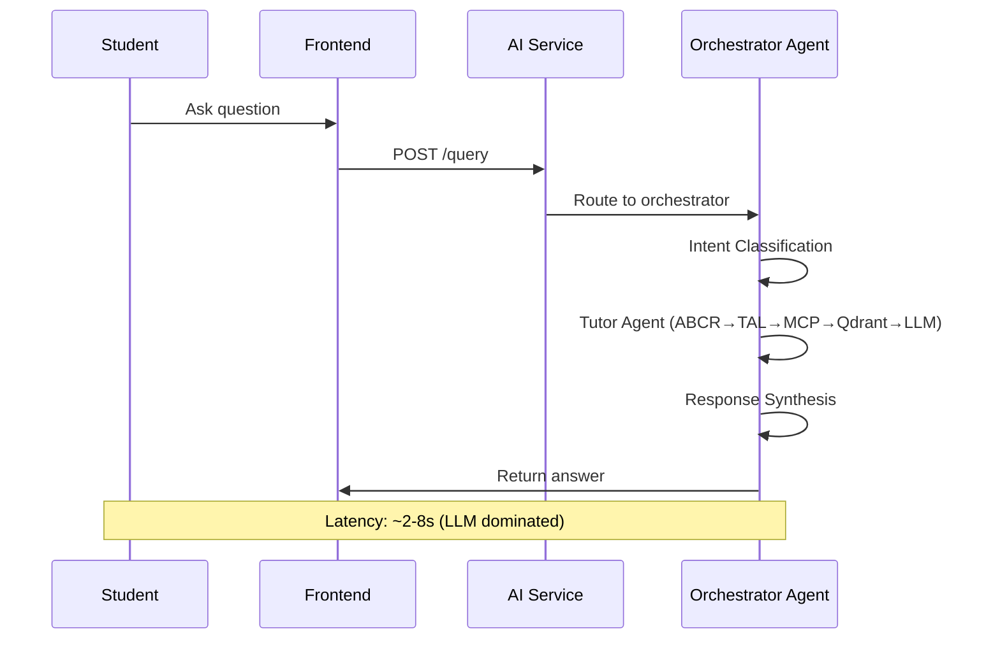
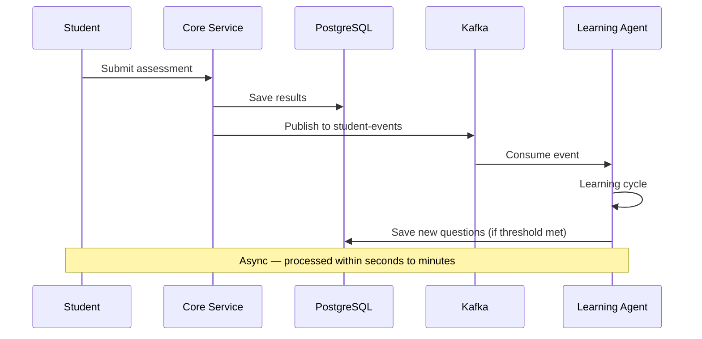
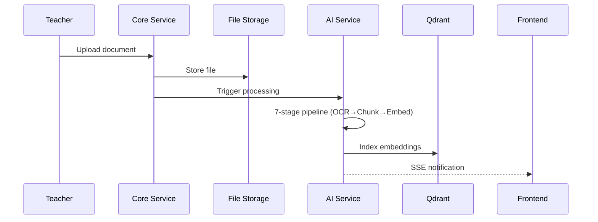

# Page 2: System Architecture & Design Decisions

---

## 2.1 High-Level Architecture

ensureStudy employs a **service-oriented architecture** with three application services, five specialized databases, an event streaming layer, and supporting infrastructure — all orchestrated through Docker Compose.



---

## 2.2 Service Decomposition Rationale

### Why Two Backend Services?

The system separates concerns between **core-service** (Flask) and **ai-service** (FastAPI) for several reasons:

| Decision | Rationale |
|----------|-----------|
| **Framework choice** | Flask is mature for CRUD/auth; FastAPI provides async support essential for LLM inference and streaming responses |
| **Deployment independence** | AI service can be scaled independently (GPU instances) while core service runs on standard compute |
| **Resource isolation** | ML model loading (embeddings, classifiers, YOLO) consumes significant memory and shouldn't impact auth/CRUD latency |
| **Team separation** | AI/ML engineers work on ai-service; backend engineers work on core-service |
| **Different lifecycle** | AI models and agents evolve faster than the core data model |

### Trade-off Analysis

| Benefit | Cost |
|---------|------|
| Independent scaling of AI compute | Inter-service HTTP latency (~2-10ms per call) |
| Resource isolation for ML models | Increased operational complexity (2 services to deploy) |
| Framework-appropriate tooling | Data consistency challenges (no shared DB transactions) |
| Parallel development | Need for API contracts between services |

**Alternative considered**: Monolithic Flask app with AI modules loaded in-process. Rejected because Mistral-7B model loading requirements and async LLM calls are poorly suited to Flask's synchronous WSGI model.

---

## 2.3 Communication Patterns

### Frontend ↔ Backend

| Pattern | Use Case | Implementation |
|---------|----------|----------------|
| REST API | CRUD operations, agent queries | Axios HTTP client → Flask/FastAPI |
| Server-Sent Events (SSE) | Real-time resource updates | `/sse` endpoint in ai-service |
| WebSocket | Proctoring frame streaming | FastAPI WebSocket endpoints |
| WebRTC | Video conferencing | LiveKit SDK (cloud-hosted SFU) |

### Backend ↔ Backend

| Pattern | Direction | Use Case |
|---------|-----------|----------|
| HTTP REST | Core → AI Service | Grading callbacks, assessment triggers |
| Kafka events | Core → AI Service (async) | Assessment submissions trigger Learning Agent |
| Shared database | Both → PostgreSQL | User data, classroom context |

### Backend ↔ Databases

| Database | Access Pattern | Connection Strategy |
|----------|---------------|---------------------|
| PostgreSQL | SQLAlchemy ORM | Connection pool with pre-ping and 300s recycle |
| Qdrant | HTTP/gRPC client | Direct connection via `qdrant-client` |
| Redis | Redis client | Single connection via `redis-py` |
| MongoDB | PyMongo | Direct connection with auth |
| Cassandra | CQL driver | Session-based connection |

---

## 2.4 Docker Compose Topology

### Development Environment (13 services)

```yaml
# docker-compose.yml service graph
services:
  postgres         → Port 5432 (health: pg_isready)
  redis            → Port 6379 (health: redis-cli ping)
  qdrant           → Port 6333/6334 (health: curl /health)
  zookeeper        → Port 2181 (health: nc -z)
  kafka            → Port 9092/29092 (depends: zookeeper)
  kafka-ui         → Port 8080 (depends: kafka)
  core-api         → Port 8000 (depends: postgres, redis)
  ai-service       → Port 8001 (depends: postgres, redis, qdrant, kafka)
  frontend         → Port 3000 (depends: core-api, ai-service)
  dashboards       → Port 8501 (depends: postgres, qdrant)
  mlflow           → Port 5000 (depends: postgres)
  mongodb          → Port 27017 (health: mongosh)
  cassandra        → Port 9042 (health: cqlsh)
  minio            → Port 9100/9101 (health: curl /minio/health/live)
```

### Service Dependency Chain



### Volume Management

| Volume | Purpose | Persistence |
|--------|---------|-------------|
| `postgres_data` | User data, curriculum, assessments | Critical |
| `qdrant_storage` | Document embeddings, RAG index | Rebuild-able |
| `redis_data` | Session cache | Ephemeral |
| `kafka_data` | Event log | Important for replay |
| `mongo_data` | Meeting transcripts | Important |
| `cassandra_data` | Analytics time-series | Important |
| `minio_data` | File uploads | Critical |
| `mlflow_artifacts` | Model artifacts | Important |

---

## 2.5 Network Architecture

All services communicate on a shared Docker bridge network (`ensure-study`). In development:

- **Internal DNS**: Services reference each other by container name (e.g., `kafka:29092`, `postgres:5432`)
- **External access**: Ports are mapped to localhost for development  
- **LAN mode**: `run-lan.sh` script configures services to bind to the machine's LAN IP using mkcert TLS certificates

### TLS Certificate Strategy

The repository includes pre-generated mkcert certificates for local HTTPS:

| Certificate | Purpose |
|-------------|---------|
| `localhost+2.pem` / `localhost+2-key.pem` | Local development HTTPS |
| `192.168.4.60+2.pem` | LAN access (specific IP) |
| `192.168.4.157+2.pem` | LAN access (alternate IP) |
| `rootCA.pem` | Root CA for mkcert trust chain |

---

## 2.6 API Gateway Pattern

The system does **not** use a dedicated API gateway. Instead:

- The **Next.js frontend** acts as a BFF (Backend-for-Frontend), determining which backend service to call based on the request type
- **NextAuth.js** handles OAuth/session management on the frontend
- **JWT tokens** from the core-service are passed as Bearer tokens to both services
- **CORS** is configured with wildcard origins (`*`) on both services for LAN/dev flexibility

### Design Trade-off

| Current Approach | Production Consideration |
|-----------------|--------------------------|
| Direct client-to-service routing | Add nginx/Traefik as reverse proxy for TLS termination |
| Wildcard CORS | Restrict to specific origins in production |
| No rate limiting at gateway level | Add API gateway with rate limiting |
| No request routing logic | Consolidate under single domain with path-based routing |

---

## 2.7 Data Flow Patterns

### Synchronous Request Path (Tutor Agent Query)



**Latency budget**: ~2-8 seconds (dominated by LLM inference via HuggingFace API)

### Asynchronous Event Path (Assessment Submission)



**Processing time**: Decoupled from request — processed within seconds to minutes.

### Document Ingestion Path



---

## 2.8 Error Handling Strategy

### Service-Level Resilience

| Pattern | Implementation |
|---------|----------------|
| Health checks | `/health` endpoint on both services with Docker healthchecks |
| Database connection pooling | SQLAlchemy pool with pre-ping and 300s recycle |
| Graceful degradation | Moderation can be skipped (`SKIP_MODERATION=true`) |
| Model preloading | Optional at startup (`PRELOAD_MODELS=true`) |
| Request logging middleware | All requests logged with timing in ai-service |

### Agent-Level Error Handling

Each LangGraph agent includes error state in its `TypedDict`:
- `error: Optional[str]` field in every agent state
- Try-catch blocks around LLM calls with fallback responses
- Timeout handling for external API calls (HuggingFace, Serper, YouTube)

---

## 2.9 Configuration Management

Configuration flows through three layers:

1. **Root `.env` file** — Loaded by both services via `python-dotenv`
2. **Pydantic Settings** — `config.py` in ai-service with typed validation
3. **Docker Compose environment** — Environment variables in `docker-compose.yml` (can override `.env`)

### Configuration Hierarchy (ai-service)

```python
# Priority: Environment variable > .env file > Pydantic defaults
class Settings(BaseSettings):
    EMBEDDING_MODEL: str = "sentence-transformers/all-mpnet-base-v2"
    LLM_MODEL: str = "mistralai/Mistral-7B-Instruct-v0.2"
    QDRANT_HOST: str = "localhost"
    TOP_K_RESULTS: int = 8
    MAX_CONTEXT_TOKENS: int = 2000
    ...
```

### Notable Configuration Decisions

| Setting | Value | Rationale |
|---------|-------|-----------|
| `EMBEDDING_DIMENSION` | 768 | all-mpnet-base-v2 output dimension |
| `LLM_MAX_NEW_TOKENS` | 1024 | Balance between detail and latency |
| `LLM_TEMPERATURE` | 0.3 | Low for factual educational content |
| `TOP_K_RESULTS` | 8 | Sufficient context without overwhelming the LLM |
| `SIMILARITY_THRESHOLD` | 0.5 | Permissive to avoid missing relevant chunks |
| `MAX_CONTENT_LENGTH` | 500 MB | Supports large document uploads (textbooks, slides) |
| `WHISPER_MODEL` | medium | Balance accuracy vs. speed (769M params) |
