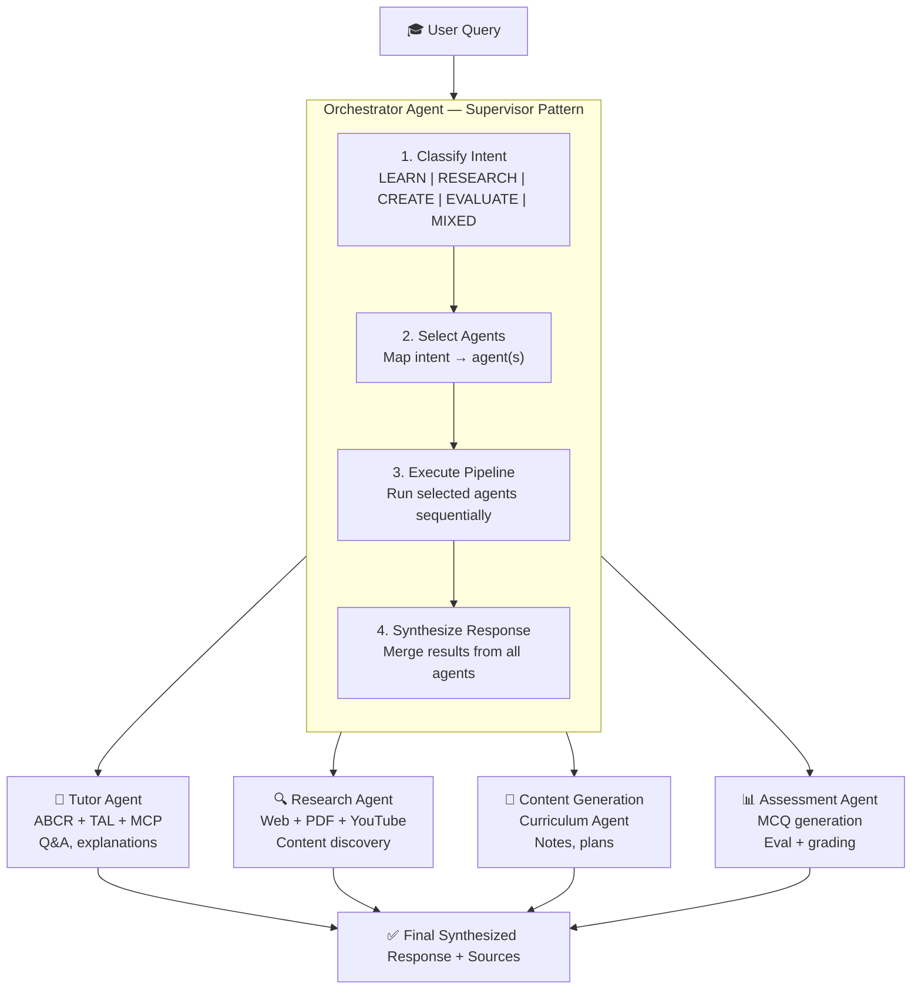
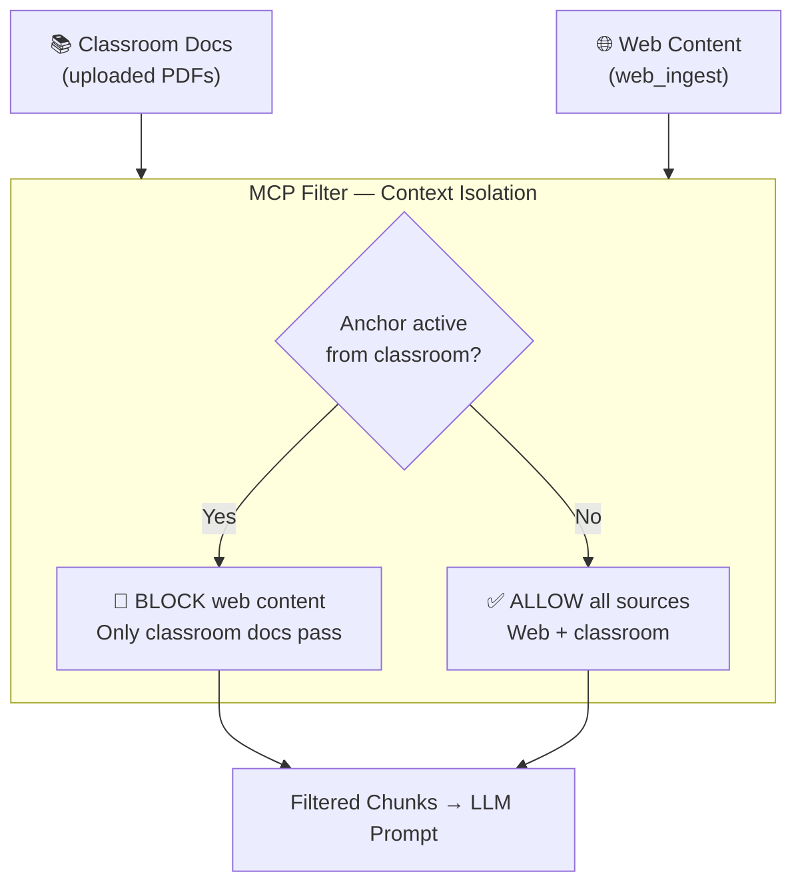
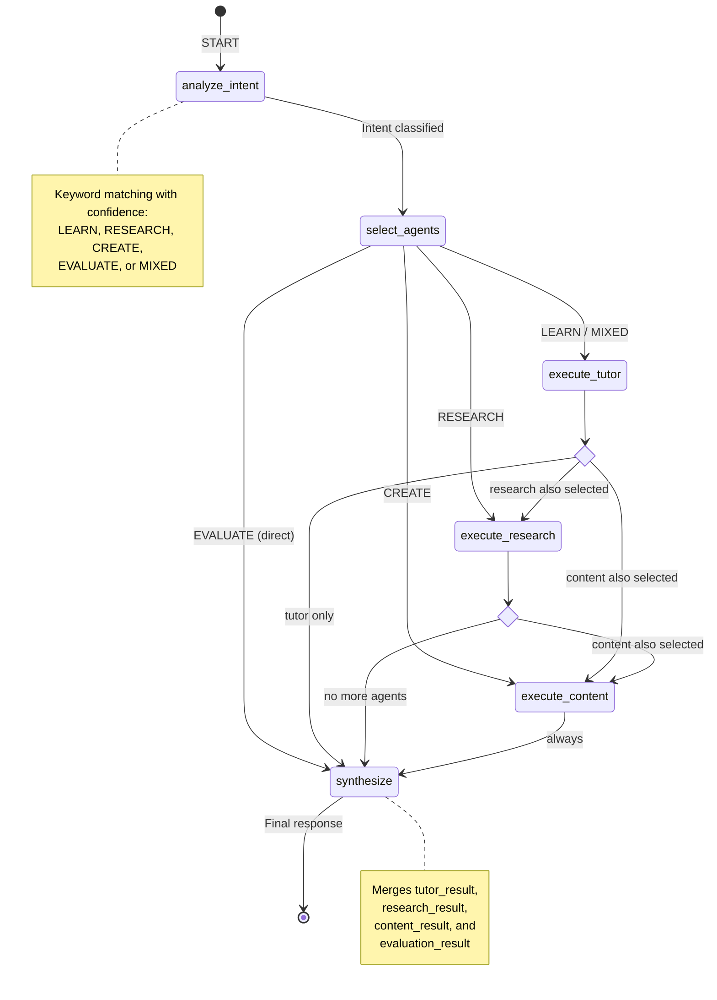
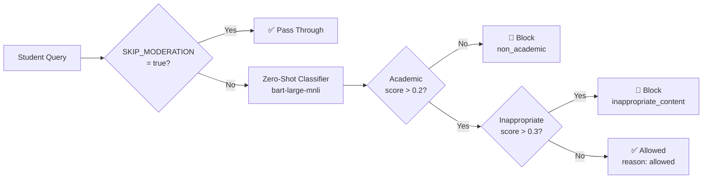

# Page 3: Multi-Agent System Deep Dive

---

## 3.1 Architecture Overview

The ensureStudy multi-agent system implements a **Supervisor Pattern** using LangGraph's `StateGraph` framework. A central **Orchestrator Agent** receives every user query, classifies intent, routes to one or more specialized agents, and synthesizes a unified response.



---

## 3.2 Agent Inventory

The system contains **17 agent files** in `backend/ai-service/app/agents/`:

| Agent | File | Lines | LangGraph | Purpose |
|-------|------|-------|-----------|---------|
| **Orchestrator** | `orchestrator.py` | 622 | Yes | Central supervisor — routes queries to sub-agents |
| **Tutor** | `tutor_agent.py` | 687 | Yes | Primary learning assistant with ABCR/TAL/MCP |
| **Research** | `research_agent.py` | 510 | Yes | Web search, PDF discovery, YouTube search |
| **Curriculum** | `curriculum_agent.py` | ~700 | Yes | Personalized learning path generation |
| **Document** | `document_agent.py` | ~550 | Yes | 7-stage document processing pipeline |
| **Learning** | `learning_agent.py` | 569 | Yes | Type 5 self-improving question generation |
| **Notes** | `notes_agent.py` | ~500 | Yes | Study notes generation from materials |
| **Assessment** | `assessment_agent.py` | ~200 | Yes | Question generation and answer evaluation |
| **Question Pool** | `question_pool_agent.py` | ~250 | Yes | Question bank management and retrieval |
| **Revision Assessment** | `revision_assessment_agent.py` | ~480 | Yes | Spaced repetition assessment generation |
| **Interview Question** | `interview_question_agent.py` | ~800 | Yes | Interview preparation question generation |
| **Web Enrichment** | `web_enrichment_agent.py` | ~400 | Yes | Web content enrichment with trust scoring |
| **Study Planner** | `study_planner.py` | ~200 | No | Legacy study plan generation |
| **Notes Generator** | `notes_generator.py` | ~150 | No | Legacy notes generation |
| **Moderation** | `moderation.py` | ~120 | No | Content moderation and safety checks |
| **Base Agent** | `base_agent.py` | 98 | No | Abstract base class with MCP protocol |
| **Tools** | `tools/` (5 files) | ~500 | No | Shared tools: RAG, web, content, media |

---

## 3.3 BaseAgent & Model Context Protocol (MCP)

All agents share a common base class that enforces the Model Context Protocol pattern:

### Source: `backend/ai-service/app/agents/base_agent.py`

```python
class AgentContext(Enum):
    """Bounded contexts for each agent (MCP)"""
    TUTOR = "tutor"
    STUDY_PLANNER = "study_planner"
    ASSESSMENT = "assessment"
    NOTES_GENERATOR = "notes_generator"
    MODERATION = "moderation"
    SCRAPER = "scraper"

class BaseAgent(ABC):
    def __init__(self, context: AgentContext):
        self.context = context
        self.responsibilities: List[str] = []
        self.communication_channels: List[str] = []
    
    @abstractmethod
    async def execute(self, input_data: Dict[str, Any]) -> Dict[str, Any]:
        """Execute the agent's main task."""
        pass
    
    def format_output(self, data, output_type="json", metadata=None):
        """Format agent output in standard MCP format."""
        return {
            "timestamp": datetime.utcnow().isoformat(),
            "agent": self.context.value,
            "output_type": output_type,
            "data": data,
            "metadata": metadata or {}
        }
```

### MCP Design Principles

The Model Context Protocol serves as a **bounded context isolation mechanism**:

1. **Agent Identity**: Each agent declares its `AgentContext`, ensuring outputs are tagged with their source
2. **Standardized I/O**: `format_output()` creates a uniform response envelope across all agents
3. **Input Validation**: `validate_input()` ensures required keys are present before execution
4. **Execution Logging**: `log_execution()` provides consistent monitoring hooks
5. **Context Boundaries**: Agents only see data relevant to their bounded context

### MCP in Practice: Web Content Isolation

The MCP protocol is most impactful in the Tutor Agent, where it prevents **web-sourced content** from polluting answers when a classroom context is active:



---

## 3.4 Orchestrator Agent — Supervisor Pattern

### Source: `backend/ai-service/app/agents/orchestrator.py`

The Orchestrator is the entry point for all conversational AI requests. It implements a **4-stage pipeline** using LangGraph:

### Stage 1: Intent Classification

```python
class Intent(str, Enum):
    LEARN = "learn"        # "What is...", "Explain..."
    RESEARCH = "research"  # "Find...", "Search...", "Look up..."
    CREATE = "create"      # "Generate...", "Make...", "Create..."
    EVALUATE = "evaluate"  # "Check...", "Assess...", "Grade..."
    MIXED = "mixed"        # Multiple intents detected

INTENT_KEYWORDS = {
    Intent.LEARN: ["what is", "explain", "how does", "why", "define", ...],
    Intent.RESEARCH: ["find", "search", "look up", "research", ...],
    Intent.CREATE: ["generate", "create", "make", "produce", ...],
    Intent.EVALUATE: ["check", "verify", "assess", "grade", "evaluate", ...],
}
```

The classification uses **keyword matching with confidence scoring**:
- Keywords are checked against the query in lowercase
- The intent with the most keyword matches wins
- If multiple intents score equally, `MIXED` is assigned
- Confidence is computed as `max_score / (total_matches + 1)`

### Stage 2: Agent Selection

Based on the classified intent, the Orchestrator selects which agents to invoke:

| Intent | Primary Agent | Secondary Agents |
|--------|--------------|------------------|
| LEARN | Tutor Agent | (optional) Research Agent |
| RESEARCH | Research Agent | — |
| CREATE | Content Generation | Curriculum Agent |
| EVALUATE | Assessment Agent | — |
| MIXED | Tutor Agent | Research Agent, Content Generation |

### Stage 3: Agent Execution

Agents are executed sequentially through the LangGraph state machine. Each agent node:
1. Receives the full `OrchestratorState` (TypedDict)
2. Executes its specialized logic
3. Writes results back to the state
4. Returns state for the next node

### Stage 4: Response Synthesis

The `synthesize_response_node` combines results from all executed agents:
- Merges tutor, research, content, and evaluation results
- Aggregates source lists from all agents
- Builds a coherent final response
- Records all actions taken for traceability

### OrchestratorState (TypedDict)

```python
class OrchestratorState(TypedDict):
    # Input
    query: str
    user_id: str
    session_id: str
    request_id: str
    classroom_id: Optional[str]
    
    # Classification
    primary_intent: str
    secondary_intents: List[str]
    confidence: float
    topic: str
    selected_agents: List[str]
    
    # Agent results
    tutor_result: Optional[Dict]
    research_result: Optional[Dict]
    content_result: Optional[Dict]
    evaluation_result: Optional[Dict]
    
    # Output
    final_response: str
    sources: List[Dict]
    actions_taken: List[str]
    error: Optional[str]
```

### LangGraph Workflow Definition

```python
def build_orchestrator_graph():
    graph = StateGraph(OrchestratorState)
    
    # Add nodes
    graph.add_node("analyze_intent", analyze_intent_node)
    graph.add_node("select_agents", select_agents_node)
    graph.add_node("execute_tutor", execute_tutor_node)
    graph.add_node("execute_research", execute_research_node)
    graph.add_node("execute_content", execute_content_node)
    graph.add_node("synthesize", synthesize_response_node)
    
    # Define edges
    graph.add_edge(START, "analyze_intent")
    graph.add_edge("analyze_intent", "select_agents")
    graph.add_conditional_edges("select_agents", route_to_agents,
        {"tutor": "execute_tutor", "research": "execute_research",
         "content": "execute_content", "synthesize": "synthesize"})
    graph.add_conditional_edges("execute_tutor", route_after_tutor,
        {"research": "execute_research", "content": "execute_content",
         "synthesize": "synthesize"})
    graph.add_conditional_edges("execute_research", route_after_research,
        {"content": "execute_content", "synthesize": "synthesize"})
    graph.add_edge("execute_content", "synthesize")
    graph.add_edge("synthesize", END)
    
    return graph.compile()
```

### Visual Flow — LangGraph State Machine



---

## 3.5 Agent Communication Pattern

Agents do **not** communicate directly with each other. Instead, they follow a **shared-state pattern**:

1. The Orchestrator initializes a `OrchestratorState` dict
2. Each agent node reads from and writes to this shared state
3. Routing functions examine the state to determine the next node
4. Results accumulate in the state until the synthesis node combines them

This design has several implications:

| Aspect | Implication |
|--------|-------------|
| **No inter-agent coupling** | Agents can be developed and tested independently |
| **Sequential execution** | No parallel agent execution (LangGraph supports it but not used) |
| **State accumulation** | Large state objects for complex multi-agent queries |
| **Single transaction** | Entire agent pipeline is a single request-response cycle |

---

## 3.6 Agent Tools System

Agents have access to a shared tool library in `backend/ai-service/app/agents/tools/`:

| Tool Module | Functions | Purpose |
|-------------|-----------|---------|
| `base_tool.py` | BaseTool class | Abstract tool interface with execution logging |
| `rag_tools.py` | `search_documents()`, `index_content()` | Qdrant vector search and indexing |
| `web_tools.py` | `web_search()`, `fetch_url()`, `download_pdf()` | Web research capabilities |
| `content_tools.py` | `generate_notes()`, `create_flashcards()`, `summarize()` | Content generation |
| `media_tools.py` | `search_youtube()`, `search_images()` | Media discovery |

Each tool follows the LangGraph tool pattern:
- Wrapped as `@tool` decorated functions
- Receive typed parameters
- Return structured results
- Include error handling and logging

---

## 3.7 Agent Lifecycle & Initialization

Most agents follow a **singleton pattern**:

```python
# Pattern used by ResearchAgent, LearningAgent, etc.
_research_agent = None

def get_research_agent():
    global _research_agent
    if _research_agent is None:
        _research_agent = ResearchAgent()
    return _research_agent
```

The LangGraph workflow is compiled once during agent initialization:

```python
class OrchestratorAgent:
    def __init__(self):
        self.graph = build_orchestrator_graph()
    
    async def chat(self, query, user_id, session_id, classroom_id):
        state = OrchestratorState(
            query=query,
            user_id=user_id,
            session_id=session_id,
            ...
        )
        result = await self.graph.ainvoke(state)
        return result
```

### Design Decision: Singletons vs. Per-Request Agents

| Approach | Benefits | Drawbacks |
|----------|----------|-----------|
| **Singleton (current)** | Graph compiled once, lower memory, faster response | Shared state requires careful thread safety |
| **Per-request** | Clean state isolation, simpler debugging | Repeated graph compilation overhead |

The singleton pattern is the correct choice here because LangGraph state is passed as a parameter (not stored on the agent instance), so thread safety is maintained despite sharing the compiled graph.

---

## 3.8 Moderation & Safety Layer

Content moderation is integrated as the first node in the Tutor Agent's pipeline and as a standalone service:

### Source: `backend/ai-service/app/agents/moderation.py`

The moderation system uses **facebook/bart-large-mnli** for zero-shot classification to determine if a query is academic-related:

```python
# Classification labels for academic content detection
labels = ["academic question", "homework help", "educational content",
          "inappropriate content", "off-topic question"]
```



**Skip mechanism**: Setting `SKIP_MODERATION=true` bypasses the classifier entirely, which is useful during development to reduce latency and avoid loading the classification model.
