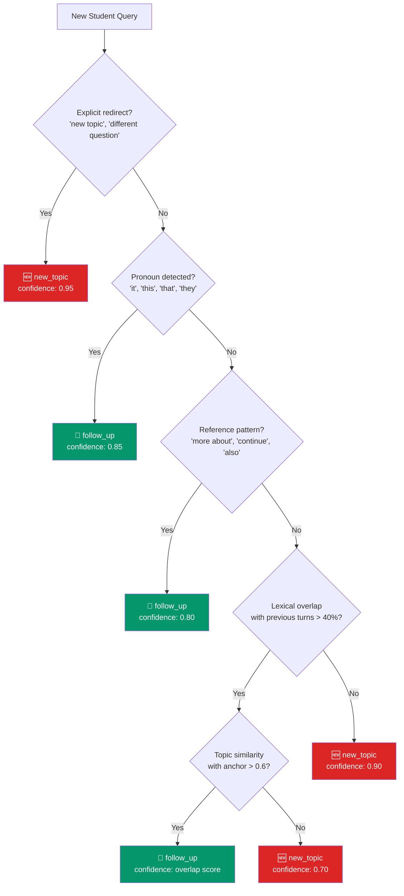

# Page 4: Tutor Agent — ABCR, TAL, MCP Integration

---

## 4.1 Overview

The Tutor Agent is the **primary learning assistant** and the most sophisticated agent in the ensureStudy platform. It implements three key subsystems that collectively provide context-aware, topic-coherent, and source-isolated tutoring:

| Subsystem | Full Name | Function |
|-----------|-----------|----------|
| **ABCR** | Attention-Based Context Routing | Determines whether a query is a follow-up to the current topic or a new topic |
| **TAL** | Topic Anchor Layer | Maintains topic continuity across conversation turns by "anchoring" to a subject |
| **MCP** | Memory Context Processor | Isolates web-sourced content from classroom-uploaded content in RAG retrieval |

### Source: `backend/ai-service/app/agents/tutor_agent.py` (687 lines)

---

## 4.2 LangGraph State Machine

The Tutor Agent's processing pipeline is defined as a LangGraph `StateGraph` with 4 nodes and conditional routing:

```mermaid
stateDiagram-v2
    [*] --> moderate_query: Student question arrives

    state moderate_query_decision <<choice>>
    moderate_query --> moderate_query_decision
    moderate_query_decision --> BLOCKED: blocked = true
    moderate_query_decision --> context_routing: blocked = false

    state context_routing {
        direction LR
        ABCR: ABCR Classification
        TAL: TAL Anchor Management
        ABCR --> TAL
    }

    context_routing --> retrieve_with_mcp: Anchor set / maintained

    state retrieve_with_mcp {
        direction LR
        QDRANT: Qdrant Vector Search<br/>top_k=8, threshold=0.5
        MCP_FILTER: MCP Context Isolation<br/>Filter web if classroom active
        QDRANT --> MCP_FILTER
    }

    retrieve_with_mcp --> generate_answer: Filtered chunks ready

    state generate_answer {
        direction LR
        PROMPT: Build Prompt<br/>system + context + anchor + query
        LLM: Mistral-7B Inference<br/>temp=0.3, max_tokens=1024
        SOURCES: Source Attribution<br/>doc name + page + score
        PROMPT --> LLM --> SOURCES
    }

    generate_answer --> [*]: Answer + Sources + Suggestions
    BLOCKED --> [*]: Blocked response returned

    note right of moderate_query
        bart-large-mnli zero-shot
        classifier checks if query
        is academic
    end note

    note right of context_routing
        ABCR: follow_up vs new_topic
        TAL: create/maintain/destroy anchor
    end note
```

### TutorState (TypedDict) — Full State Definition

```python
class TutorState(TypedDict):
    # === INPUT ===
    query: str                          # Student's question
    user_id: str                        # Authenticated user ID
    session_id: str                     # Conversation session ID
    request_id: str                     # Unique request trace ID
    classroom_id: str                   # Active classroom context
    clicked_suggestion: bool            # Whether user clicked a suggested question
    
    # === CONVERSATION MEMORY ===
    turn_texts: List[str]               # All conversation turns in session
    
    # === ABCR STATE ===
    last_abcr_decision: str             # "follow_up" | "new_topic" | ""
    abcr_confidence: float              # Confidence of ABCR classification
    is_followup: bool                   # Final determination
    
    # === TAL STATE ===
    anchor_topic: str                   # Currently anchored topic
    anchor_keywords: List[str]          # Keywords for the anchored topic
    confirm_new_topic: bool             # Whether topic change needs confirmation
    
    # === RAG & MCP STATE ===
    raw_chunks: List[Dict]              # Raw Qdrant retrieval results
    mcp_chunks: List[Dict]              # Chunks after MCP filtering
    mcp_reason: str                     # Reason for MCP filtering decision
    anchor_hits: int                    # Number of chunks matching anchor topic
    web_filtered_count: int             # Number of web chunks filtered out
    context_sources: List[str]          # Sources included in context
    
    # === OUTPUT ===
    answer: str                         # Generated answer text
    sources: List[Dict]                 # Source attributions with page numbers
    blocked: bool                       # Whether query was blocked by moderation
    error: str                          # Error message if any
```

---

## 4.3 Node 1: Content Moderation (`moderate_query`)

The first node in the pipeline validates that the query is academic in nature:

### Process

1. **Skip check**: If `SKIP_MODERATION` environment variable is `true`, bypass entirely
2. **Classifier inference**: Uses facebook/bart-large-mnli for zero-shot classification
3. **Label matching**: Checks query against academic vs. non-academic categories
4. **Decision routing**: Sets `blocked=True` if non-academic, allowing the conditional edge to terminate early

### Routing Logic

```python
def route_moderation(state: TutorState):
    """Route based on moderation result"""
    if state["blocked"]:
        return END
    return "context_routing"
```

### Design Decision

Content moderation is implemented at the **agent level** rather than at the API gateway level. This allows per-agent moderation policies — for example, the Research Agent may have looser content restrictions than the Tutor Agent since research queries may legitimately span broader topics.

---

## 4.4 Node 2: ABCR — Attention-Based Context Routing (`context_routing`)

### Purpose

ABCR solves a fundamental problem in multi-turn tutoring: **determining whether a student's query continues the current topic or introduces a new one**. This distinction is critical because:

- **Follow-up queries** should reuse the existing topic anchor and conversation context
- **New topic queries** should create a new anchor and potentially reset the context window

### Source: `backend/ai-service/app/services/abcr_service.py` (16,852 bytes)

### ABCR Decision Flowchart



### Classification Signals

| Signal | Weight | Indicates |
|--------|--------|----------|
| **Explicit redirections** | Highest | "new topic", "different question" → new_topic |
| **Pronoun detection** | High | "it", "this", "that" → follow_up |
| **Reference patterns** | Medium-high | "more about", "continue" → follow_up |
| **Lexical overlap** | Medium | Keyword overlap between query and previous turns |
| **Topic similarity** | Medium | Semantic similarity with current anchor |

### ABCR Decision Output

```python
{
    "decision": "follow_up" | "new_topic",
    "confidence": 0.0 - 1.0,
    "reasoning": "Detected pronoun reference 'it' with 78% lexical overlap"
}
```

### Integration in `context_routing` Node

```python
async def context_routing(state: TutorState):
    """
    ABCR + TAL integration:
    1. Run ABCR to detect if query is follow-up or new topic
    2. If follow-up -> keep existing anchor, no confirmation needed
    3. If new topic -> create new anchor, may need confirmation
    """
    session = get_session_state(state["session_id"])
    
    # Run ABCR classification
    abcr_result = await abcr_service.classify(
        query=state["query"],
        turn_history=state["turn_texts"],
        current_anchor=session.get("anchor_topic", "")
    )
    
    is_followup = abcr_result["decision"] == "follow_up"
    
    if is_followup:
        # Keep existing anchor — TAL stays locked
        return {
            "is_followup": True,
            "anchor_topic": session["anchor_topic"],
            "anchor_keywords": session["anchor_keywords"],
            "abcr_confidence": abcr_result["confidence"]
        }
    else:
        # New topic — extract and set new anchor via TAL
        new_anchor = await topic_anchor_service.extract_anchor(state["query"])
        update_session_state(state["session_id"], {
            "anchor_topic": new_anchor["topic"],
            "anchor_keywords": new_anchor["keywords"]
        })
        return {
            "is_followup": False,
            "anchor_topic": new_anchor["topic"],
            "anchor_keywords": new_anchor["keywords"],
            "abcr_confidence": abcr_result["confidence"],
            "confirm_new_topic": True
        }
```

### ABCR Performance Characteristics

| Metric | Value |
|--------|-------|
| Inference time | < 50ms (keyword-based, no ML model) |
| Accuracy (estimated) | ~85-90% for clear follow-ups |
| False positive rate | Higher for vague queries like "tell me more" |
| Fallback | Defaults to "new_topic" when uncertain |

---

## 4.5 Node 2 (continued): TAL — Topic Anchor Layer

### Purpose

TAL maintains **topic continuity** across conversation turns. When a student asks about "neural networks" and then asks "how does backpropagation work?", TAL ensures the RAG retrieval is still scoped to neural networks content.

### Source: `backend/ai-service/app/services/topic_anchor_service.py` (16,248 bytes)

### Anchor Structure

```python
{
    "topic": "Neural Networks",
    "keywords": ["neural", "network", "neuron", "layer", "activation"],
    "scope": "classroom_materials",  # or "web_content"
    "created_at": "2026-02-27T10:30:00Z",
    "turn_count": 3  # Number of turns on this topic
}
```

### TAL Operations

| Operation | Trigger | Effect |
|-----------|---------|--------|
| **Create Anchor** | New topic detected by ABCR | Extracts topic and keywords from query using LLM |
| **Maintain Anchor** | Follow-up detected | Keeps current anchor, increments turn count |
| **Refresh Anchor** | Keywords become stale | Re-extracts keywords with accumulated context |
| **Destroy Anchor** | Explicit topic change or session end | Clears anchor state |

### Keyword Extraction

TAL uses the LLM to extract topic keywords:

```
Prompt: "Extract the main topic and 5-10 relevant keywords 
         from this student query: '{query}'"

Response: {
    "topic": "Backpropagation in Neural Networks",
    "keywords": ["backpropagation", "gradient", "chain rule", 
                 "loss function", "weight update", "neural network"]
}
```

---

## 4.6 Node 3: RAG Retrieval with MCP (`retrieve_with_mcp`)

### Purpose

This node performs semantic search against Qdrant and then applies MCP isolation rules to filter the results based on the active context.

### Two-Phase Process

**Phase 1: Vector Retrieval**

```python
# Retrieve raw chunks from Qdrant
raw_chunks = await qdrant_service.search(
    query=state["query"],
    collection=classroom_collection,
    limit=settings.TOP_K_RESULTS,  # 8
    score_threshold=settings.SIMILARITY_THRESHOLD  # 0.5
)
```

The retrieval uses:
- `sentence-transformers/all-mpnet-base-v2` for query embedding (768 dimensions)
- Cosine similarity scoring in Qdrant
- Top-K=8 results with minimum similarity threshold of 0.5

**Phase 2: MCP Filtering**

```python
# Apply MCP context isolation
mcp_chunks = []
web_filtered = 0

for chunk in raw_chunks:
    source_type = chunk.get("metadata", {}).get("source_type", "unknown")
    
    if state["anchor_topic"] and state["classroom_id"]:
        # Active classroom anchor — filter web content
        if source_type == "web_content":
            web_filtered += 1
            continue
    
    mcp_chunks.append(chunk)
```

### MCP Filtering Rules

| Condition | Web Content | Classroom Content |
|-----------|-------------|-------------------|
| Active classroom + anchor topic | **BLOCKED** | Allowed |
| Active classroom + no anchor | Allowed (lower priority) | Allowed |
| No classroom context | Allowed | Allowed |
| Explicit web research request | Allowed | Allowed |

### Source: `backend/ai-service/app/services/mcp_context.py` (15,161 bytes)

The MCP context service provides a more sophisticated implementation:

```python
class MCPContextManager:
    """
    Memory Context Processor — manages context isolation between
    different content sources (classroom vs web).
    
    Rules:
    1. When a topic anchor is active from classroom materials,
       web content is filtered out to prevent confusion
    2. When no anchor is active, all sources contribute equally
    3. Explicit web research requests bypass filtering
    """
```

### Anchor-Boosted Retrieval

When a TAL anchor is active, retrieval uses a **boosting strategy**:

1. Primary query: Student's question embedded normally
2. Anchor boost: Anchor keywords are appended to the query
3. Result ranking: Chunks matching anchor keywords receive a score boost

```python
# Effective query with anchor boost
effective_query = f"{state['query']} {' '.join(state['anchor_keywords'])}"
```

This ensures that retrieval results stay topically coherent even when the student's follow-up question is vague (e.g., "What about the other type?").

---

## 4.7 Node 4: Answer Generation (`generate_answer`)

### Purpose

The final node constructs a prompt from the filtered chunks and generates an answer using the LLM.

### LLM Configuration

| Parameter | Value | Rationale |
|-----------|-------|-----------|
| Model | Mistral-7B-Instruct-v0.2 | Best open-source choice for RAG-grounded educational QA |
| Temperature | 0.3 | Low for factual consistency |
| Max tokens | 1024 | Sufficient for detailed explanations |
| API | HuggingFace Inference API | Free tier, no GPU required locally |

### Prompt Construction

The prompt is structured with several components:

```
System: You are an AI tutor for academic subjects. Answer questions 
        based ONLY on the provided context. If the context doesn't 
        contain enough information, say so clearly.

Context: [MCP-filtered chunks with source citations]

Topic Anchor: {anchor_topic}
Session Context: {previous_turn_summaries}

Student Question: {query}

Instructions:
- Provide clear, educational explanations
- Reference specific sources with page numbers
- If this is a follow-up, build on previous answers
- Use examples where appropriate
- Indicate confidence level in your answer
```

### Source Attribution

Each answer includes source citations mapped back to the original documents:

```python
sources = [
    {
        "document": "Introduction to Machine Learning.pdf",
        "page": 42,
        "chunk_text": "Neural networks consist of...",
        "similarity_score": 0.87,
        "source_type": "classroom_material"
    }
]
```

### Learning Enhancement

The answer generation node also integrates with the **suggestion engine** and **followup generator**:

- **Suggestion Engine** (`services/suggestion_engine.py`): Generates 3-5 follow-up question suggestions based on the answer and topic
- **Followup Generator** (`services/followup_generator.py`): Creates contextual follow-up prompts to encourage deeper learning

---

## 4.8 Session Management

### In-Memory Session Store

```python
_session_states: Dict[str, Dict] = {}

def get_session_state(session_id: str):
    if session_id not in _session_states:
        _session_states[session_id] = {
            "anchor_topic": "",
            "anchor_keywords": [],
            "turn_count": 0,
            "turn_texts": [],
            "last_abcr_decision": "",
        }
    return _session_states[session_id]
```

> **Production Note**: The comment in the source code acknowledges this should be Redis/DB-backed in production. The in-memory store works for single-instance deployment but will lose state on service restart.

### Session Intelligence

Beyond basic session state, the platform includes a sophisticated session intelligence service:

**Source**: `backend/ai-service/app/services/session_intelligence.py` (12,986 bytes)

This service tracks:
- **Session quality metrics**: Answer confidence over time
- **Topic depth**: How deep the student goes into a subject
- **Learning velocity**: Questions per time unit
- **Engagement signals**: Follow-up rate, suggestion click rate

### Session Cache

**Source**: `backend/ai-service/app/services/session_cache.py` (8,740 bytes)

The session cache provides Redis-backed storage for:
- Recent query-response pairs (for ABCR context)
- Active topic anchor state
- Session telemetry data

---

## 4.9 TutorAgent Class Interface

```python
class TutorAgent:
    """
    LangGraph-based Tutor Agent with TAL/ABCR/MCP Integration
    
    Features:
    - ABCR for follow-up detection
    - TAL for topic anchoring
    - MCP for web isolation
    - Hugging Face LLM (Mistral-7B)
    """
    
    def __init__(self):
        self.graph = build_tutor_graph()
    
    async def execute(self, input_data: Dict[str, Any]):
        """
        Process a student question
        
        Args:
            input_data: {
                query: str,
                user_id: str,
                session_id: str (optional),
                classroom_id: str (optional),
                clicked_suggestion: bool (optional)
            }
        
        Returns: {
            answer: str,
            sources: List[Dict],
            anchor_topic: str,
            is_followup: bool,
            abcr_confidence: float,
            context_sources: List[str],
            blocked: bool,
            confirm_new_topic: bool
        }
        """
```

---

## 4.10 ABCR Cache Layer

**Source**: `backend/ai-service/app/services/abcr_cache.py` (8,153 bytes)

To avoid redundant ABCR classifications, a cache layer stores recent decisions:

| Cache Key | Value | TTL |
|-----------|-------|-----|
| `abcr:{session_id}:{query_hash}` | `{decision, confidence}` | Session duration |

This is particularly useful when:
- The same query is retried (network issues)
- The frontend refreshes and replays the last message
- Multiple tabs are open on the same session

---

## 4.11 End-to-End Request Flow

```
1. Student types: "How does backpropagation work?"
   ↓
2. Frontend → POST /api/tutor/chat
   ↓
3. AI Service → TutorAgent.execute({
       query: "How does backpropagation work?",
       user_id: "u123",
       session_id: "s456",
       classroom_id: "c789"
   })
   ↓
4. Node: moderate_query
   → bart-large-mnli classifies as "academic question" (0.94)
   → PASS
   ↓
5. Node: context_routing
   → ABCR: No previous turns → "new_topic" (confidence: 0.95)
   → TAL: Extract anchor → {topic: "Backpropagation", keywords: [...]}
   → Session state updated
   ↓
6. Node: retrieve_with_mcp
   → Embed query + anchor keywords via all-mpnet-base-v2
   → Qdrant search → 8 chunks retrieved
   → MCP filter: 2 web chunks removed (classroom_id active)
   → 6 chunks passed to generation
   ↓
7. Node: generate_answer
   → Build prompt: system + context (6 chunks) + session + query
   → Mistral-7B inference via HuggingFace API
   → Answer: "Backpropagation is an algorithm for training neural networks..."
   → Sources: [{document: "ML_Textbook.pdf", page: 156, score: 0.91}]
   → Suggestions: ["What's the chain rule?", "How are weights updated?", ...]
   ↓
8. Response → Frontend
   → {answer, sources, anchor_topic, is_followup: false, suggestions}
```

#### Follow-up Query (same session):

```
1. Student types: "What about the chain rule?"
   ↓
2-3. Same routing...
   ↓
4. moderate_query → PASS
   ↓
5. context_routing
   → ABCR: "chain rule" relates to "Backpropagation" → "follow_up" (0.88)
   → TAL: Maintain anchor "Backpropagation", add "chain rule" to keywords
   ↓
6. retrieve_with_mcp
   → Query: "What about the chain rule? backpropagation gradient chain rule..."
   → Anchor-boosted retrieval → more relevant chunks about calculus in backprop
   → MCP: Web chunks filtered
   ↓
7. generate_answer
   → Previous turn context included in prompt
   → Answer builds on previous explanation
```
