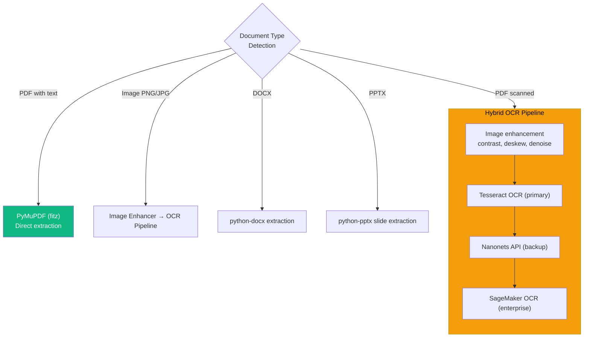
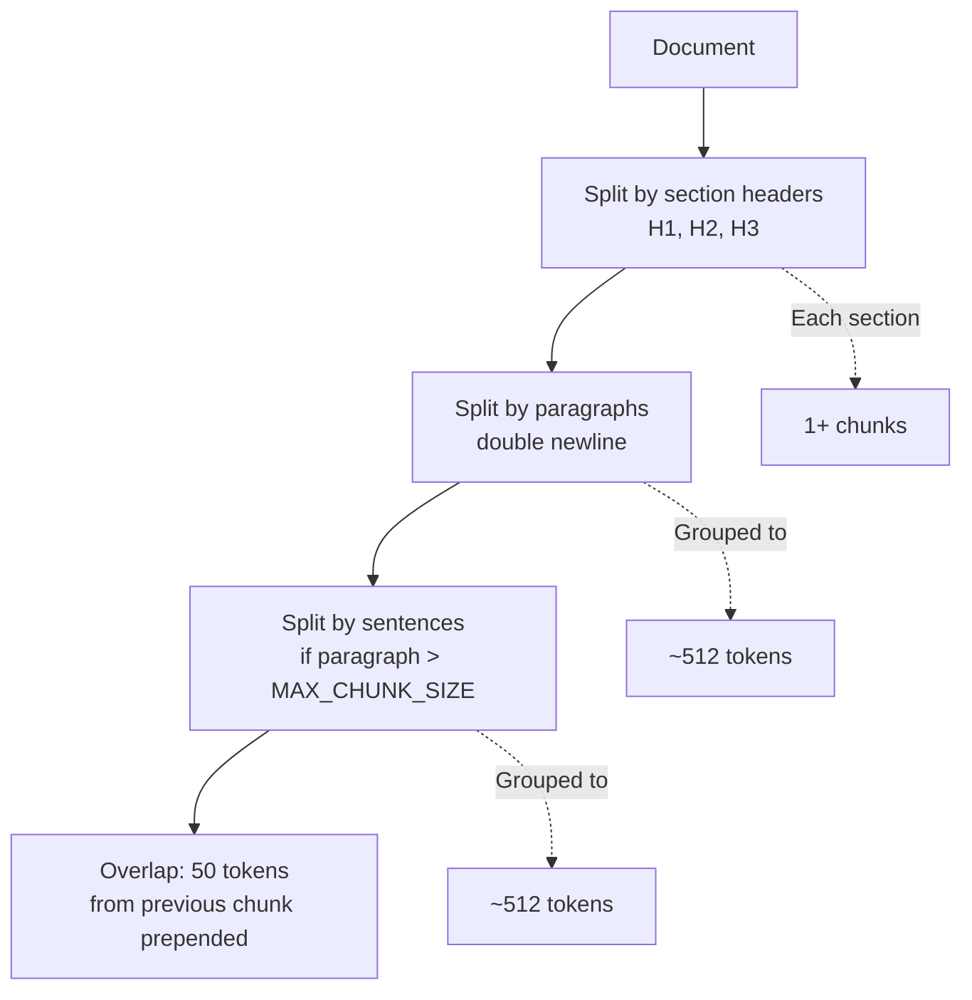
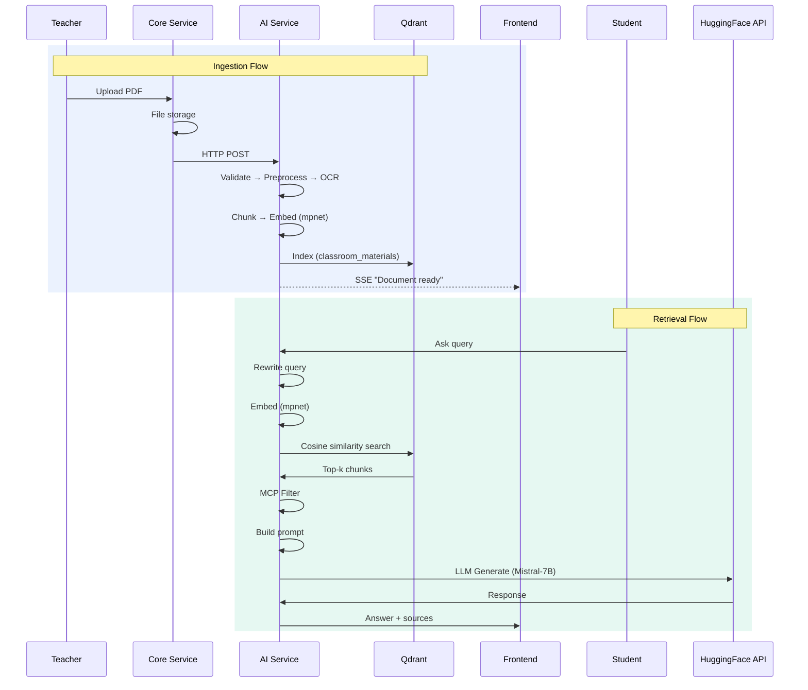

# Page 5: RAG Pipeline & Vector Search Engine

---

## 5.1 Architecture Overview

The Retrieval-Augmented Generation (RAG) pipeline is the core knowledge system of ensureStudy. It enables the AI tutor to answer questions grounded in specific classroom materials rather than relying solely on the LLM's pre-trained knowledge.


---

## 5.2 Core Components

### File Inventory

| Component | File | Size | Purpose |
|-----------|------|------|---------|
| **Document Loader** | `rag/document_loader.py` | 6,707 bytes | Multi-format document loading |
| **Qdrant Setup** | `rag/qdrant_setup.py` | 5,108 bytes | Collection creation and configuration |
| **Retriever** | `rag/retriever.py` | 10,527 bytes | Semantic search with scoring |
| **Qdrant Service** | `services/qdrant_service.py` | 25,432 bytes | Full Qdrant client wrapper |
| **Chunking Service** | `services/chunking_service.py` | 8,818 bytes | Semantic text chunking |
| **Text Chunker** | `services/text_chunker.py` | 8,986 bytes | Low-level chunking algorithms |
| **Document Processor** | `services/document_processor.py` | 16,114 bytes | Orchestrates 7-stage pipeline |
| **Document Preprocessor** | `services/document_preprocessor.py` | 13,536 bytes | Text cleaning and normalization |
| **PDF Extractor** | `services/pdf_extractor.py` | 9,145 bytes | PyMuPDF-based PDF text extraction |
| **PDF Processor** | `services/pdf_processor.py` | 9,115 bytes | PDF-specific processing logic |
| **PPTX Extractor** | `services/pptx_extractor.py` | 7,233 bytes | PowerPoint slide extraction |
| **OCR Service** | `services/ocr_service.py` | 15,901 bytes | Optical character recognition |
| **Hybrid OCR** | `services/hybrid_ocr.py` | 12,361 bytes | Multi-backend OCR with fallback |
| **OCR Adapter** | `services/ocr_adapter.py` | 16,689 bytes | Unified OCR interface |
| **Image Enhancer** | `services/image_enhancer.py` | 19,344 bytes | Pre-OCR image preprocessing |
| **Material Indexer** | `services/material_indexer.py` | 13,122 bytes | Batch material indexing |
| **Retrieval Service** | `services/retrieval.py` | 8,363 bytes | High-level retrieval interface |
| **Query Rewriter** | `services/query_rewriter.py` | 14,915 bytes | Query expansion and refinement |
| **Content Normalizer** | `services/content_normalizer.py` | 7,393 bytes | Text normalization post-extraction |
| **LaTeX Converter** | `services/latex_converter.py` | 11,905 bytes | LaTeX formula handling |

---

## 5.3 Embedding Strategy

### Primary Model: all-mpnet-base-v2

| Property | Value |
|----------|-------|
| Model | `sentence-transformers/all-mpnet-base-v2` |
| Dimension | 768 |
| Max sequence length | 384 tokens |
| Speed | ~14,000 sentences/second (GPU) |
| Quality | SOTA on semantic similarity benchmarks (2022) |
| Hosting | Local via sentence-transformers library |

### Model Selection Rationale

| Considered Model | Dimension | Quality | Reason for Decision |
|-----------------|-----------|---------|---------------------|
| all-mpnet-base-v2 | 768 | Highest | **Selected** — best quality for educational text |
| all-MiniLM-L6-v2 | 384 | Good | Available as fallback (referenced in `.env`) |
| text-embedding-3-small | 1536 | High | OpenAI API — cost concerns for high-volume |
| all-MiniLM-L12-v2 | 384 | Better than L6 | Still lower quality than mpnet |

### Embedding Process

```python
from sentence_transformers import SentenceTransformer

model = SentenceTransformer("sentence-transformers/all-mpnet-base-v2")

# Single query embedding
query_vector = model.encode("What is backpropagation?")
# Shape: (768,)

# Batch document embedding
doc_vectors = model.encode([chunk1, chunk2, chunk3, ...])
# Shape: (n, 768)
```

### Embedding Consistency Issue

> **Important**: The `.env` file contains conflicting embedding configurations:
> ```
> EMBEDDING_MODEL=text-embedding-3-small     # Line 4
> EMBEDDING_DIMENSIONS=1536                   # Line 5
> EMBEDDING_MODEL=sentence-transformers/all-MiniLM-L6-v2  # Line 59
> EMBEDDING_DIMENSIONS=1536                   # Line 61
> ```
> While `config.py` defaults to `all-mpnet-base-v2` (768 dimensions). The `.env` values may override the config depending on load order. **Production fix recommended**: Resolve to a single, canonical embedding model.

---

## 5.4 Qdrant Vector Database

### Collection Architecture

**Source**: `backend/ai-service/app/rag/qdrant_setup.py`

```python
# Primary collection for classroom materials
collection_name = "classroom_materials"

# Collection configuration
qdrant_client.create_collection(
    collection_name=collection_name,
    vectors_config=VectorParams(
        size=768,  # all-mpnet-base-v2 dimension
        distance=Distance.COSINE
    )
)
```

### Collection Schema

Each vector point in Qdrant stores:

```python
{
    "id": "uuid-v4",
    "vector": [0.012, -0.045, ...],  # 768-dim float32 array
    "payload": {
        # Document metadata
        "document_id": "doc_abc123",
        "document_name": "Introduction to ML.pdf",
        "classroom_id": "class_xyz789",
        "uploaded_by": "teacher_001",
        "upload_date": "2026-02-15T10:30:00Z",
        
        # Chunk metadata
        "chunk_index": 5,
        "total_chunks": 42,
        "page_number": 12,
        "section_title": "Chapter 3: Neural Networks",
        
        # Content
        "text": "A neural network consists of layers of interconnected nodes...",
        "text_length": 512,
        
        # Source tracking
        "source_type": "classroom_material",  # or "web_content", "meeting_transcript"
        "format": "pdf",
        
        # Processing metadata
        "processed_at": "2026-02-15T10:35:00Z",
        "embedding_model": "all-mpnet-base-v2",
        "ocr_used": false
    }
}
```

### Qdrant Service API

**Source**: `backend/ai-service/app/services/qdrant_service.py` (25,432 bytes — the largest service file)

The Qdrant service provides a comprehensive API:

| Method | Purpose |
|--------|---------|
| `create_collection()` | Initialize collection with vector config |
| `upsert_points()` | Insert or update vectors with payloads |
| `search()` | Semantic search with filtering |
| `search_with_filter()` | Search with Qdrant filter conditions |
| `delete_by_document()` | Remove all chunks for a document |
| `delete_by_classroom()` | Remove all chunks for a classroom |
| `get_collection_info()` | Collection statistics |
| `scroll()` | Paginated retrieval of all points |
| `update_payload()` | Update metadata without re-embedding |

### Filtering Capabilities

Qdrant payload filters enable scoped retrieval:

```python
# Search within a specific classroom
results = await qdrant_service.search(
    query_vector=query_embedding,
    collection="classroom_materials",
    limit=8,
    score_threshold=0.5,
    filter={
        "must": [
            {"key": "classroom_id", "match": {"value": "class_xyz789"}},
            {"key": "source_type", "match": {"value": "classroom_material"}}
        ]
    }
)
```

---

## 5.5 Document Ingestion Pipeline

### Stage 1: Validation

- File format check (PDF, PNG, JPG, DOCX, PPTX)
- File size validation (max 500MB)
- MIME type verification
- Duplicate detection via hash

### Stage 2: Preprocessing

**Source**: `backend/ai-service/app/services/document_preprocessor.py`

- Encoding detection and normalization (UTF-8)
- Whitespace normalization
- Control character removal
- Character set validation
- Language detection (optional)

### Stage 3: Text Extraction / OCR

The system employs a **multi-strategy extraction** approach:



#### OCR Backends

| Backend | File | Priority | Use Case |
|---------|------|----------|----------|
| Tesseract | `ocr_service.py` | Primary | Local, no API cost |
| Nanonets | `nanonets_ocr.py` | Secondary | Better accuracy for complex layouts |
| SageMaker | `sagemaker_ocr.py` | Tertiary | Enterprise-grade, AWS-hosted |
| Hybrid | `hybrid_ocr.py` | Orchestrator | Tries backends in order with fallback |

#### Image Enhancement

**Source**: `backend/ai-service/app/services/image_enhancer.py` (19,344 bytes)

Before OCR, images are preprocessed:

1. **Contrast enhancement** — CLAHE (Contrast Limited Adaptive Histogram Equalization)
2. **Deskewing** — Hough line detection for rotation correction
3. **Denoising** — Non-local means denoising
4. **Binarization** — Otsu's method for clean text extraction
5. **Border removal** — Crop non-content areas
6. **Resolution scaling** — Upscale low-DPI images

### Stage 4: Semantic Chunking

**Source**: `backend/ai-service/app/services/chunking_service.py` (8,818 bytes)

The chunking strategy uses **semantic boundaries** rather than fixed character counts:

```python
class ChunkingService:
    """
    Semantic chunking that respects document structure:
    1. Split on section headers (##, ###)
    2. Split on paragraph boundaries
    3. Split on sentence boundaries (if paragraph too large)
    4. Maintain overlap between adjacent chunks
    """
    
    DEFAULT_CHUNK_SIZE = 512      # tokens
    DEFAULT_OVERLAP = 50          # tokens
    MIN_CHUNK_SIZE = 100          # tokens
    MAX_CHUNK_SIZE = 1000         # tokens
```

#### Chunking Hierarchy



#### Chunk Metadata Enrichment

Each chunk is enriched with:

```python
{
    "text": "The gradient descent algorithm...",
    "chunk_index": 5,
    "page_number": 12,
    "section_title": "3.2 Optimization Methods",
    "token_count": 487,
    "has_equations": True,
    "has_code": False,
    "language": "en",
    "parent_document_id": "doc_abc123"
}
```

### Stage 5: Embedding Generation

```python
from sentence_transformers import SentenceTransformer

model = SentenceTransformer("sentence-transformers/all-mpnet-base-v2")

# Batch encode all chunks
chunk_texts = [chunk["text"] for chunk in chunks]
embeddings = model.encode(chunk_texts, batch_size=32, show_progress_bar=True)
# Shape: (num_chunks, 768)
```

### Stage 6: Qdrant Indexing

```python
# Upsert points into Qdrant
points = [
    PointStruct(
        id=str(uuid4()),
        vector=embedding.tolist(),
        payload={
            "text": chunk["text"],
            "document_id": document_id,
            "classroom_id": classroom_id,
            "page_number": chunk["page_number"],
            "chunk_index": i,
            "source_type": "classroom_material",
            ...
        }
    )
    for i, (chunk, embedding) in enumerate(zip(chunks, embeddings))
]

qdrant_client.upsert(
    collection_name="classroom_materials",
    points=points
)
```

### Stage 7: Completion & Notification

- Document status updated in PostgreSQL (`processing_complete`)
- SSE event sent to frontend for real-time UI update
- Processing metrics logged (time, chunk count, OCR status)

---

## 5.6 Retrieval Pipeline

### Query Processing

**Source**: `backend/ai-service/app/services/query_rewriter.py` (14,915 bytes)

Before vector search, queries are processed through a rewriting pipeline:

1. **Spelling correction** — Fix common typos
2. **Expansion** — Add synonyms and related terms
3. **Decomposition** — Split complex queries into sub-queries
4. **Anchor injection** — Append TAL anchor keywords (if active)

Example:
```
Original: "How does backprop work?"
Expanded: "How does backpropagation work? gradient descent chain rule neural network"
With anchor: "How does backpropagation work? gradient descent chain rule neural network backpropagation neural networks"
```

### Vector Search

**Source**: `backend/ai-service/app/rag/retriever.py` (10,527 bytes)

```python
class RAGRetriever:
    """
    Semantic retrieval from Qdrant with scoring and filtering.
    """
    
    async def retrieve(
        self,
        query: str,
        classroom_id: str = None,
        top_k: int = 8,
        score_threshold: float = 0.5,
        source_filter: str = None
    ) -> List[Dict]:
        """
        Retrieve relevant chunks for a query.
        
        Returns:
            List of chunks with similarity scores and metadata
        """
        # 1. Embed the query
        query_vector = self.embedding_model.encode(query)
        
        # 2. Build filter
        filter_conditions = []
        if classroom_id:
            filter_conditions.append(
                {"key": "classroom_id", "match": {"value": classroom_id}}
            )
        if source_filter:
            filter_conditions.append(
                {"key": "source_type", "match": {"value": source_filter}}
            )
        
        # 3. Search Qdrant
        results = self.qdrant_client.search(
            collection_name="classroom_materials",
            query_vector=query_vector.tolist(),
            limit=top_k,
            score_threshold=score_threshold,
            query_filter=Filter(must=filter_conditions) if filter_conditions else None
        )
        
        # 4. Format results
        return [
            {
                "text": hit.payload["text"],
                "score": hit.score,
                "document_name": hit.payload.get("document_name"),
                "page_number": hit.payload.get("page_number"),
                "source_type": hit.payload.get("source_type"),
                "chunk_index": hit.payload.get("chunk_index"),
            }
            for hit in results
        ]
```

### Scoring & Ranking

Retrieved chunks are scored on multiple dimensions:

| Factor | Weight | Source |
|--------|--------|--------|
| Cosine similarity | Primary | Qdrant vector distance |
| Anchor keyword match | Boost | TAL anchor keywords in chunk text |
| Source type priority | Modifier | Classroom > Notes > Web |
| Recency | Tiebreaker | More recently uploaded documents preferred |

### Response Cache

**Source**: `backend/ai-service/app/services/response_cache.py` (8,799 bytes)

To reduce redundant LLM calls, a Redis-backed response cache stores recent query-response pairs:

```python
class ResponseCache:
    """
    Cache for RAG responses to avoid redundant LLM calls.
    
    Cache key: hash(query + classroom_id + anchor_topic)
    TTL: 1 hour (configurable)
    """
    
    async def get_cached_response(self, query, classroom_id, anchor):
        cache_key = self._build_key(query, classroom_id, anchor)
        cached = await self.redis.get(cache_key)
        if cached:
            return json.loads(cached)
        return None
    
    async def cache_response(self, query, classroom_id, anchor, response):
        cache_key = self._build_key(query, classroom_id, anchor)
        await self.redis.setex(cache_key, 3600, json.dumps(response))
```

---

## 5.7 Specialized RAG Variants

### Notes Embedding Service

**Source**: `backend/ai-service/app/services/notes_embedding.py` (13,778 bytes)

Student-uploaded handwritten notes are processed through a specialized pipeline:
1. Image enhancement (deskew, contrast)
2. OCR (optimized for handwriting)
3. Chunking (smaller chunks for notes)
4. Embedding into a notes-specific Qdrant collection

### Meeting RAG

**Source**: `backend/ai-service/app/services/meeting_rag.py` (8,371 bytes)

Meeting transcripts are indexed for Q&A over classroom discussions:
1. Whisper transcription produces timestamped text
2. Speaker diarization labels segments
3. Chunks include speaker attribution and timestamps
4. Retrieval enables questions like "What did the teacher say about X?"

### Meeting Embedding Service

**Source**: `backend/ai-service/app/services/meeting_embedding_service.py` (12,590 bytes)

Dedicated service for embedding meeting content with metadata:
- Speaker labels
- Timestamp ranges
- Topic segments
- Action items

### Web Content Embedding

**Source**: `backend/ai-service/app/services/web_ingest_service.py` (59,963 bytes — the largest service file in the codebase)

The web ingest service handles:
1. Web page crawling and content extraction
2. Article summarization
3. Content quality scoring (trust score)
4. Chunking and embedding with `source_type: "web_content"`
5. MCP tagging for isolation from classroom materials

---

## 5.8 Performance Characteristics

### Ingestion Performance

| Operation | Estimated Time | Bottleneck |
|-----------|---------------|------------|
| PDF text extraction (100 pages) | 2-5 seconds | PyMuPDF I/O |
| OCR (100 scanned pages) | 30-120 seconds | Tesseract processing |
| Chunking (100 pages) | < 1 second | Text processing |
| Embedding (50 chunks) | 2-5 seconds | Model inference |
| Qdrant indexing (50 points) | < 1 second | Network I/O |
| **Total (text PDF)** | **5-10 seconds** | Embedding |
| **Total (scanned PDF)** | **35-130 seconds** | OCR |

### Retrieval Performance

| Operation | Estimated Time |
|-----------|---------------|
| Query embedding | 20-50ms |
| Qdrant vector search (top-8) | 5-20ms |
| MCP filtering | < 5ms |
| **Total retrieval** | **30-75ms** |

### LLM Generation (not part of RAG but follows retrieval)

| Operation | Estimated Time |
|-----------|---------------|
| Prompt construction | < 10ms |
| HuggingFace API inference | 2-8 seconds |
| Response parsing | < 10ms |
| **Total generation** | **2-8 seconds** |

---

## 5.9 Scalability Considerations

| Concern | Current State | Production Recommendation |
|---------|--------------|--------------------------|
| **Embedding model** | Loaded per-process, single instance | Shared model server (Triton/TorchServe) |
| **Qdrant** | Single node, Docker volume | Qdrant Cloud or clustered deployment |
| **Chunk storage** | ~50 chunks per document | Monitor collection size, add HNSW tuning |
| **Query latency** | 30-75ms retrieval | Acceptable for interactive use |
| **Concurrent ingestion** | Sequential processing | Add Celery/worker queue for parallel ingestion |
| **Embedding cache** | None | Cache embeddings for frequently queried documents |

---

## 5.10 Data Flow Summary


