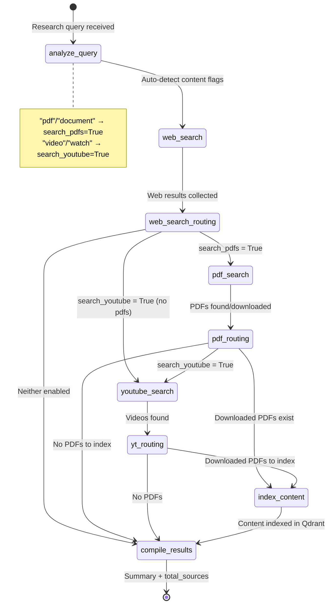
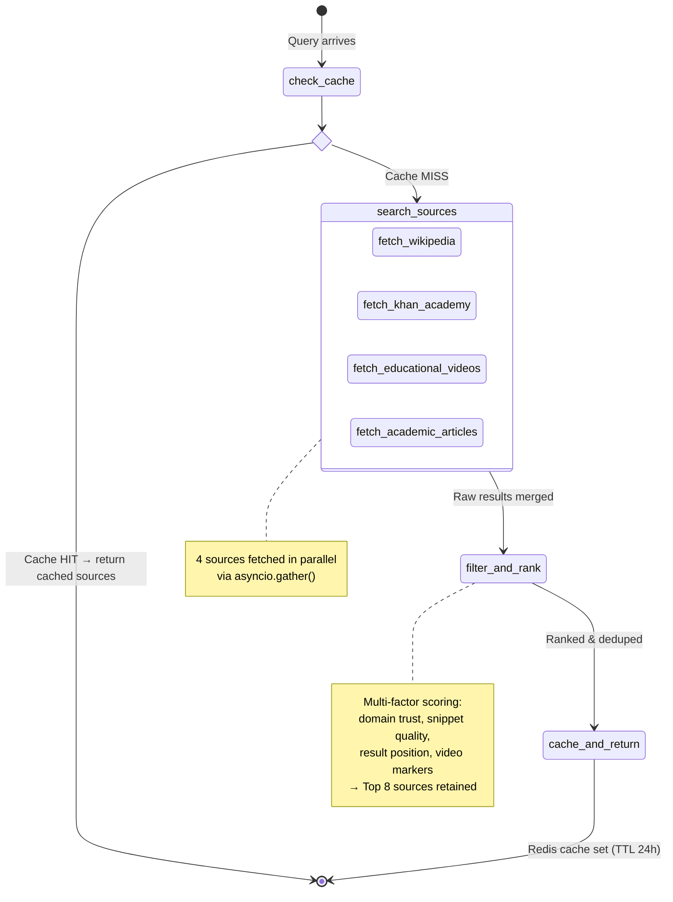

# Page 6: Research Agent & Web Enrichment Agent

---

## 6.1 Research Agent Overview

The Research Agent is responsible for **discovering and indexing educational content** from external sources. It operates as a LangGraph-based pipeline that searches the web, finds PDFs, discovers YouTube videos, and indexes discovered content into Qdrant for future RAG retrieval.

### Source: `backend/ai-service/app/agents/research_agent.py` (510 lines)

---

## 6.2 Research Agent LangGraph Pipeline

### State Definition

```python
class ResearchState(TypedDict):
    # Input
    query: str
    user_id: str
    session_id: str
    request_id: str
    
    # Configuration flags
    search_web: bool          # Default: True
    search_pdfs: bool         # Default: False (auto-detected)
    search_youtube: bool      # Default: False (auto-detected)
    download_pdfs: bool       # Default: False
    index_content: bool       # Default: True
    max_results: int          # Default: 5
    
    # Accumulated results
    web_results: List[Dict]
    pdf_results: List[Dict]
    downloaded_pdfs: List[Dict]
    youtube_results: List[Dict]
    indexed_documents: List[Dict]
    
    # Output
    summary: str
    total_sources: int
    error: Optional[str]
```

### Pipeline Flow



The routing is **conditional** — each node checks configuration flags to determine the next step:

| After Node | Condition | Next Node |
|------------|-----------|-----------|
| `web_search` | `search_pdfs=True` | `pdf_search` |
| `web_search` | `search_youtube=True` | `youtube_search` |
| `web_search` | Neither | `compile` |
| `pdf_search` | `search_youtube=True` | `youtube_search` |
| `pdf_search` | Downloaded PDFs exist | `index` |
| `pdf_search` | Neither | `compile` |
| `youtube_search` | Downloaded PDFs exist | `index` |
| `youtube_search` | No PDFs | `compile` |

### Node Details

#### Node 1: `analyze_query`
- Auto-detects content type preferences from query keywords
- Keywords containing "pdf", "document", "notes" → enable PDF search
- Keywords containing "video", "watch", "explain" → enable YouTube search
- Assigns a unique `request_id` for tracing

#### Node 2: `web_search_node`
- Invokes the shared `web_search` tool from `agents/tools/`
- Uses Serper API (Google SERP) as the primary search backend
- Returns up to `max_results` (default 5) web articles
- Falls back gracefully on failure with empty results

#### Node 3: `pdf_search_node`
- Two-phase operation: **search** then **download**
- Searches for PDFs via the `pdf_search` tool
- If `download_pdfs=True`, downloads up to 3 PDFs in batch
- Downloaded PDFs are stored locally for indexing

#### Node 4: `youtube_search_node`
- Invokes the `youtube_search` tool
- Returns up to 3 educational videos
- Results include video metadata (title, URL, thumbnail)

#### Node 5: `index_content_node`
- Processes downloaded PDFs through text extraction
- Indexes extracted text into Qdrant with `source_type: "web_pdf"`
- Tracks number of chunks indexed per document
- Links back to source URL in metadata

#### Node 6: `compile_results`
- Aggregates counts from all sources
- Builds human-readable summary (e.g., "Found 5 web articles, 2 PDFs downloaded, 3 videos")
- Sets `total_sources` for the Orchestrator

### Supporting Services

| Service | File | Purpose |
|---------|------|---------|
| Search API | `services/search_api.py` (16,819 bytes) | Multi-provider web search (Serper, DuckDuckGo) |
| PDF Downloader | `services/pdf_downloader.py` (11,750 bytes) | Async PDF download with size limits |
| Content Crawler | `services/content_crawler.py` (10,590 bytes) | Web page crawling and text extraction |
| Fast Fetcher | `services/fast_content_fetcher.py` (5,505 bytes) | Lightweight URL content fetcher |
| YouTube Video | `services/youtube_video_service.py` (6,510 bytes) | YouTube Data API v3 client |
| YouTube Transcript | `services/youtube_transcript_service.py` (3,497 bytes) | YouTube transcript extraction |

---

## 6.3 Web Enrichment Agent

### Purpose

While the Research Agent is for **explicit content discovery** (user requests research), the Web Enrichment Agent provides **query-time supplemental sources** for the Tutor Agent. It runs in the background alongside RAG retrieval to provide Wikipedia, Khan Academy, and video links alongside tutor answers.

### Source: `backend/ai-service/app/agents/web_enrichment_agent.py` (456 lines)

### Key Design Differences from Research Agent

| Aspect | Research Agent | Web Enrichment Agent |
|--------|---------------|---------------------|
| Trigger | Explicit user request | Every tutor query (background) |
| Content indexing | Yes (into Qdrant) | No (returned inline) |
| PDF download | Yes | No |
| Primary source | Serper (Google) | DuckDuckGo (no API key) |
| Caching | No | Yes (Redis, 24h TTL) |
| Concurrency | Sequential nodes | Parallel fetching |

### LangGraph Pipeline



### Source Fetchers (Parallel Execution)

The agent fetches from **4 sources simultaneously** using `asyncio.gather`:

```python
results = await asyncio.gather(
    fetch_wikipedia(query),           # site:wikipedia.org via DuckDuckGo
    fetch_khan_academy(query, subject), # site:khanacademy.org via DuckDuckGo
    fetch_educational_videos(query),   # DuckDuckGo videos API
    fetch_academic_articles(query),    # .edu, Coursera, EdX, MIT
    return_exceptions=True             # Don't fail entire pipeline
)
```

### WebSource Data Structure

```python
@dataclass
class WebSource:
    id: str              # e.g., "wiki_0", "khan_1", "video_2"
    title: str
    url: str
    source_type: str     # "wikipedia", "khan_academy", "video", "article"
    snippet: str
    relevance_score: float  # 0.0 - 1.0
    domain: str
    cached_content: Optional[str] = None
```

### Quality Scoring & Ranking

The `filter_and_rank` node applies a multi-factor scoring system:

| Factor | Score Impact |
|--------|-------------|
| Educational domain (`.edu`, `wikipedia`, `khanacademy`, `coursera`) | +0.1 |
| Empty snippet | -0.2 |
| Source-type base score (Wikipedia: 0.9, Khan: 0.92, Video: 0.85, Article: 0.8) | Base |
| Position in results (per source) | -0.05 to -0.1 per rank |
| Educational video markers ("academy", "edu", "tutorial", "khan", "crash course") | +0.15 |

After scoring:
1. All sources merged into single list
2. Sorted by `relevance_score` descending
3. URL-based deduplication
4. Top 8 sources retained

### Caching Strategy

```python
# Redis caching with 24-hour TTL
cache.set_web_resources(
    query,
    {"sources": filtered_sources},
    ttl=86400  # 24 hours
)
```

**Cache key**: Normalized query string
**Cache hit behavior**: Skip search, filter, and cache nodes entirely — go straight to END

### Performance Characteristics

| Metric | Typical Value |
|--------|---------------|
| Cache hit latency | < 10ms |
| Full search latency | 1-3 seconds |
| Source count | 6-8 sources per query |
| DuckDuckGo rate limits | ~50 queries/minute (free) |

---

## 6.4 Web Ingest Service

### Source: `backend/ai-service/app/services/web_ingest_service.py` (59,963 bytes — largest file in codebase)

The Web Ingest Service is a comprehensive web crawling and content extraction system that supports the Research Agent. Key capabilities:

| Capability | Implementation |
|------------|----------------|
| **Agentic crawling** | Multi-page crawling with link following |
| **Content extraction** | HTML-to-text with boilerplate removal |
| **PDF ingestion** | Download and chunk web-sourced PDFs |
| **Trust scoring** | Domain reputation-based content quality scoring |
| **Rate limiting** | Per-domain request throttling |
| **Content deduplication** | Hash-based duplicate detection |
| **Chunking for RAG** | Chunks web content using same chunking service as documents |
| **Qdrant indexing** | Indexes web content with `source_type: "web_content"` |

### Web Resource Services

| Service | File | Purpose |
|---------|------|---------|
| `web_resources.py` | 13,832 bytes | Resource management and retrieval |
| `web_cache_service.py` | 14,055 bytes | Redis caching for web content |
| `content_crawler.py` | 10,590 bytes | Concurrent web page crawling |
| `pdf_downloader.py` | 11,750 bytes | PDF download with validation |
| `search_api.py` | 16,819 bytes | Multi-provider search API |

### Trust Score Calculation

Web content quality is assessed using domain-based trust scoring:

| Domain Category | Trust Score |
|----------------|-------------|
| `.edu`, `.gov`, known academic sites | 0.9 - 1.0 |
| Wikipedia, Khan Academy, Coursera | 0.85 - 0.95 |
| Medium, tech blogs, Stack Overflow | 0.6 - 0.75 |
| General web pages | 0.4 - 0.6 |
| Unknown / low-quality domains | 0.2 - 0.4 |
