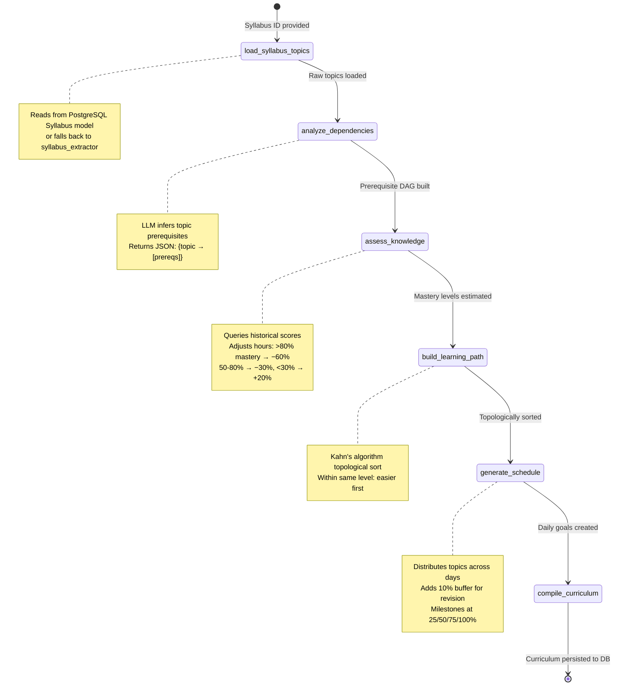
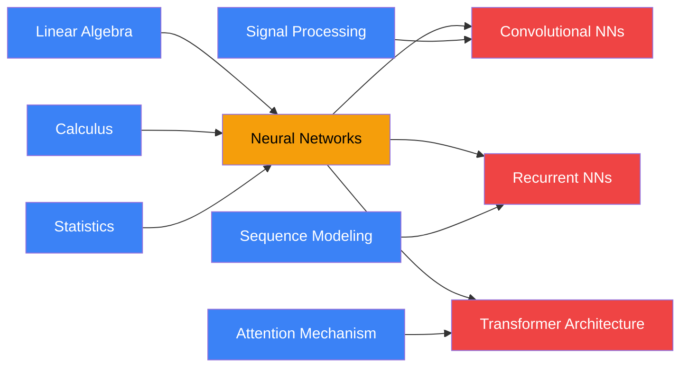
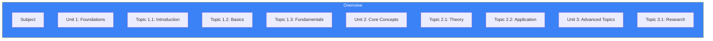

# Page 7: Curriculum Agent & Learning Path Generation

---

## 7.1 Overview

The Curriculum Agent creates **personalized learning paths** from syllabus documents. It analyzes topic dependencies using LLM inference, performs a topological sort to find optimal learning order, generates daily schedules with milestones, and adapts to student knowledge levels through diagnostic assessment integration.

### Source: `backend/ai-service/app/agents/curriculum_agent.py` (733 lines)

---

## 7.2 Data Model

### CurriculumTopic

```python
@dataclass
class CurriculumTopic:
    id: str
    name: str
    description: str
    difficulty: str       # "beginner", "intermediate", "advanced"
    estimated_hours: float
    prerequisites: List[str]  # IDs of prerequisite topics
    subtopics: List[str]
    order: int            # Position in learning sequence
```

### DailyGoal

```python
@dataclass
class DailyGoal:
    day: int
    date: str             # YYYY-MM-DD
    topics: List[str]     # Topic names for the day
    activities: List[Dict] # Learning activities
    total_hours: float
    milestone: Optional[str] = None
```

### Curriculum

```python
@dataclass
class Curriculum:
    id: str
    user_id: str
    syllabus_id: str
    subject_name: str
    created_at: str
    topics: List[CurriculumTopic]
    topic_order: List[str]    # Topologically sorted IDs
    start_date: str
    end_date: str
    total_days: int
    hours_per_day: float
    daily_goals: List[DailyGoal]
    milestones: List[Dict]
    current_topic_index: int = 0
    completed_topics: List[str] = None
```

---

## 7.3 LangGraph Pipeline



### Topic Dependency Graph — Example Visualization



> **Legend**: 🔵 Beginner (no prerequisites) → 🟡 Intermediate → 🔴 Advanced

### CurriculumState

```python
class CurriculumState(TypedDict):
    # Input
    syllabus_id: str
    user_id: str
    classroom_id: str
    subject_name: str
    hours_per_day: float      # Student's available hours
    deadline_days: int        # Days until exam/deadline
    start_date: str
    
    # Processing
    raw_topics: List[Dict]    # From syllabus extractor
    dependencies: Dict        # Topic → prerequisites mapping
    student_knowledge: Dict[str, float]  # Topic → mastery (0-1)
    diagnostic_complete: bool
    
    # Output
    ordered_topics: List[CurriculumTopic]
    topic_order: List[str]
    daily_goals: List[Dict]
    milestones: List[Dict]
    curriculum: Optional[Dict]
    error: Optional[str]
```

---

## 7.4 Node Details

### Node 1: `load_syllabus_topics`

Loads previously extracted syllabus topics from the database or syllabus extractor:

- Reads from `Syllabus` model in PostgreSQL
- Falls back to syllabus extractor service if not cached
- Normalizes topic format into `CurriculumTopic` data objects

### Node 2: `analyze_dependencies` (LLM-Powered)

This is the most compute-intensive node — it uses the LLM to analyze prerequisite relationships between topics:

```python
prompt = f"""Analyze these topics from a {subject_name} syllabus and determine 
which topics are prerequisites for others.

Topics:
{topic_list_formatted}

For each topic, list its prerequisites (topics that should be studied first).
Return as JSON: {{"topic_name": ["prerequisite_1", "prerequisite_2"]}}
Only include real dependencies, not all topics."""
```

**Output format:**
```json
{
    "Neural Networks": ["Linear Algebra", "Calculus", "Statistics"],
    "Convolutional Neural Networks": ["Neural Networks", "Signal Processing"],
    "Recurrent Neural Networks": ["Neural Networks", "Sequence Modeling"],
    "Transformer Architecture": ["Neural Networks", "Attention Mechanism"]
}
```

### Node 3: `assess_knowledge`

Integrates with the Knowledge Assessment Service to gauge student's existing mastery:

1. Queries existing progress data from PostgreSQL
2. If available, uses historical scores to estimate mastery per topic
3. If not available, can trigger a diagnostic quiz (async flow)
4. Adjusts `estimated_hours` based on mastery level:
   - Mastery > 0.8 → reduce hours by 60%
   - Mastery 0.5-0.8 → reduce hours by 30%
   - Mastery < 0.3 → increase hours by 20%

### Node 4: `build_learning_path` (Topological Sort)

Performs a **Kahn's algorithm** topological sort on the dependency graph with cycle detection:

```python
def topological_sort(topic_map: Dict, dependencies: Dict):
    """Topological sort with cycle detection"""
    # Build adjacency list and in-degree count
    in_degree = {t: 0 for t in topic_map}
    adj = {t: [] for t in topic_map}
    
    for topic, prereqs in dependencies.items():
        for prereq in prereqs:
            if prereq in topic_map:
                adj[prereq].append(topic)
                in_degree[topic] += 1
    
    # BFS with queue of zero in-degree nodes
    queue = [t for t, d in in_degree.items() if d == 0]
    result = []
    
    while queue:
        # Sort queue for deterministic ordering
        queue.sort(key=lambda t: topic_map[t].difficulty_score)
        node = queue.pop(0)
        result.append(node)
        
        for neighbor in adj[node]:
            in_degree[neighbor] -= 1
            if in_degree[neighbor] == 0:
                queue.append(neighbor)
    
    # Cycle detection
    if len(result) != len(topic_map):
        # Handle cycles by adding remaining topics at the end
        remaining = [t for t in topic_map if t not in result]
        result.extend(remaining)
    
    return result
```

**Ordering heuristics** (within same dependency level):
1. Lower difficulty topics first (easier → harder)
2. Topics with more dependents first (foundational topics prioritized)
3. Shorter topics before longer ones

### Node 5: `generate_schedule`

Distributes ordered topics across available days:

```
Input: 15 topics, 3 hours/day, 30 days deadline
Output: Daily goals with topic assignments
```

Algorithm:
1. Calculate total available hours: `hours_per_day × deadline_days`
2. If total hours < sum of topic hours → compress topics
3. Distribute topics day-by-day, respecting `hours_per_day` limit
4. Add buffer days (10% of total) for revision
5. Insert milestone markers at 25%, 50%, 75%, and 100%

### Activity Generation

Each daily goal includes learning activities:

```python
def generate_activities(topics: List[CurriculumTopic]):
    activities = []
    for topic in topics:
        activities.extend([
            {"type": "read", "description": f"Study {topic.name}", "duration": topic.estimated_hours * 0.4},
            {"type": "practice", "description": f"Practice problems for {topic.name}", "duration": topic.estimated_hours * 0.3},
            {"type": "quiz", "description": f"Self-assessment on {topic.name}", "duration": topic.estimated_hours * 0.2},
            {"type": "review", "description": f"Review notes on {topic.name}", "duration": topic.estimated_hours * 0.1}
        ])
    return activities
```

### Node 6: `compile_curriculum`

Assembles all data into a `Curriculum` object and persists to the database.

---

## 7.5 Curriculum Storage

### Source: `backend/ai-service/app/services/curriculum_storage.py` (22,284 bytes)

The curriculum storage service handles persistence and retrieval:

| Operation | Description |
|-----------|-------------|
| `save_curriculum()` | Stores curriculum in PostgreSQL with all goals and milestones |
| `get_curriculum()` | Retrieves curriculum by user and syllabus |
| `update_progress()` | Marks topics as completed, updates `current_topic_index` |
| `get_daily_goals()` | Returns goals for a specific date |
| `adjust_schedule()` | Recalculates schedule when student falls behind |

---

## 7.6 Spaced Repetition Integration

### Source: `backend/ai-service/app/services/spaced_repetition.py` (20,244 bytes)

The spaced repetition service integrates with the curriculum for long-term retention:

| Feature | Implementation |
|---------|----------------|
| Algorithm | Modified SM-2 (SuperMemo 2) |
| Review intervals | 1, 3, 7, 14, 30, 60 days |
| Difficulty adjustment | Based on assessment performance |
| Integration | Revision calendar generated from curriculum completion |
| Trigger | Assessment completion triggers spaced repetition scheduling |

---

## 7.7 Syllabus Extraction

### Source: `backend/ai-service/app/services/syllabus_extractor.py` (33,138 bytes — second largest service)

Before the Curriculum Agent runs, the syllabus must be extracted from uploaded documents:

| Stage | Description |
|-------|-------------|
| PDF/DOCX parsing | Extract text from syllabus documents |
| Topic detection | LLM identifies topics, subtopics, and chapter structure |
| Hierarchy building | Creates parent-child topic relationships |
| Difficulty estimation | LLM estimates difficulty level per topic |
| Hours estimation | Estimates study hours based on topic complexity |

### Syllabus Hierarchy Extractor

**Source**: `backend/ai-service/app/services/syllabus_hierarchy_extractor.py` (16,277 bytes)

Builds a hierarchical tree from flat topic lists:


---

## 7.8 Topic Extraction (Groq-Powered)

### Source: `backend/ai-service/app/services/topic_extractor.py` (36,594 bytes)

For fast topic extraction, the system uses **Groq API** (optimized for speed):

```python
# Uses Groq for fast topic extraction
GROQ_API_KEY = os.getenv("GROQ_API_KEY")
```

Groq is chosen over Mistral for this task because:
1. **Speed**: Groq's LPU delivers sub-second inference
2. **Structured output**: Better at returning consistent JSON
3. **Cost**: Competitive pricing for batch extraction
4. **Accuracy**: Strong performance on structured extraction tasks
