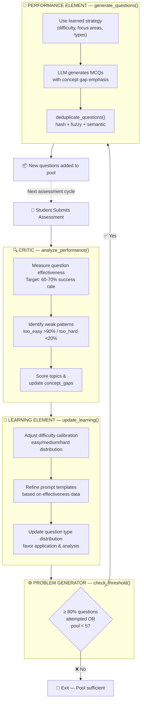
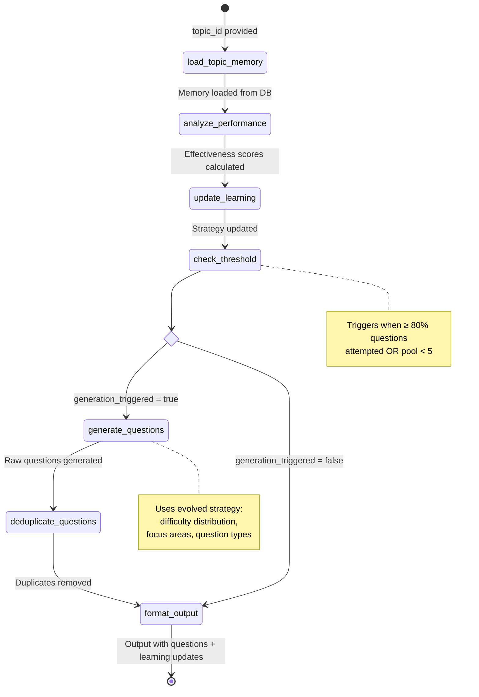

# Page 8: Learning Agent (Type 5 Self-Improving)

---

## 8.1 Overview

The Learning Agent implements a **Type 5 AI Agent** architecture — a self-improving system that adapts its behavior based on student performance data. It follows the classic **Critic → Learner → Performance → Problem Generator** cycle from AI agent theory.

### Source: `backend/ai-service/app/agents/learning_agent.py` (569 lines)

### Agent Type Classification

| Type | Description | ensureStudy Example |
|------|-------------|---------------------|
| Type 1 | Simple reflex | Content moderation |
| Type 2 | Model-based | Tutor Agent (uses session state) |
| Type 3 | Goal-based | Curriculum Agent (optimizes learning path) |
| Type 4 | Utility-based | Web Enrichment (ranks by relevance score) |
| **Type 5** | **Learning** | **Learning Agent (improves from feedback)** |

---

## 8.2 Architecture — Critic-Learner-Performance Cycle



---

## 8.3 LangGraph State Machine

### LearningState

```python
class LearningState(TypedDict):
    # Task configuration
    task_type: str               # "learn", "generate", "evaluate", "check_threshold"
    topic_id: str
    classroom_id: Optional[str]
    
    # Memory (persisted across invocations)
    memory: Dict[str, Any]       # Learning memory for the topic
    recent_responses: List[Dict] # Student's recent assessment responses
    existing_questions: List[Dict]
    
    # Threshold checking
    questions_attempted: int
    total_questions: int
    attempt_percentage: float
    
    # Generation strategy (evolved by learning element)
    generation_strategy: Dict[str, Any]
    
    # Output
    generated_questions: List[Dict]
    deduplicated_questions: List[Dict]
    output: Dict
    error: Optional[str]
    learning_triggered: bool
    generation_triggered: bool
```

### Pipeline Flow — LangGraph State Machine



---

## 8.4 Node Implementations

### Node 1: `load_topic_memory`

Loads persistent learning memory for a specific topic from the database:

```python
memory = {
    "topic_id": "topic_123",
    "avg_score": 0.72,
    "difficulty_calibration": {
        "easy": 0.85,    # Success rate on easy questions
        "medium": 0.68,  # Success rate on medium questions
        "hard": 0.45     # Success rate on hard questions
    },
    "question_effectiveness": {
        "q_001": 0.9,   # High effectiveness — differentiates well
        "q_002": 0.3    # Low effectiveness — everyone gets it right
    },
    "concept_gaps": ["recursion", "dynamic programming"],
    "generation_count": 3,  # Number of times questions have been generated
    "last_updated": "2026-02-20T10:00:00Z"
}
```

### Node 2: `analyze_performance` (Critic Function)

Analyzes recent student responses to evaluate question quality:

```python
async def analyze_performance(state: LearningState):
    responses = state["recent_responses"]
    
    # Calculate question effectiveness
    for response in responses:
        question_id = response["question_id"]
        was_correct = response["is_correct"]
        time_spent = response["time_spent_seconds"]
        
        # A good question should have ~60-70% success rate
        # Too easy (>90%) or too hard (<20%) = low effectiveness
        current_rate = memory["question_effectiveness"].get(question_id, 0.5)
        new_rate = (current_rate + (1.0 if was_correct else 0.0)) / 2
        
        memory["question_effectiveness"][question_id] = new_rate
    
    # Identify problematic patterns
    too_easy = [q for q, rate in effectiveness.items() if rate > 0.9]
    too_hard = [q for q, rate in effectiveness.items() if rate < 0.2]
    
    # Update concept gaps
    incorrect_topics = [r["topic"] for r in responses if not r["is_correct"]]
    memory["concept_gaps"] = list(set(memory.get("concept_gaps", []) + incorrect_topics))
```

### Node 3: `update_learning` (Learning Element)

Updates the question generation strategy based on performance analysis:

```python
async def update_learning(state: LearningState):
    memory = state["memory"]
    
    # Adjust difficulty distribution based on calibration
    if memory["difficulty_calibration"]["easy"] > 0.85:
        # Students finding easy questions too easy — reduce proportion
        strategy["difficulty_distribution"] = {"easy": 0.2, "medium": 0.5, "hard": 0.3}
    elif memory["difficulty_calibration"]["hard"] < 0.3:
        # Hard questions too hard — increase medium
        strategy["difficulty_distribution"] = {"easy": 0.3, "medium": 0.5, "hard": 0.2}
    
    # Focus on concept gaps
    strategy["focus_areas"] = memory["concept_gaps"][:3]
    
    # Adjust question types based on effectiveness
    strategy["preferred_types"] = ["application", "analysis"]  # Higher-order thinking
```

### Node 4: `check_threshold` (Problem Generator)

```python
async def check_threshold(state: LearningState):
    attempted = state["questions_attempted"]
    total = state["total_questions"]
    
    percentage = (attempted / total * 100) if total > 0 else 0
    state["attempt_percentage"] = percentage
    
    # Trigger generation when 80% of questions are attempted
    if percentage >= 80 or total < 5:
        state["generation_triggered"] = True
    else:
        state["generation_triggered"] = False
```

### Node 5: `generate_questions` (Performance Element)

Uses the evolved strategy to generate new MCQs:

```python
# Prompt incorporating learned strategy
prompt = f"""Generate {num_questions} multiple choice questions about "{topic_name}".

Difficulty Distribution: {strategy['difficulty_distribution']}
Focus Areas: {', '.join(strategy['focus_areas'])}
Question Types: {', '.join(strategy['preferred_types'])}

Concept Gaps to Address: {', '.join(memory['concept_gaps'])}

Avoid questions similar to:
{existing_question_texts[:5]}

Return JSON array of questions with: question, options (4), correct_answer, 
explanation, difficulty, concept_tested.
"""
```

### Node 6: `deduplicate_questions`

Multi-layer deduplication:

1. **Hash-based**: SHA-256 of normalized question text
2. **Fuzzy matching**: Levenshtein distance < threshold (80% similarity → duplicate)
3. **Semantic similarity**: Embedding-based comparison against existing question pool

---

## 8.5 Kafka Integration — Event-Driven Triggering

The Learning Agent is triggered asynchronously via Kafka when assessments are submitted:

```python
# In backend/kafka/consumers/agent_consumer.py
async def handle_assessment_submission(event):
    learning_agent = get_learning_agent()
    await learning_agent.trigger_on_assessment_submit(
        topic_id=event["topic_id"],
        responses=event["responses"]
    )
```

**Kafka topic**: `assessment-submissions`
**Consumer group**: `ensure-study-consumers`

This decouples assessment submission (synchronous, user-facing) from the learning/generation cycle (asynchronous, background).

---

## 8.6 Interview Question Agent (Variant)

### Source: `backend/ai-service/app/agents/interview_question_agent.py` (798 lines)

A specialized variant of the Learning Agent for interv question generation with additional features:

| Feature | Learning Agent | Interview Question Agent |
|---------|---------------|-------------------------|
| Question type | MCQ (multiple choice) | Descriptive (open-ended) |
| Evaluation criteria | Binary correct/incorrect | Score-based (0-10) |
| Lines of code | 569 | 798 |
| Deduplication | Hash + fuzzy | Hash + fuzzy + semantic embedding |
| State fields | 19 | 22 |
| Learning signals | Answer correctness | Interview scores, concept depth |

The interview agent includes additional generation capabilities for:
- Follow-up questions based on answers
- Scenario-based questions
- "Tell me more about X" probing questions
- Cross-topic integration questions

---

## 8.7 Design Decisions & Trade-offs

| Decision | Rationale | Trade-off |
|----------|-----------|-----------|
| 80% threshold trigger | Ensures students always have fresh questions | May generate unnecessary questions if students don't reach 80% |
| In-memory learning state | Fast access, no DB latency | Lost on service restart (should migrate to Redis) |
| LLM for question generation | High-quality, diverse questions | Cost per generation, ~3-5s latency |
| Multi-layer deduplication | Prevents repetitive questions | Additional compute for embedding comparison |
| Singleton pattern | Single-instance learning state | Not horizontally scalable without shared state |
| Kafka triggers | Non-blocking for students | Delayed learning (questions appear after next session) |
