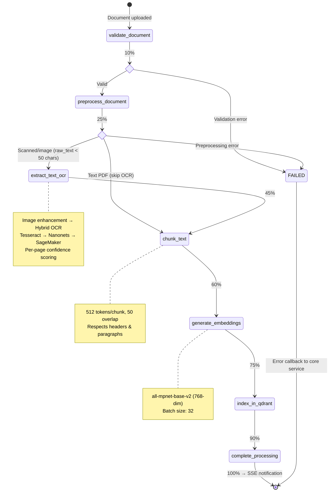

# Page 9: Document Processing Pipeline (7-Stage)

---

## 9.1 Overview

The Document Processing Agent orchestrates a **7-stage ingestion pipeline** using LangGraph, transforming uploaded documents (PDF, DOCX, PPTX, images) into searchable, embeddable chunks indexed in Qdrant.

### Source: `backend/ai-service/app/agents/document_agent.py` (617 lines)

---

## 9.2 Processing Stages

```python
class ProcessingStage(str, Enum):
    PENDING = "pending"
    VALIDATING = "validating"
    PREPROCESSING = "preprocessing"
    OCR = "ocr"
    CHUNKING = "chunking"
    EMBEDDING = "embedding"
    INDEXING = "indexing"
    COMPLETED = "completed"
    FAILED = "failed"
```



---

## 9.3 State Definition

```python
class DocumentProcessingState(TypedDict):
    document_id: str
    student_id: str
    classroom_id: str
    source_url: str
    file_type: str              # "pdf", "docx", "pptx", "png", "jpg"
    subject: Optional[str]
    is_teacher_material: bool
    raw_text: str
    ocr_results: List[Dict]
    chunks: List[Dict]
    embeddings: List[List[float]]
    current_stage: str
    progress: int               # 0-100
    completed_stages: List[str]
    error: Optional[str]
    retry_count: int
    qdrant_point_ids: List[str]
    total_tokens: int
    total_chunks: int
    avg_confidence: float
```

### Supporting Data Classes

```python
@dataclass
class TextChunk:
    chunk_id: str
    document_id: str
    chunk_index: int
    text: str
    token_count: int
    page_number: int
    section_heading: Optional[str]
    source_confidence: float
    contains_formula: bool
    formula_latex: Optional[str] = None

@dataclass
class OCRResult:
    page_number: int
    text: str
    confidence: float
    formulas: List[Dict[str, Any]]
    headings: List[str]
```

---

## 9.4 Stage Details

### Stage 1: `validate_document`

| Check | Criteria |
|-------|----------|
| File exists | Source URL/path is accessible |
| Format support | PDF, DOCX, PPTX, PNG, JPG |
| File size | ≤ 500 MB |
| MIME verification | Magic bytes match extension |
| Duplicate check | Hash-based dedup |

### Stage 2: `preprocess_document`

Format-specific extraction:
- **PDF**: `pdf_extractor.py` (PyMuPDF) → determines if OCR needed
- **DOCX**: `document_preprocessor.py` (python-docx) → direct text
- **PPTX**: `pptx_extractor.py` (python-pptx) → slide text
- **Images**: Always routed to OCR

### Stage 3: `extract_text_ocr` (Conditional)

Only runs if preprocessing determines text extraction was insufficient:

- Image enhancement pipeline (contrast, deskew, denoise, binarize)
- Hybrid OCR with multi-backend fallback: Tesseract → Nanonets → SageMaker
- Per-page confidence scoring
- Formula and heading detection

### Stage 4: `chunk_text`

Semantic chunking with the `ChunkingService`:
- Default chunk size: 512 tokens
- Overlap: 50 tokens
- Respects section headers and paragraph boundaries
- Enriches chunks with page number, heading, formula detection

### Stage 5: `generate_embeddings`

Batch embedding via sentence-transformers (`all-mpnet-base-v2`):
- Batch size: 32
- Normalized embeddings for cosine similarity
- Output: 768-dimensional float32 vectors

### Stage 6: `index_in_qdrant`

Upserts points with full metadata payloads:
- `text`, `document_id`, `classroom_id`, `page_number`, `chunk_index`
- `source_type` (teacher_material / student_material)
- `subject`, `contains_formula`, `source_confidence`
- `processed_at` timestamp

### Stage 7: `complete_processing`

- HTTP callback to core service with final status
- SSE notification to frontend
- Logging of processing metrics

---

## 9.5 Conditional Routing

```python
def route_after_preprocess(state):
    if state.get("error"):
        return END
    if not state.get("raw_text") or len(state["raw_text"]) < 50:
        return "ocr"    # Needs OCR
    return "chunk"      # Text PDF, skip OCR
```

Each stage has a routing function that checks for errors and determines whether to proceed or terminate.

---

## 9.6 OCR Architecture

### Image Enhancement Pipeline

Source: `services/image_enhancer.py` (19,344 bytes)

1. **CLAHE** — Contrast Limited Adaptive Histogram Equalization
2. **Deskewing** — Hough line-based rotation correction
3. **Denoising** — Non-local means denoising
4. **Binarization** — Otsu's thresholding
5. **Border removal** — Crop non-content areas
6. **Resolution scaling** — Upscale low-DPI images

### Hybrid OCR Backends

| Backend | File | Priority | Strengths |
|---------|------|----------|-----------|
| Tesseract | `ocr_service.py` (15,901 bytes) | Primary | Free, local, reliable |
| Nanonets | `nanonets_ocr.py` | Secondary | Better for complex layouts |
| SageMaker | `sagemaker_ocr.py` | Tertiary | Enterprise-grade accuracy |
| Hybrid Orchestrator | `hybrid_ocr.py` (12,361 bytes) | Controller | Tries backends in order |
| OCR Adapter | `ocr_adapter.py` (16,689 bytes) | Interface | Unified API for all backends |

### LaTeX Formula Handling

Source: `services/latex_converter.py` (11,905 bytes)

- Pattern-based formula region detection in OCR output
- Conversion to LaTeX notation
- Dual storage: raw text + LaTeX in chunk metadata
- KaTeX rendering in frontend

---

## 9.7 Progress Reporting

The agent updates the core service at each stage:

| Stage | Progress % |
|-------|-----------|
| Validating | 10% |
| Preprocessing | 25% |
| OCR | 45% |
| Chunking | 60% |
| Embedding | 75% |
| Indexing | 90% |
| Completed | 100% |

---

## 9.8 Performance

| Operation | Text PDF (100 pg) | Scanned PDF (100 pg) |
|-----------|-------------------|---------------------|
| Validation | < 1s | < 1s |
| Preprocessing | 2-5s | 2-5s |
| OCR | Skipped | 30-120s |
| Chunking | < 1s | < 1s |
| Embedding | 2-5s | 2-5s |
| Indexing | < 1s | < 1s |
| **Total** | **5-10s** | **35-130s** |

---

## 9.9 Notes Processing Agent

### Source: `backend/ai-service/app/agents/notes_agent.py` (483 lines)

A specialized document processor for student handwritten notes:

**Pipeline**: Extract frames → Enhance → OCR → Generate searchable PDF

| Feature | Description |
|---------|-------------|
| Video input | Extracts best frames from lecture recordings |
| Frame selection | Blur detection (threshold: 80.0) + interval sampling |
| Max frames | 30 per video |
| Image enhancement | Minimal — preserves handwriting quality |
| OCR backend | HuggingFace API (Nanonets-OCR2-3B or olmOCR-7B) |
| Output | Searchable PDF with embedded OCR text layer |
| Multi-format | Video, images, PDF, PPTX, DOCX |
