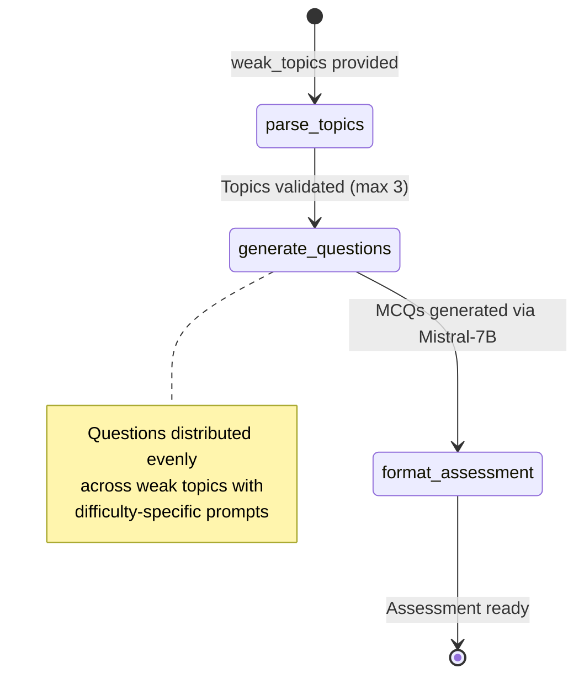
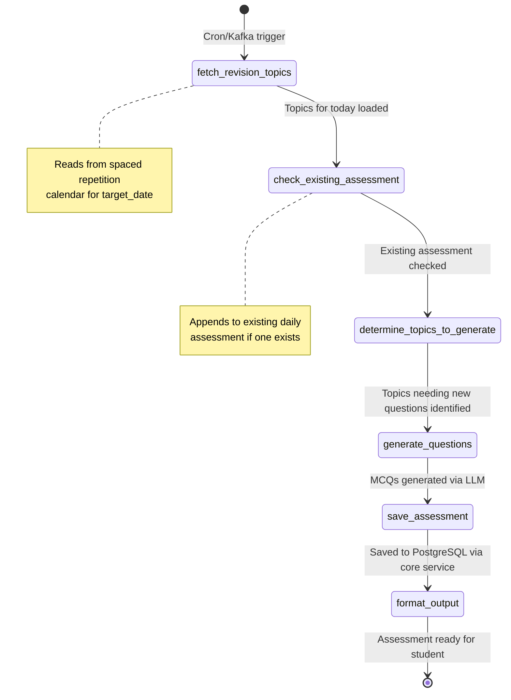
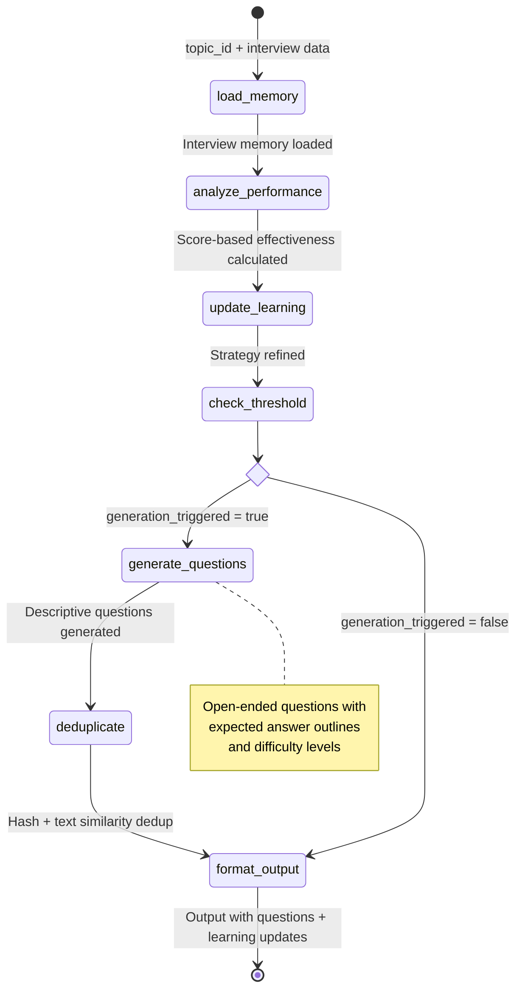
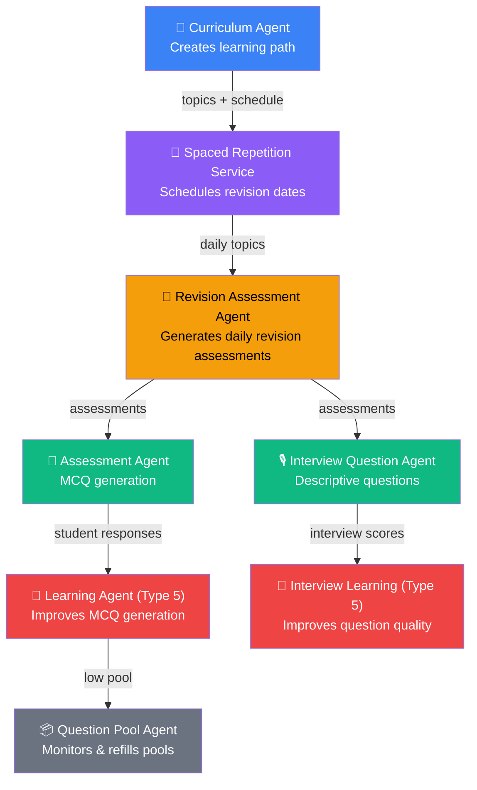
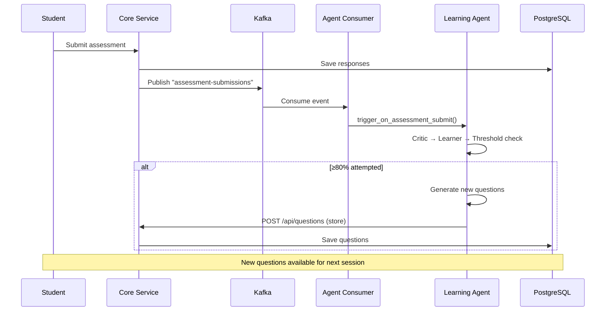

# Page 10: Notes, Assessment & Question Pool Agents

---

## 10.1 Assessment Agent

### Source: `backend/ai-service/app/agents/assessment_agent.py` (213 lines)

The Assessment Agent generates **adaptive MCQ assessments** using Mistral-7B via HuggingFace, targeting student weak areas with configurable difficulty.

### LangGraph Pipeline



### AssessmentState

```python
class AssessmentState(TypedDict):
    weak_topics: List[Dict]      # [{topic, subject, score}]
    num_questions: int           # Default: 10
    difficulty: str              # "easy", "medium", "hard"
    current_topic_idx: int
    generated_questions: List[Dict]
    assessment: Dict
    error: str
```

### Question Generation

The agent distributes questions evenly across weak topics and uses difficulty-specific prompts:

| Difficulty | Guidance |
|-----------|----------|
| Easy | Basic recall and understanding questions |
| Medium | Application and analysis questions |
| Hard | Synthesis and evaluation — complex scenarios |

**Output format per question:**
```json
{
    "question": "Which sorting algorithm has O(n log n) average case?",
    "options": ["Bubble Sort", "Merge Sort", "Insertion Sort", "Selection Sort"],
    "correct_answer": "B",
    "explanation": "Merge Sort uses divide and conquer...",
    "topic": "Sorting Algorithms"
}
```

### Safety Measures
- Topics limited to max 3 per assessment
- JSON parsing with ````json` block extraction fallback
- Single-character answer normalization (`correct_answer[0].upper()`)
- Validation: all required keys must be present

---

## 10.2 Question Pool Agent

### Source: `backend/ai-service/app/agents/question_pool_agent.py` (241 lines)

A **background monitoring agent** that automatically replenishes question pools when they deplete.

### Configuration

```python
MIN_QUESTIONS_PER_TOPIC = 5   # Minimum pool size
GENERATION_THRESHOLD = 0.8    # Trigger at 80% attempted
GENERATE_BATCH_SIZE = 3       # New questions per batch
```

### Trigger Conditions

| Condition | Action |
|-----------|--------|
| 80%+ questions attempted for a topic | Generate 3 new questions |
| Pool < 5 questions | Generate to reach minimum |
| Student completes assessment session | Check all related topics |

### Operations

| Method | Purpose |
|--------|---------|
| `check_and_replenish()` | Check single topic, generate if needed |
| `check_session_completion()` | Post-session check across all topics |
| `bulk_replenish()` | Replenish multiple topics at once |
| `_store_questions()` | Persist generated questions via core service API |

### Integration with Learning Agent

The Question Pool Agent is a simplified version of the Type 5 Learning Agent:
- **No learning element** — uses fixed generation strategy
- **No critic function** — doesn't analyze question effectiveness
- **Threshold-only trigger** — purely quantity-based, not quality-based
- Used for **quick replenishment** when full learning cycle is unnecessary

---

## 10.3 Revision Assessment Agent

### Source: `backend/ai-service/app/agents/revision_assessment_agent.py` (473 lines)

Generates **daily revision assessments** aligned with the spaced repetition calendar. This is the bridge between the Curriculum Agent's schedule and the Assessment Agent's question generation.

### LangGraph Pipeline (6 nodes)



### RevisionAssessmentState

```python
class RevisionAssessmentState(TypedDict):
    user_id: str
    target_date: str               # ISO date
    auth_token: Optional[str]
    revision_topics: List[Dict]    # Topics scheduled for today
    existing_assessment_id: Optional[str]
    existing_questions: List[Dict]
    topics_to_generate: List[Dict] # Topics needing new questions
    generated_questions: List[Dict]
    assessment_id: Optional[str]
    total_questions: int
    new_questions_added: int
    error: Optional[str]
```

### Key Features

| Feature | Implementation |
|---------|----------------|
| **Calendar integration** | Fetches topics from core service's revision calendar API |
| **Incremental updates** | Appends to existing daily assessment if one already exists |
| **Topic deduplication** | Skips topics that already have questions in today's assessment |
| **Sync wrapper** | `execute_sync()` for non-async contexts (Kafka consumers) |
| **Core service API** | Saves assessments via HTTP POST to `/api/revision-assessments` |

### Daily Flow

```
1. Cron/Kafka trigger at midnight
2. Fetch revision topics for today from spaced repetition calendar
3. Check if assessment already exists for today
4. Determine which topics need new questions
5. Generate MCQs for missing topics via LLM
6. Save/update assessment in PostgreSQL via core service
```

---

## 10.4 Interview Question Agent

### Source: `backend/ai-service/app/agents/interview_question_agent.py` (798 lines — largest agent)

A **Type 5 self-improving agent** specialized for interview preparation with descriptive (open-ended) questions.

### LangGraph Pipeline (8 nodes)



### InterviewLearningState (22 fields)

```python
class InterviewLearningState(TypedDict):
    task_type: str         # "learn", "generate", "evaluate", "check_threshold"
    topic_id: str
    topic_name: str
    topic_description: str
    classroom_id: Optional[str]
    memory: Dict[str, Any]
    recent_responses: List[Dict]
    existing_questions: List[Dict]
    questions_attempted: int
    total_questions: int
    attempt_percentage: float
    questions_per_topic: int
    generation_strategy: Dict[str, Any]
    generated_questions: List[Dict]
    deduplicated_questions: List[Dict]
    questions: List[Dict]
    output: Dict
    error: Optional[str]
    learning_triggered: bool
    generation_triggered: bool
```

### Multi-Layer Deduplication

The interview agent uses the most sophisticated deduplication:

1. **Hash-based exact match** — SHA-256 of normalized question text
2. **Text similarity** — Levenshtein/edit distance comparison
3. Removes questions above similarity threshold

### Differentiation from Learning Agent

| Aspect | Learning Agent | Interview Question Agent |
|--------|---------------|-------------------------|
| Question format | MCQ (4 options) | Descriptive (open-ended) |
| Evaluation input | Binary (correct/incorrect) | Score-based (0-10 scale) |
| Memory fields | question_effectiveness | interview scores, concept depth |
| Generation prompt | MCQ format with options | Descriptive with expected answer outline |
| File size | 569 lines | 798 lines |
| State fields | 19 | 22 |

---

### Agent Interconnection Diagram



### Event Flow via Kafka



---

## 10.6 Summary — Agent Capability Matrix

| Agent | LangGraph | Nodes | Lines | Self-Improving | Trigger |
|-------|-----------|-------|-------|----------------|---------|
| Orchestrator | ✅ | 6 | 622 | No | Every query |
| Tutor | ✅ | 4 | 687 | No (session state) | Every query |
| Research | ✅ | 6 | 510 | No | User request |
| Web Enrichment | ✅ | 4 | 456 | No | Every tutor query |
| Curriculum | ✅ | 6 | 733 | No | Teacher creates curriculum |
| Document | ✅ | 7 | 617 | No | Document upload |
| Learning | ✅ | 7 | 569 | **Yes (Type 5)** | Kafka event |
| Assessment | ✅ | 3 | 213 | No | On demand |
| Question Pool | No | — | 241 | No | Session completion |
| Revision Assessment | ✅ | 6 | 473 | No | Daily cron/trigger |
| Interview Question | ✅ | 8 | 798 | **Yes (Type 5)** | Interview completion |
| Notes | No | — | 483 | No | Notes upload |
| Moderation | No | — | 120 | No | Every tutor query |
