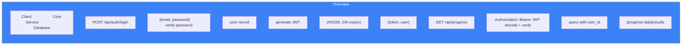

# Page 12: Core Service Routes & Authentication

---

## 12.1 Route Architecture

The Core Service registers **29 Flask Blueprints**, each handling a specific domain. All routes are prefixed with `/api/` and use JWT authentication for protected endpoints.

---

## 12.2 Complete Route Inventory

### Authentication & Users

| Blueprint | Prefix | File | Key Endpoints |
|-----------|--------|------|---------------|
| `auth_bp` | `/api/auth` | `routes/auth.py` | `POST /register`, `POST /login`, `POST /refresh`, `GET /me` |
| `users_bp` | `/api/users` | `routes/users.py` | `GET /`, `GET /:id`, `PUT /:id`, `DELETE /:id` |
| `admin_bp` | `/api/admin` | `routes/admin.py` | `GET /users`, `PUT /role/:id`, `GET /stats` |

### Classroom Management

| Blueprint | Prefix | File | Key Endpoints |
|-----------|--------|------|---------------|
| `classroom_bp` | `/api/classrooms` | `routes/classroom.py` | `POST /`, `POST /join`, `GET /:id`, `POST /:id/syllabus`, `GET /:id/students` |
| `teacher_bp` | `/api/teacher` | `routes/teacher.py` | `GET /classrooms`, `POST /classrooms`, `GET /dashboard` |
| `students_bp` | `/api/students` | `routes/students.py` | `GET /classrooms`, `GET /progress`, `GET /dashboard` |

### Learning & Curriculum

| Blueprint | Prefix | File | Key Endpoints |
|-----------|--------|------|---------------|
| `curriculum_bp` | `/api/curriculum` | `routes/curriculum.py` | `POST /generate`, `GET /:id`, `PUT /progress`, `GET /schedule` |
| `topics_bp` | `/api/topics` | `routes/topics.py` | `GET /classroom/:id`, `POST /`, `PUT /:id`, `DELETE /:id` |
| `progress_bp` | `/api/progress` | `routes/progress.py` | `GET /`, `POST /update`, `GET /summary` |
| `revision_bp` | `/api/revision` | `routes/revision.py` | `GET /calendar`, `GET /today`, `POST /complete` |
| `question_progress_bp` | `/api/question-progress` | `routes/question_progress.py` | `GET /:topic_id`, `POST /submit`, `GET /analytics` |

### Assessments & Evaluation

| Blueprint | Prefix | File | Key Endpoints |
|-----------|--------|------|---------------|
| `assessments_bp` | `/api/assessments` | `routes/assessments.py` | `POST /generate`, `POST /submit`, `GET /`, `GET /:id/results` |
| `evaluation_bp` | `/api/evaluation` | `routes/evaluation.py` | `POST /exam`, `GET /sessions`, `GET /results/:id` |
| `interview_questions_bp` | `/api/interview` | `routes/interview_questions.py` | `POST /generate`, `POST /evaluate`, `GET /sessions` |
| `leaderboard_bp` | `/api/leaderboard` | `routes/leaderboard.py` | `GET /`, `GET /classroom/:id`, `GET /me` |

### Content & Materials

| Blueprint | Prefix | File | Key Endpoints |
|-----------|--------|------|---------------|
| `files_bp` | `/api/files` | `routes/files.py` | `POST /upload`, `GET /:id`, `DELETE /:id` |
| `notes_bp` | `/api/notes` | `routes/notes.py` | `POST /digitize`, `GET /`, `GET /:id`, `DELETE /:id` |
| `web_resources_bp` | `/api/web-resources` | `routes/web_resources.py` | `GET /`, `POST /save`, `DELETE /:id` |

### Communication

| Blueprint | Prefix | File | Key Endpoints |
|-----------|--------|------|---------------|
| `chat_bp` | `/api/chat` | `routes/chat.py` | `POST /`, `GET /history`, `GET /conversations` |
| `notifications_bp` | `/api/notifications` | `routes/notifications.py` | `GET /`, `PUT /read/:id`, `GET /unread-count` |
| `feedback_bp` | `/api/feedback` | `routes/feedback.py` | `POST /`, `GET /agent/:id`, `GET /metrics` |

### Assignments & Grading

| Blueprint | Prefix | File | Key Endpoints |
|-----------|--------|------|---------------|
| `assignment_bp` | `/api/assignments` | `routes/assignment.py` | `POST /`, `GET /:id`, `POST /:id/submit`, `POST /:id/grade` |
| `grading_bp` | `/api/grading` | `routes/grading_callback.py` | `POST /callback` (webhook from AI service) |

### Meetings & Recordings

| Blueprint | Prefix | File | Key Endpoints |
|-----------|--------|------|---------------|
| `meetings_bp` | `/api/meetings` | `routes/meetings.py` | `POST /`, `POST /start/:id`, `POST /end/:id`, `GET /` |
| `recordings_bp` | `/api/recordings` | `routes/recordings.py` | `POST /upload`, `GET /`, `GET /:id` |

### Teacher Assistant & Interact

| Blueprint | Prefix | File | Key Endpoints |
|-----------|--------|------|---------------|
| `teacher_assistant_bp` | `/api/teacher-assistant` | `routes/teacher_assistant.py` | `POST /ask`, `GET /insights`, `POST /generate-quiz` |
| `interact_bp` | `/api/interact` | `routes/interact.py` | `POST /start`, `POST /respond`, `GET /sessions` |

---

## 12.3 Authentication System

### JWT Token Flow



### JWT Payload

```python
payload = {
    "user_id": user.id,        # UUID string
    "username": user.username,
    "role": user.role,         # "student", "teacher", "parent", "admin"
    "exp": datetime.utcnow() + timedelta(hours=24)
}
token = jwt.encode(payload, app.config['SECRET_KEY'], algorithm='HS256')
```

### `token_required` Decorator

```python
def token_required(f):
    @wraps(f)
    def decorated(*args, **kwargs):
        token = request.headers.get('Authorization', '').replace('Bearer ', '')
        if not token:
            return jsonify({"error": "Token missing"}), 401
        try:
            data = jwt.decode(token, current_app.config['SECRET_KEY'], algorithms=['HS256'])
            current_user = User.query.get(data['user_id'])
            if not current_user:
                return jsonify({"error": "User not found"}), 401
        except jwt.ExpiredSignatureError:
            return jsonify({"error": "Token expired"}), 401
        except jwt.InvalidTokenError:
            return jsonify({"error": "Invalid token"}), 401
        return f(current_user, *args, **kwargs)
    return decorated
```

### Role-Based Access

```python
def role_required(*roles):
    """Restrict access to specific roles"""
    def decorator(f):
        @wraps(f)
        @token_required
        def decorated(current_user, *args, **kwargs):
            if current_user.role not in roles:
                return jsonify({"error": "Insufficient permissions"}), 403
            return f(current_user, *args, **kwargs)
        return decorated
    return decorator

# Usage:
@teacher_bp.route('/classrooms', methods=['POST'])
@role_required('teacher', 'admin')
def create_classroom(current_user):
    ...
```

---

## 12.4 File Upload System

### Upload Flow

```python
@files_bp.route('/upload', methods=['POST'])
@token_required
def upload_file(current_user):
    file = request.files.get('file')
    classroom_id = request.form.get('classroom_id')
    
    # Generate unique filename
    filename = f"{uuid4()}_{secure_filename(file.filename)}"
    
    # Save to local storage (MinIO in production)
    upload_dir = os.path.join(app.config['UPLOAD_FOLDER'], classroom_id)
    os.makedirs(upload_dir, exist_ok=True)
    filepath = os.path.join(upload_dir, filename)
    file.save(filepath)
    
    # Create ClassroomMaterial record
    material = ClassroomMaterial(
        classroom_id=classroom_id,
        name=file.filename,
        file_url=f"/uploads/{classroom_id}/{filename}",
        file_type=file.content_type,
        file_size=os.path.getsize(filepath),
        uploaded_by=current_user.id,
        indexing_status='pending'  # Triggers async RAG indexing
    )
    db.session.add(material)
    db.session.commit()
    
    # Trigger async document processing via AI service
    trigger_document_indexing(material)
    
    return jsonify(material.to_dict()), 201
```

### Supported Upload Types

| Type | Max Size | Trigger | Processing |
|------|----------|---------|------------|
| PDF | 500 MB | Auto-index | Document Agent → Qdrant |
| DOCX | 500 MB | Auto-index | Text extraction → Qdrant |
| PPTX | 500 MB | Auto-index | Slide extraction → Qdrant |
| PNG/JPG | 100 MB | Auto-index | OCR → Qdrant |
| Syllabus PDF | 500 MB | Topic extraction | Syllabus Extractor → Topics |

---

## 12.5 Inter-Service Communication

### Core → AI Service (HTTP)

```python
AI_SERVICE_URL = os.getenv('AI_SERVICE_URL', 'http://ai-service:8001')

async def trigger_document_indexing(material):
    """Trigger async document processing"""
    async with httpx.AsyncClient() as client:
        await client.post(f"{AI_SERVICE_URL}/api/index/document", json={
            "document_id": material.id,
            "classroom_id": material.classroom_id,
            "file_url": material.file_url,
            "file_type": material.file_type,
            "student_id": material.uploaded_by
        })
```

### AI Service → Core Service (Callbacks)

```python
@grading_bp.route('/callback', methods=['POST'])
def grading_callback():
    """Receive grading results from AI service"""
    data = request.json
    assignment_id = data['assignment_id']
    submission_id = data['submission_id']
    
    submission = Submission.query.get(submission_id)
    submission.grade = data['grade']
    submission.feedback = data['feedback']
    submission.graded_at = datetime.utcnow()
    db.session.commit()
    
    return jsonify({"status": "ok"})
```
