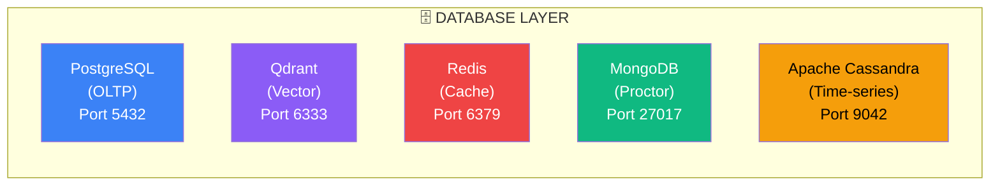

# Page 14: Database Architecture

---

## 14.1 Overview

ensureStudy uses a **polyglot persistence** strategy with 5 database technologies, each chosen for specific workload characteristics:



---

## 14.2 PostgreSQL — Primary Relational Store

### Configuration

```python
# docker-compose.yml
postgres:
  image: postgres:15
  environment:
    POSTGRES_DB: ensure_study
    POSTGRES_USER: ensure_study_user
    POSTGRES_PASSWORD: secure_password_123
  ports:
    - "5432:5432"
  volumes:
    - postgres_data:/var/lib/postgresql/data
```

### Schema Statistics

| Metric | Count |
|--------|-------|
| Total tables | 40+ |
| Model files | 20 |
| Foreign keys | 30+ |
| Unique constraints | 8 |
| Composite indexes | 13 |
| JSON columns | 12 |

### Table Groups

| Group | Tables | Purpose |
|-------|--------|---------|
| **Identity** | users, organizations, student_profiles, parent_student_links | User management, multi-tenancy |
| **Classroom** | classrooms, student_classrooms, classroom_materials, chapters | Google Classroom-style hierarchy |
| **Curriculum** | subjects, topics, subtopics, syllabi, classroom_topics | Learning hierarchies |
| **Assessment** | assessments, assessment_results, assessment_challenges, subtopic_assessments | Quizzes, grades, peer challenges |
| **Questions** | question_banks, questions, topic_questions, student_question_responses | Question pool and analytics |
| **Progress** | progress, student_subtopic_progress, student_topic_scores, study_schedule_entries | Mastery tracking, scheduling |
| **AI Learning** | learning_agent_memory, question_effectiveness | Type 5 agent persistence |
| **Chat** | chat_sessions, chat_conversations, chat_messages, chat_sources | Tutor conversations with citations |
| **Notes** | study_notes, note_processing_jobs, digitized_note_pages, note_embeddings | Note digitization pipeline |
| **Meetings** | meetings, meeting_participants, meeting_recordings | Video conferencing |
| **Assignments** | assignments, assignment_attachments, submissions, submission_files | Teacher assignments |
| **System** | moderation_logs, notifications, leaderboard, agent_interactions, feedback | Platform operations |

### Migration Strategy

```bash
# Flask-Migrate (Alembic under the hood)
flask db init        # Initialize migrations
flask db migrate     # Auto-generate migration
flask db upgrade     # Apply migrations
flask db downgrade   # Rollback
```

**Current approach**: `db.create_all()` on startup (auto-creates missing tables). Flask-Migrate configured for production migrations.

---

## 14.3 Qdrant — Vector Database

### Configuration

```python
# docker-compose.yml
qdrant:
  image: qdrant/qdrant:latest
  ports:
    - "6333:6333"    # REST API
    - "6334:6334"    # gRPC
  volumes:
    - qdrant_data:/qdrant/storage
```

### Collections

| Collection | Vector Size | Distance | Purpose |
|------------|-------------|----------|---------|
| `classroom_materials` | 768 | Cosine | Document chunks from uploaded materials |
| `web_content` | 768 | Cosine | Web-crawled and research content |
| `note_embeddings` | 768 | Cosine | Digitized note text embeddings |
| Dynamic per-classroom | 768 | Cosine | Classroom-specific collections |

### Payload Schema

Every Qdrant point carries metadata:

```json
{
    "text": "Newton's Third Law states...",
    "document_id": "doc_abc123",
    "classroom_id": "class_xyz789",
    "student_id": "user_001",
    "page_number": 15,
    "chunk_index": 42,
    "section_heading": "Newton's Laws of Motion",
    "source_type": "teacher_material",
    "file_type": "pdf",
    "subject": "Physics",
    "contains_formula": true,
    "source_confidence": 0.95,
    "processed_at": "2026-02-20T10:00:00Z"
}
```

### Filtering in RAG Queries

```python
# Smart retrieval with filters
results = await qdrant.search(
    collection="classroom_materials",
    query_vector=query_embedding,
    limit=10,
    query_filter=Filter(
        must=[
            FieldCondition(key="classroom_id", match=MatchValue(value=classroom_id)),
        ],
        should=[
            FieldCondition(key="subject", match=MatchValue(value=detected_subject)),
        ]
    )
)
```

### Embedding Model

| Property | Value |
|----------|-------|
| Model | `sentence-transformers/all-mpnet-base-v2` |
| Vector dimensions | 768 |
| Max sequence length | 384 tokens |
| Normalization | L2 normalized |
| Batch size | 32 |

---

## 14.4 Redis — Caching & Sessions

### Configuration

```python
# docker-compose.yml
redis:
  image: redis:7-alpine
  ports:
    - "6379:6379"
  command: redis-server --maxmemory 256mb --maxmemory-policy allkeys-lru
```

### Cache Usage Patterns

| Cache Key Pattern | TTL | Purpose |
|-------------------|-----|---------|
| `web_resources:{query_hash}` | 24h | Web enrichment results |
| `response_cache:{query_hash}` | 1h | LLM response caching |
| `embedding:{text_hash}` | 7d | Embedding vector caching |
| `session:{session_id}` | 2h | Tutor session state (TAL levels) |
| `rate_limit:{user_id}` | 1min | API rate limiting |
| `topic_extract:{doc_hash}` | 24h | Extracted topics caching |

### Redis Services

| Service | File | Lines | Purpose |
|---------|------|-------|---------|
| `response_cache.py` | `services/response_cache.py` | ~200 | LLM response deduplication |
| `web_cache_service.py` | `services/web_cache_service.py` | 14,055 bytes | Web content caching |
| `session_manager.py` | `services/session_manager.py` | ~150 | TAL/ABCR session state |

---

## 14.5 MongoDB — Proctoring Data

### Configuration

```python
# docker-compose.yml
mongodb:
  image: mongo:7
  ports:
    - "27017:27017"
  environment:
    MONGO_INITDB_ROOT_USERNAME: admin
    MONGO_INITDB_ROOT_PASSWORD: password
  volumes:
    - mongo_data:/data/db
```

### Collections

| Collection | Document Shape | Purpose |
|------------|---------------|---------|
| `proctoring_sessions` | Session metadata, start/end times, final score | Proctoring session tracking |
| `proctoring_frames` | Frame analysis results (per-frame detections) | Individual frame data |
| `proctoring_violations` | Violation type, timestamp, confidence, evidence | Detected violations |
| `proctoring_scores` | Per-category scores, weighted final score | Scoring breakdown |

### Why MongoDB?

1. **Schema flexibility**: Detector outputs vary (face detection has bounding boxes, audio has frequencies)
2. **High write throughput**: 1 frame/second per student → 60 writes/minute per session
3. **Document nesting**: Natural fit for nested detector results
4. **TTL indexes**: Auto-expire frame data after 30 days

---

## 14.6 Apache Cassandra — Time-Series Analytics

### Configuration

```python
# docker-compose.yml
cassandra:
  image: cassandra:4.1
  ports:
    - "9042:9042"
  environment:
    CASSANDRA_CLUSTER_NAME: ensure-study
  volumes:
    - cassandra_data:/var/lib/cassandra
```

### Keyspace & Tables

```sql
CREATE KEYSPACE ensure_study WITH replication = {
    'class': 'SimpleStrategy',
    'replication_factor': 1
};

-- Time-series: student activity events
CREATE TABLE student_activity (
    student_id UUID,
    timestamp TIMESTAMP,
    event_type TEXT,
    subject TEXT,
    duration_seconds INT,
    metadata MAP<TEXT, TEXT>,
    PRIMARY KEY ((student_id), timestamp)
) WITH CLUSTERING ORDER BY (timestamp DESC);

-- Analytics: daily aggregated metrics
CREATE TABLE daily_metrics (
    date DATE,
    metric_name TEXT,
    value DOUBLE,
    dimensions MAP<TEXT, TEXT>,
    PRIMARY KEY ((date), metric_name)
);
```

### Why Cassandra?

1. **Write-optimized**: Handles high-frequency activity events
2. **Time-series native**: Efficient range queries on timestamps
3. **Partitioning**: Student-based partitioning for even distribution
4. **Compaction**: Time-window compaction for analytics data

---

## 14.7 Database Selection Matrix

| Use Case | Database | Justification |
|----------|----------|---------------|
| User profiles, classrooms | PostgreSQL | Relational integrity, JOINs |
| Assessment responses | PostgreSQL | ACID transactions |
| Document vectors | Qdrant | ANN search, filters |
| Web search cache | Redis | Sub-ms access, TTL expiry |
| Session state | Redis | Ephemeral, fast access |
| Proctoring frames | MongoDB | Flexible schema, high writes |
| Activity time-series | Cassandra | Write throughput, range scans |
| Agent learning memory | PostgreSQL | Durable, relational links |

---

## 14.8 Docker Volume Strategy

```yaml
volumes:
  postgres_data:    # Persistent — user data, assessments
  qdrant_data:      # Persistent — embeddings, re-indexable
  redis_data:       # Semi-persistent — cache, rebuilt on loss
  mongo_data:       # Persistent — proctoring evidence
  cassandra_data:   # Persistent — analytics history
  upload_data:      # Persistent — uploaded files (PDFs, images)
```
