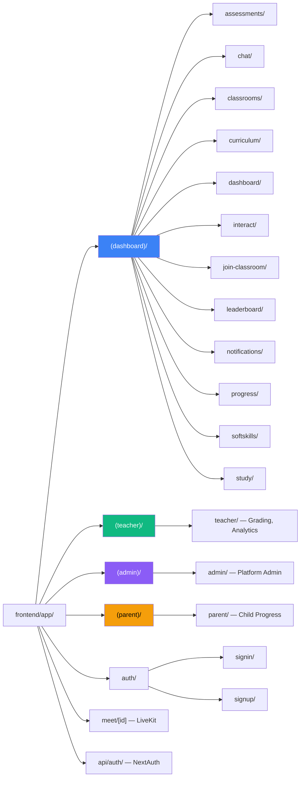
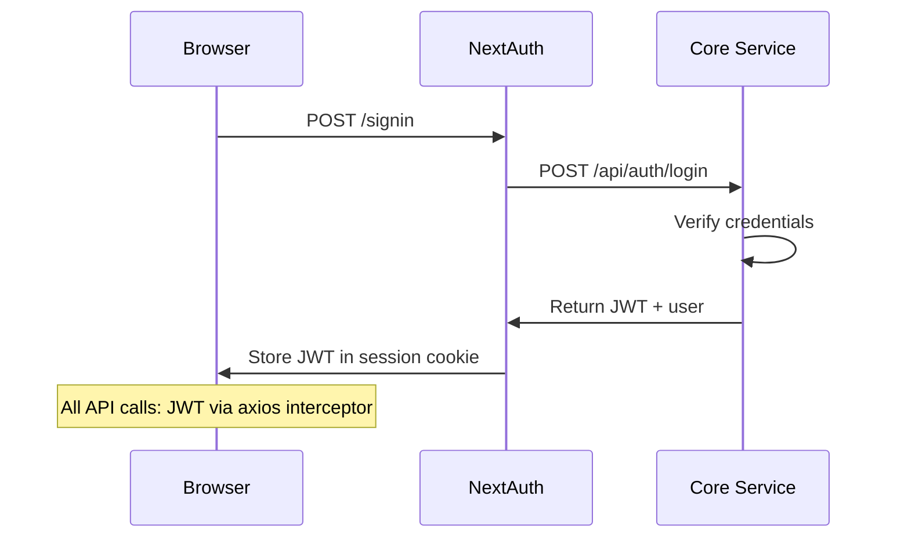

# Page 15: Frontend Architecture (Next.js 14)

---

## 15.1 Overview

The ensureStudy frontend is a **Next.js 14 App Router** application built with TypeScript, TailwindCSS, and Zustand for state management. It provides role-based dashboards for students, teachers, parents, and admins, with real-time features powered by SSE and LiveKit.

### Source: `frontend/`

| Metric | Value |
|--------|-------|
| Framework | Next.js 14.0.4 (App Router) |
| Language | TypeScript 5.3 |
| Styling | TailwindCSS 3.4 |
| State | Zustand 4.4 |
| Auth | NextAuth.js 4.24 (Credentials provider) |
| Icons | Heroicons 2.1 |
| Charts | Recharts 2.10 |
| 3D | Three.js 0.160 / React Three Fiber |
| Video | LiveKit 2.9 |
| Markdown | react-markdown + remark-gfm + rehype-katex |
| PDF | react-pdf 10.2 |

---

## 15.2 App Router Structure

### Route Groups (Layout-Based)



---

## 15.3 Dashboard Layout

### Source: `frontend/app/(dashboard)/layout.tsx` (225 lines)

The student dashboard layout provides a persistent sidebar with navigation:

```typescript
const navigation = [
    { name: 'Dashboard', href: '/dashboard', icon: HomeIcon },
    { name: 'Chat', href: '/chat', icon: ChatBubbleLeftRightIcon },
    { name: 'Classrooms', href: '/classrooms', icon: AcademicCapIcon },
    { name: 'Assessments', href: '/assessments', icon: ClipboardDocumentListIcon },
    { name: 'Progress', href: '/progress', icon: ChartBarIcon },
    { name: 'Leaderboard', href: '/leaderboard', icon: TrophyIcon },
]
```

**Features**:
- Session-aware (redirects if not authenticated)
- Responsive (mobile hamburger menu)
- Role-based navigation items
- Active route highlighting
- Sign-out functionality

---

## 15.4 Component Library (53 Components)

### Top-Level Components

| Component | File | Purpose |
|-----------|------|---------|
| `Providers.tsx` | Auth + toast providers wrapper | `SessionProvider` + `Toaster` |
| `NotificationBell.tsx` | Header notification bell | Real-time unread count |
| `NotificationProvider.tsx` | Notification context | Polling for new notifications |
| `LatexRenderer.tsx` | KaTeX math rendering | Inline and block LaTeX |
| `PDFViewer.tsx` | PDF document viewer | react-pdf based |
| `PDFViewerWithHighlight.tsx` | PDF with highlight support | Search term highlighting |
| `PptxToPdfViewer.tsx` | PPTX preview as PDF | Server-side conversion |
| `ImageViewer.tsx` | Image viewer modal | Zoom, pan, download |
| `DocumentContextPanel.tsx` | Document context sidebar | RAG source citations |
| `DocumentSidebar.tsx` | Document navigation | File tree, search |
| `SessionDecisionBadge.tsx` | Study session badge | Active session indicator |

### Assessment Components (`assessments/`)

| Component | Purpose |
|-----------|---------|
| `QuestionCard.tsx` | MCQ / descriptive question display |
| `QuestionNavigator.tsx` | Question navigation sidebar |
| `AssessmentTimer.tsx` | Countdown timer for timed assessments |
| `CreateAssessmentModal.tsx` | Teacher creates new assessment |
| `DailyRevisionBanner.tsx` | Spaced repetition reminder |
| `LearningAgentStatus.tsx` | Shows Type 5 agent status |
| `ChallengeModal.tsx` | Peer challenge creation |
| `ReceivedChallenges.tsx` | Incoming challenge notifications |
| `TopicProgressBar.tsx` | Topic mastery visualization |

### Chat Components (`chat/`)

| Component | Purpose |
|-----------|---------|
| `MarkdownRenderer.tsx` | Rich markdown with LaTeX, code highlighting, mermaid |

### Curriculum Components (`curriculum/`)

| Component | Purpose |
|-----------|---------|
| `RevisionCalendar.tsx` | Spaced repetition calendar view |
| `StudyCalendar.tsx` | Drag-and-drop study scheduler |
| `WeeklyCalendar.tsx` | Weekly study plan view |
| `SyllabusUploadModal.tsx` | Upload syllabus for extraction |
| `TopicsSidebar.tsx` | Topic hierarchy navigation |
| `ProgressDashboard.tsx` | Overall progress visualization |
| `ClassroomTopicHierarchy.tsx` | Chapter → Topic tree view |
| `ExamPrepModal.tsx` | Exam-focused study mode |
| `LearningStyleQuiz.tsx` | Student learning preferences |

### Avatar Components (`avatar/`)

| Component | Purpose |
|-----------|---------|
| `TalkingHeadAvatar.tsx` | 3D talking head (Three.js) |
| `RealisticAvatar.tsx` | Realistic avatar rendering |
| `Avatar3D.tsx` | Base 3D avatar component |
| `AvatarViewer.tsx` | Avatar display container |
| `SpeechEngine.tsx` | TTS speech with lip-sync |
| `VisemeSpeechEngine.tsx` | AWS Polly viseme-based speech |
| `useTalkingHead.ts` | Custom hook for avatar control |

### Meeting Components (`meeting/`)

| Component | Purpose |
|-----------|---------|
| `MeetingCanvas.tsx` | LiveKit video conference |
| `MeetingPlayer.tsx` | Recording playback |
| `EnhancedSessionPlayer.tsx` | Advanced session replay |
| `MeetingQA.tsx` | Q&A during/after meetings |
| `RecordingControls.tsx` | Record/pause/stop controls |
| `RecordingsList.tsx` | Meeting recordings list |

### Soft Skills Components (`softskills/`)

| Component | Purpose |
|-----------|---------|
| `GazeIndicator.tsx` | Eye contact tracking display |
| `PostureSkeleton.tsx` | Posture analysis overlay |

### Classroom Components (`classroom/`)

| Component | Purpose |
|-----------|---------|
| `TeacherSyllabusModal.tsx` | Teacher uploads syllabus |
| `TeacherTopicManager.tsx` | Teacher manages topics |
| `StudentTopicsViewer.tsx` | Student views topic hierarchy |

---

## 15.5 Authentication (NextAuth.js)

### Configuration

```typescript
// app/api/auth/[...nextauth]/route.ts
export const authOptions: AuthOptions = {
    providers: [
        CredentialsProvider({
            name: "Credentials",
            credentials: {
                email: { label: "Email", type: "email" },
                password: { label: "Password", type: "password" }
            },
            async authorize(credentials) {
                const res = await fetch(`${CORE_API}/api/auth/login`, {
                    method: 'POST',
                    headers: { 'Content-Type': 'application/json' },
                    body: JSON.stringify(credentials)
                })
                const data = await res.json()
                if (res.ok && data.token) {
                    return { ...data.user, token: data.token }
                }
                return null
            }
        })
    ],
    callbacks: {
        async jwt({ token, user }) {
            if (user) { token.accessToken = user.token; token.role = user.role }
            return token
        },
        async session({ session, token }) {
            session.accessToken = token.accessToken
            session.user.role = token.role
            return session
        }
    },
    pages: { signIn: '/auth/signin' }
}
```

### Auth Flow



---

## 15.6 State Management (Zustand)

```typescript
// Zustand store pattern used across the app
import { create } from 'zustand'

interface ChatStore {
    messages: Message[]
    isStreaming: boolean
    sessionId: string | null
    addMessage: (msg: Message) => void
    setStreaming: (v: boolean) => void
    clearMessages: () => void
}

const useChatStore = create<ChatStore>((set) => ({
    messages: [],
    isStreaming: false,
    sessionId: null,
    addMessage: (msg) => set((s) => ({ messages: [...s.messages, msg] })),
    setStreaming: (v) => set({ isStreaming: v }),
    clearMessages: () => set({ messages: [], sessionId: null })
}))
```

---

## 15.7 Key Frontend Dependencies

| Package | Version | Purpose |
|---------|---------|---------|
| `next` | 14.0.4 | Framework |
| `next-auth` | 4.24.5 | Authentication |
| `zustand` | 4.4.7 | State management |
| `axios` | 1.6.2 | HTTP client |
| `tailwindcss` | 3.4.0 | Utility CSS |
| `@heroicons/react` | 2.1.1 | Icon library |
| `recharts` | 2.10.3 | Charts and graphs |
| `react-markdown` | 9.1.0 | Markdown rendering |
| `remark-gfm` | 4.0.1 | GitHub-flavored markdown |
| `remark-math` + `rehype-katex` | 6.0/7.0 | LaTeX math rendering |
| `highlight.js` | 11.9.0 | Code syntax highlighting |
| `mermaid` | 11.12.2 | Diagram rendering |
| `react-pdf` | 10.2.0 | PDF viewer |
| `katex` | 0.16.27 | Math typesetting |
| `three` | 0.160.1 | 3D rendering |
| `@react-three/fiber` | 8.15.12 | React Three.js bindings |
| `@react-three/drei` | 9.92.7 | Three.js helpers |
| `@met4citizen/talkinghead` | 1.7.0 | 3D talking head avatar |
| `livekit-client` | 2.17.0 | Video conferencing |
| `@livekit/components-react` | 2.9.19 | LiveKit React components |
| `date-fns` | 3.0.6 | Date utilities |
| `clsx` | 2.0.0 | Conditional classnames |
| `react-hot-toast` | 2.4.1 | Toast notifications |
