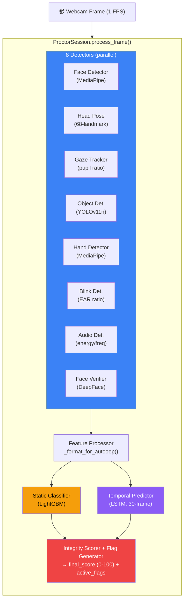

# Page 16: Proctoring System — Detectors, Scoring & ML Models

---

## 16.1 Overview

The proctoring system provides **real-time exam integrity monitoring** using computer vision, audio analysis, and machine learning. It processes webcam frames at ~1 FPS, runs 8 independent detectors, aggregates results through static (LightGBM) and temporal (LSTM) classifiers, and produces a final integrity score.

### Source: `backend/ai-service/app/proctor/` (34 files)

---

## 16.2 Architecture



---

## 16.3 Detectors (8 Total)

### Detector Inventory

| Detector | File | Technology | Output |
|----------|------|-----------|--------|
| **FaceDetector** | `detectors/face_detector.py` | MediaPipe Face Detection | face_present, face_count, bounding_box |
| **HeadPoseEstimator** | `detectors/head_pose.py` | dlib 68-landmark + solvePnP | yaw, pitch, roll angles |
| **GazeTracker** | `detectors/gaze_tracker.py` | Pupil-iris ratio analysis | direction (center/left/right/up/down) |
| **ProhibitedObjectDetector** | `detectors/object_detector.py` | YOLOv11n (custom trained) | phone, book, earphone, second_screen |
| **HandDetector** | `detectors/hand_detector.py` | MediaPipe Hands | hand_visible, hand_count, near_face |
| **AudioDetector** | `detectors/audio_detector.py` | Energy + frequency analysis | noise_level, speech_detected, multiple_voices |
| **BlinkDetector** | `detectors/blink_detector.py` | Eye Aspect Ratio (EAR) | blink_rate, prolonged_closure |
| **FaceVerifier** | `detectors/face_verifier.py` | DeepFace | identity_match, confidence |

### Lazy Loading Pattern

All detectors use `@property` lazy loading to avoid loading ML models until needed:

```python
@property
def face_detector(self):
    if self._face_detector is None:
        self._face_detector = FaceDetector()
    return self._face_detector
```

### Key Detector Details

**Object Detector (YOLOv11n)**:
- Custom-trained model: `models/weights/OEP_YOLOv11n.pt`
- Prohibited items: phone, book, earphone, second screen, another person
- Confidence threshold: 0.5

**Head Pose Estimator**:
- Uses dlib's 68 face landmarks + OpenCV `solvePnP`
- Suspicious thresholds: |yaw| > 30°, |pitch| > 25°
- Shape predictor: `models/weights/shape_predictor_68_face_landmarks.dat`

**Gaze Tracker**:
- Calculates pupil-to-iris center ratio
- Directions: center, left, right, up, down
- Numeric encoding: center=0, left=1, right=2, up=3, down=4

---

## 16.4 ML Models

### Static Classifier (LightGBM)

```
Input:  Per-frame feature vector (face, gaze, head pose, objects, hands)
Output: Binary classification — cheating / not cheating
Model:  models/weights/lightgbm_cheating_model_20250818_132555.pkl
Scaler: models/weights/scaler_20250818_132555.pkl
```

### Temporal Predictor (LSTM)

```
Input:  Sequence of 30 frames of features (sliding window)
Output: Cheating probability (0-1)
Model:  models/weights/temporal_proctor_trained_on_processed.pt
```

The temporal predictor captures **behavioral patterns over time** — a student briefly looking away is fine, but sustained off-screen gaze combined with hand movement triggers higher confidence.

---

## 16.5 Scoring System

### IntegrityScorer

Source: `proctor/scoring/integrity_scorer.py`

Computes a **0-100 integrity score** from aggregated detections:

| Category | Weight | Metrics |
|----------|--------|---------|
| Face presence | 25% | face_visible_ratio, face_count_anomalies |
| Gaze behavior | 20% | off_screen_ratio, gaze_direction_shifts |
| Head pose | 15% | suspicious_angle_ratio, sudden_movements |
| Object detection | 20% | prohibited_items_count, phone_detection_time |
| Audio behavior | 10% | speech_segments, multiple_voices |
| Identity | 10% | face_match_confidence |

### FlagGenerator

Source: `proctor/scoring/flag_generator.py`

Generates human-readable flags for review:

| Flag | Trigger Condition |
|------|------------------|
| `NO_FACE_DETECTED` | Face absent > 10 seconds |
| `MULTIPLE_FACES` | > 1 face detected |
| `SUSPICIOUS_GAZE` | Off-center gaze > 30% of time |
| `HEAD_TURNED` | Head yaw > 30° sustained |
| `PHONE_DETECTED` | Phone visible in frame |
| `PROHIBITED_OBJECT` | Book, earphone, or second screen |
| `IDENTITY_MISMATCH` | Face verification < 0.6 confidence |
| `AUDIO_ANOMALY` | Multiple voices or sustained speech |
| `TAB_SWITCH` | Browser tab/window change |
| `PROLONGED_ABSENCE` | Face absent > 30 seconds |

### CheatScore

Source: `proctor/scoring/cheat_score.py`

Final cheat score combining static + temporal predictions:
```python
final_score = 0.4 * static_prediction + 0.6 * temporal_prediction
```

---

## 16.6 Session Lifecycle

```python
# 1. Start session
session = ProctorSession(assessment_id="asmt_123", student_id="user_456")

# 2. Process frames (called at ~1 FPS from frontend)
result = session.process_frame(frame=cv2_image, timestamp=elapsed_seconds)
# Returns: {current_score: 87, active_flags: ["SUSPICIOUS_GAZE"], detections: {...}}

# 3. Tab switch events (from browser visibility API)
session.add_tab_switch()

# 4. Finalize session
final_results = session.finalize()
# Returns: {integrity_score: 82, flags: [...], frame_count: 1800, duration: 1800}
```

### Frame Processing Pipeline

```python
def process_frame(self, frame, timestamp=0.0):
    # 1. Check frame quality (blur, darkness)
    quality = check_frame_quality(frame)
    if not quality["acceptable"]:
        return {"current_score": self._get_current_score(), "quality_issue": True}
    
    # 2. Run all 8 detectors
    detections = self._run_detectors(frame)
    
    # 3. Format for AutoOEP models
    features = self._format_for_autooep(detections)
    
    # 4. Static classification (per-frame)
    static_pred = self.static_classifier.predict(features)
    
    # 5. Add to temporal buffer (30-frame window)
    self._feature_buffer.append(features)
    
    # 6. Temporal prediction (if buffer full)
    if len(self._feature_buffer) >= 30:
        temporal_pred = self.temporal_predictor.predict(list(self._feature_buffer))
    
    # 7. Update metrics aggregator
    self._metrics.update(detections, static_pred, temporal_pred)
    
    # 8. Generate flags
    flags = self._flag_generator.check(self._metrics)
    
    return {
        "current_score": self._get_current_score(),
        "active_flags": flags,
        "detections": detections
    }
```

---

## 16.7 Model Weights

| Model | File | Size | Training |
|-------|------|------|----------|
| YOLOv11n (objects) | `OEP_YOLOv11n.pt` | ~6 MB | Custom dataset |
| Face landmarks | `shape_predictor_68_face_landmarks.dat` | ~99 MB | dlib pre-trained |
| Face landmarker | `face_landmarker.task` | ~5 MB | MediaPipe |
| LightGBM (static) | `lightgbm_cheating_model_*.pkl` | ~500 KB | Custom proctoring data |
| Feature scaler | `scaler_*.pkl` | ~10 KB | Fitted on training data |
| LSTM (temporal) | `temporal_proctor_trained_on_processed.pt` | ~2 MB | 30-frame sequences |
