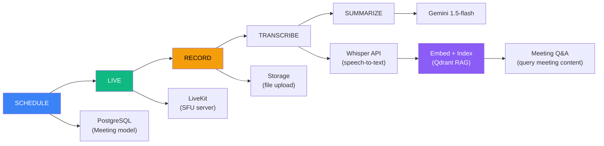
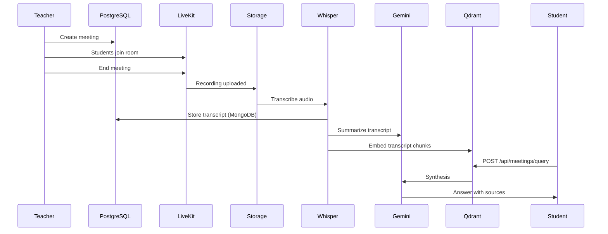

# Page 18: Meeting & Virtual Classroom System

---

## 18.1 Overview

The meeting system provides **live video conferencing** for virtual classrooms using LiveKit, with post-session capabilities including transcription (OpenAI Whisper), summarization (Google Gemini), and Q&A via RAG (Qdrant + Gemini).

---

## 18.2 Architecture



---

## 18.3 Data Models

### Source: `backend/core-service/app/models/meeting.py` (241 lines)

| Model | Key Fields | Purpose |
|-------|------------|---------|
| **Meeting** | classroom_id, host_id, title, status (scheduled/live/ended), start_time, end_time, jitsi_room_name, livekit_room | Meeting metadata |
| **MeetingParticipant** | meeting_id, user_id, role (host/participant), joined_at, left_at, duration_seconds | Attendance tracking |
| **MeetingRecording** | meeting_id, recording_url, duration_seconds, file_size, transcript_text, summary_brief | Recording + AI outputs |

### Helper Functions

```python
def create_meeting(classroom_id, host_id, title, **kwargs):
    """Create a new meeting and return it"""
    
def start_meeting(meeting_id):
    """Transition meeting status to 'live'"""
    
def end_meeting(meeting_id):
    """Transition meeting status to 'ended', calculate duration"""
```

---

## 18.4 LiveKit Integration

### Frontend: `frontend/components/meeting/MeetingCanvas.tsx`

The video conferencing uses **LiveKit** (open-source WebRTC SFU):

| Feature | Implementation |
|---------|----------------|
| Video rooms | LiveKit Cloud/self-hosted |
| Audio/video | WebRTC via `livekit-client` |
| UI components | `@livekit/components-react` |
| Screen sharing | Built-in LiveKit support |
| Recording | Server-side recording via LiveKit Egress |

### Dependencies

```json
"livekit-client": "^2.17.0",
"@livekit/components-react": "^2.9.19",
"@livekit/components-styles": "^1.2.0"
```

### Meeting Components

| Component | Purpose |
|-----------|---------|
| `MeetingCanvas.tsx` | Main video conference layout |
| `MeetingPlayer.tsx` | Recording playback |
| `EnhancedSessionPlayer.tsx` | Advanced replay with timeline |
| `MeetingQA.tsx` | Q&A during/after meetings |
| `RecordingControls.tsx` | Record/pause/stop buttons |
| `RecordingsList.tsx` | List all recordings |

---

## 18.5 Transcription Pipeline

### Source: `backend/ai-service/app/api/meetings.py` (397 lines)

```python
@router.post("/transcribe")
async def transcribe_recording(request: TranscribeRequest):
    # 1. Download recording from storage
    audio_path = await download_recording(request.recording_url)
    
    # 2. Transcribe with OpenAI Whisper API
    with open(audio_path, "rb") as audio_file:
        transcript = openai.audio.transcriptions.create(
            model="whisper-1",
            file=audio_file,
            response_format="verbose_json",
            timestamp_granularities=["segment"]
        )
    
    # 3. Store transcript in MongoDB
    mongo_db.transcripts.insert_one({
        "meeting_id": request.meeting_id,
        "transcript": transcript.text,
        "segments": transcript.segments,
        "language": transcript.language,
        "word_count": len(transcript.text.split())
    })
    
    # 4. Update MeetingRecording in PostgreSQL
    # (via callback to core service)
    
    return TranscribeResponse(
        meeting_id=request.meeting_id,
        transcript=transcript.text,
        segments=transcript.segments,
        language=transcript.language,
        word_count=len(transcript.text.split())
    )
```

---

## 18.6 Summarization (Gemini)

```python
@router.post("/summarize")
async def summarize_transcript(request: SummarizeRequest):
    prompt = f"""Summarize this meeting transcript:

{request.transcript}

Provide:
1. Brief summary (2-3 sentences)
2. Detailed summary (paragraph)
3. Key points (bullet list)
4. Topics discussed (list)
5. Action items (if any)

Return as JSON."""
    
    response = gemini_model.generate_content(prompt)
    parsed = json.loads(response.text)
    
    return SummarizeResponse(
        meeting_id=request.meeting_id,
        brief=parsed["brief"],
        detailed=parsed["detailed"],
        key_points=parsed["key_points"],
        topics_discussed=parsed["topics_discussed"],
        action_items=parsed.get("action_items", [])
    )
```

---

## 18.7 Meeting RAG (Q&A)

### Embedding Service

Source: `backend/ai-service/app/services/meeting_embedding_service.py`

Indexes meeting transcripts into Qdrant for later retrieval:
- Chunks transcript by segments (from Whisper timestamps)
- Embeds with `all-mpnet-base-v2`
- Stores with metadata: meeting_id, classroom_id, timestamp, speaker

### RAG Query

Source: `backend/ai-service/app/services/meeting_rag.py`

```python
@router.post("/query")
async def query_meeting_content(request: QueryRequest):
    # 1. Embed query
    query_embedding = embed(request.query)
    
    # 2. Search Qdrant (filtered by meeting_id or classroom_id)
    results = qdrant.search(
        collection="meeting_transcripts",
        query_vector=query_embedding,
        query_filter=Filter(must=[
            FieldCondition(key="classroom_id", match=MatchValue(value=request.classroom_id))
        ]),
        limit=request.max_results
    )
    
    # 3. Generate answer with Gemini
    context = "\n".join([r.payload["text"] for r in results])
    answer = gemini_model.generate_content(f"""
        Based on these meeting excerpts:
        {context}
        
        Answer: {request.query}
    """)
    
    return QueryResponse(
        query=request.query,
        answer=answer.text,
        sources=[{"text": r.payload["text"], "timestamp": r.payload["timestamp"]} for r in results],
        confidence=results[0].score if results else 0.0
    )
```

---

## 18.8 Meeting Flow Summary


