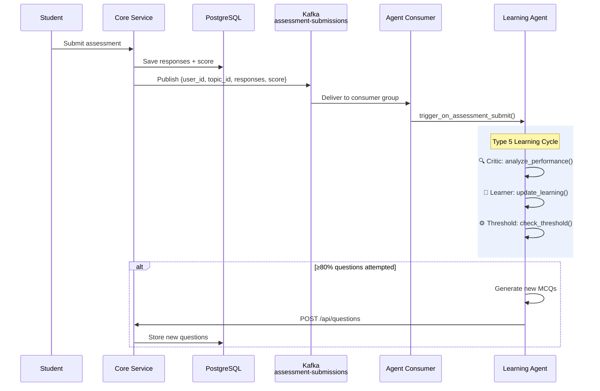
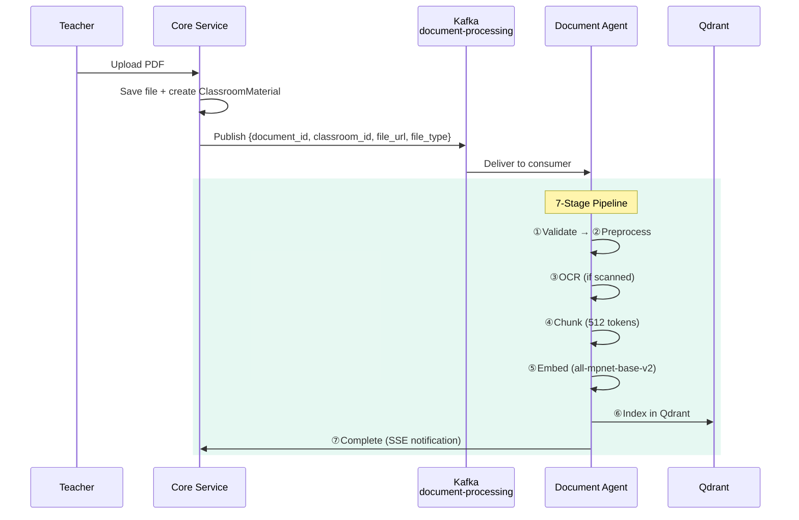
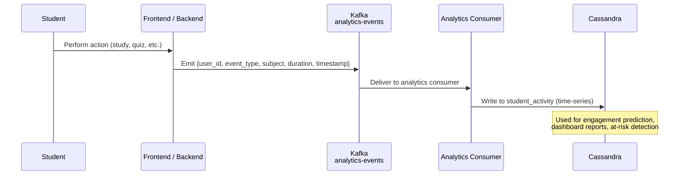

# Page 19: Kafka Event Streaming & Data Pipelines

---

## 19.1 Overview

ensureStudy uses **Apache Kafka** as its event streaming backbone to decouple real-time user actions from asynchronous processing. Events flow from the Core Service through Kafka to consumers that trigger AI agents, update analytics, and maintain system state.

### Source: `backend/kafka/config/kafka_config.py` (91 lines)

---

## 19.2 Kafka Configuration

```python
# Environment-driven configuration
KAFKA_BOOTSTRAP_SERVERS = "localhost:9092"     # Comma-separated
KAFKA_CLIENT_ID = "ensurestudy-client"
KAFKA_GROUP_ID = "ensurestudy-consumers"

# Producer settings
producer = KafkaProducer(
    bootstrap_servers=config["bootstrap_servers"],
    value_serializer=lambda v: json.dumps(v).encode("utf-8"),
    key_serializer=lambda k: k.encode("utf-8") if k else None,
    acks="all",                                # Wait for all replicas
    retries=3,                                 # Retry on failure
    max_in_flight_requests_per_connection=1     # Preserve ordering
)

# Consumer settings
consumer = KafkaConsumer(
    *topics,
    bootstrap_servers=config["bootstrap_servers"],
    group_id=config["group_id"],
    auto_offset_reset="earliest",
    enable_auto_commit=True,
    value_deserializer=lambda m: json.loads(m.decode("utf-8")),
    key_deserializer=lambda k: k.decode("utf-8") if k else None
)
```

---

## 19.3 Topic Inventory

```python
class Topics:
    STUDENT_EVENTS = "student-events"
    CHAT_MESSAGES = "chat-messages"
    ASSESSMENT_SUBMISSIONS = "assessment-submissions"
    MODERATION_EVENTS = "moderation-events"
    LEADERBOARD_UPDATES = "leaderboard-updates"
    PROGRESS_UPDATES = "progress-updates"
    ANALYTICS_EVENTS = "analytics-events"
    DOCUMENT_PROCESSING = "document-processing"
```

### Topic Details

| Topic | Partitions | Producer | Consumer | Event Shape |
|-------|-----------|----------|----------|-------------|
| `student-events` | 3 | Core Service | Analytics consumer | `{user_id, event_type, subject, timestamp, metadata}` |
| `chat-messages` | 3 | AI Service | Chat history consumer | `{session_id, user_id, message, response, tokens_used}` |
| `assessment-submissions` | 3 | Core Service | Learning Agent | `{user_id, assessment_id, topic_id, responses[], score}` |
| `moderation-events` | 3 | AI Service | Moderation log consumer | `{user_id, content, action, confidence, was_blocked}` |
| `leaderboard-updates` | 3 | Core Service | Leaderboard aggregator | `{user_id, classroom_id, score_delta, streak_update}` |
| `progress-updates` | 3 | Core Service | Progress aggregator | `{user_id, topic_id, score, mastery_level}` |
| `analytics-events` | 3 | All services | Cassandra writer | `{event_type, dimensions, value, timestamp}` |
| `document-processing` | 3 | Core Service | Document Agent | `{document_id, classroom_id, file_url, file_type}` |

### Topic Creation

```python
def create_topics(topics_config):
    admin_client = KafkaAdminClient(
        bootstrap_servers=config["bootstrap_servers"]
    )
    
    new_topics = [NewTopic(
        name=topic["name"],
        num_partitions=topic.get("partitions", 3),
        replication_factor=topic.get("replication_factor", 1)
    ) for topic in topics_config]
    
    admin_client.create_topics(new_topics=new_topics)
```

---

## 19.4 Event Flow Patterns

### Pattern 1: Assessment → Learning Agent (Async AI Trigger)



### Pattern 2: Document Upload → RAG Pipeline (Async Processing)



### Pattern 3: Student Activity → Analytics (Time-Series)



---

## 19.5 Kafka-Spark Streaming Pipeline

### Source: `backend/data-pipelines/streaming/kafka_spark_streaming.py`

For complex analytics, events are processed through Apache Spark Structured Streaming:

```python
# Read from Kafka
df = spark.readStream \
    .format("kafka") \
    .option("kafka.bootstrap.servers", "localhost:9092") \
    .option("subscribe", "analytics-events") \
    .load()

# Parse JSON events
parsed = df.select(
    from_json(col("value").cast("string"), schema).alias("data")
).select("data.*")

# Window aggregation (5-minute tumbling windows)
windowed = parsed \
    .withWatermark("timestamp", "1 minute") \
    .groupBy(
        window("timestamp", "5 minutes"),
        "event_type",
        "user_id"
    ).agg(
        count("*").alias("event_count"),
        avg("duration").alias("avg_duration")
    )

# Write to Cassandra
windowed.writeStream \
    .format("org.apache.spark.sql.cassandra") \
    .option("keyspace", "ensure_study") \
    .option("table", "daily_metrics") \
    .start()
```

---

## 19.6 Docker Deployment

```yaml
# docker-compose.yml
zookeeper:
  image: confluentinc/cp-zookeeper:7.5.0
  environment:
    ZOOKEEPER_CLIENT_PORT: 2181

kafka:
  image: confluentinc/cp-kafka:7.5.0
  depends_on:
    - zookeeper
  ports:
    - "9092:9092"
  environment:
    KAFKA_BROKER_ID: 1
    KAFKA_ZOOKEEPER_CONNECT: zookeeper:2181
    KAFKA_ADVERTISED_LISTENERS: PLAINTEXT://kafka:9092
    KAFKA_OFFSETS_TOPIC_REPLICATION_FACTOR: 1
```

---

## 19.7 Design Decisions

| Decision | Rationale |
|----------|-----------|
| `acks=all` | Ensures no event loss for assessment submissions |
| `max_in_flight=1` | Preserves ordering within partitions |
| `auto_offset_reset=earliest` | New consumers process historical events |
| `enable_auto_commit=True` | Simplified offset management |
| 3 partitions per topic | Balance between parallelism and resource usage |
| JSON serialization | Human-readable, schema-flexible |
| Replication factor 1 | Development setting; increase for production |
