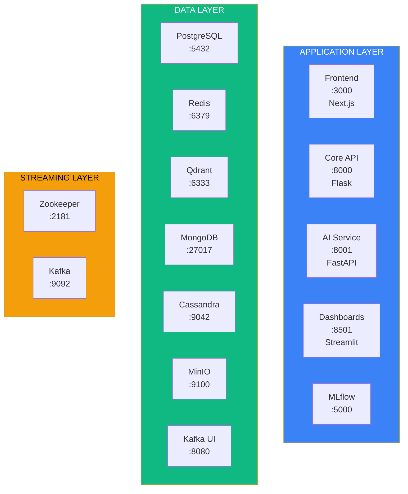
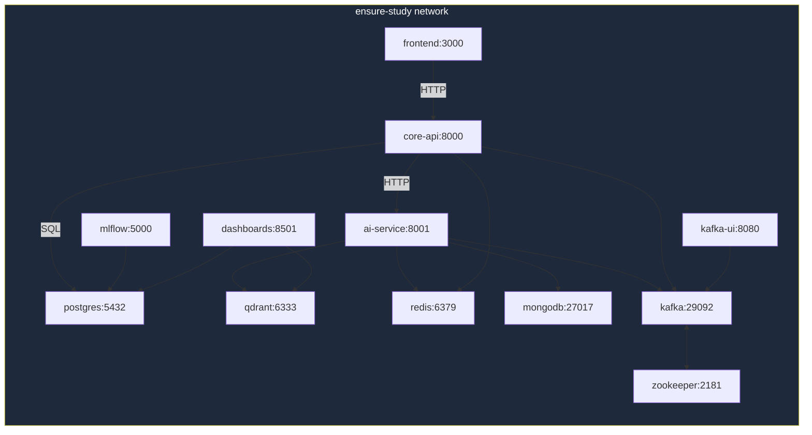
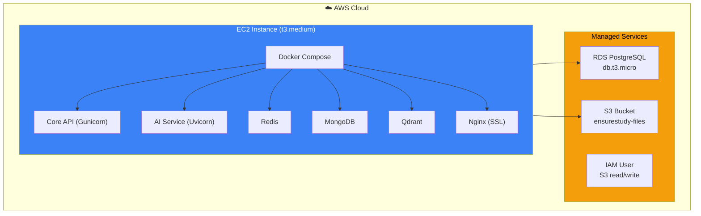

# Page 21: Infrastructure & Docker Deployment

---

## 21.1 Overview

ensureStudy runs as a **12-service Docker Compose stack** in development and a streamlined **6-service production stack** with external managed services (AWS RDS, S3). The entire platform can be brought up with a single `make up` command.

---

## 21.2 Development Stack (12 Services)

### Source: `docker-compose.yml` (340 lines)



### Service Configuration Details

| Service | Image | Port | Healthcheck | Depends On |
|---------|-------|------|-------------|------------|
| `postgres` | postgres:15-alpine | 5432 | `pg_isready` | — |
| `redis` | redis:7-alpine | 6379 | `redis-cli ping` | — |
| `qdrant` | qdrant/qdrant:latest | 6333, 6334 | HTTP /health | — |
| `zookeeper` | confluentinc/cp-zookeeper:7.5.0 | 2181 | `nc -z` | — |
| `kafka` | confluentinc/cp-kafka:7.5.0 | 9092, 29092 | broker-api-versions | zookeeper |
| `kafka-ui` | provectuslabs/kafka-ui:latest | 8080 | — | kafka |
| `mongodb` | mongo:7 | 27017 | `mongosh ping` | — |
| `cassandra` | cassandra:4 | 9042 | `cqlsh describe` | — |
| `minio` | minio/minio:latest | 9100, 9101 | HTTP /health/live | — |
| `core-api` | Built from Dockerfile | 8000 | — | postgres, redis |
| `ai-service` | Built from Dockerfile | 8001 | — | postgres, redis, qdrant, kafka |
| `frontend` | Built from Dockerfile | 3000 | — | core-api, ai-service |
| `dashboards` | Built from Dockerfile | 8501 | — | postgres, qdrant |
| `mlflow` | ghcr.io/mlflow/mlflow:v2.9.0 | 5000 | — | postgres |

### Docker Volumes (10)

```yaml
volumes:
  postgres_data:       # PostgreSQL persistent storage
  redis_data:          # Redis AOF/RDB persistence
  qdrant_storage:      # Vector database storage
  zookeeper_data:      # Zookeeper state
  zookeeper_log:       # Zookeeper transaction logs
  kafka_data:          # Kafka message logs
  mlflow_artifacts:    # MLflow experiment artifacts
  mongo_data:          # MongoDB collections
  cassandra_data:      # Cassandra SSTables
  minio_data:          # Object storage (S3-compatible)
```

---

## 21.3 Production Stack (6 Services)

### Source: `docker-compose.prod.yml` (208 lines)

| Service | Image | Key Differences from Dev |
|---------|-------|--------------------------|
| `core-api` | Dockerfile.prod | Gunicorn, `restart: unless-stopped`, AWS S3 storage |
| `ai-service` | Dockerfile.prod | Configurable Whisper model size, Gemini API |
| `mongodb` | mongo:7 | Secret-based auth, Atlas option |
| `redis` | redis:7-alpine | Persistent, `restart: unless-stopped` |
| `qdrant` | qdrant/qdrant:latest | `restart: unless-stopped` |
| `nginx` | nginx:alpine | (Commented) SSL termination, reverse proxy |

**Excluded from prod** (use managed services): PostgreSQL (AWS RDS), Kafka (optional), Cassandra, MinIO (use S3 directly), MLflow, Dashboards, Kafka-UI.

---

## 21.4 Makefile Targets

### Source: `Makefile` (92 lines)

| Target | Command | Purpose |
|--------|---------|---------|
| `make up` | `docker-compose up -d` + wait + health-check | Start everything |
| `make down` | `docker-compose down` | Stop services |
| `make logs` | `docker-compose logs -f` | Tail logs |
| `make health-check` | Check Qdrant, PostgreSQL, Redis, Kafka | Verify all services |
| `make db-init` | `flask db upgrade` | Apply database migrations |
| `make load-docs` | `python scripts/load_documents.py` | Seed Qdrant |
| `make test` | `pytest` (core, ai, kafka) | Run all tests |
| `make test-ml` | `pytest tests/` | Run ML tests |
| `make dev-frontend` | `npm run dev` | Frontend dev server |
| `make dev-ai-service` | `uvicorn --reload` | AI service dev |
| `make dev-core-service` | `flask run` | Core service dev |
| `make clean` | `docker-compose down -v` + cleanup | Full cleanup |
| `make kafka-topics` | Create 5 Kafka topics | Initialize topics |
| `make train-moderation` | Train moderation model | ML training |
| `make train-difficulty` | Train difficulty model | ML training |
| `make run-etl` | PySpark ETL pipeline | Data pipeline |
| `make dashboards` | `streamlit run` | Start dashboards |

---

## 21.5 Network Architecture

All services communicate over a single Docker bridge network: `ensure-study`.



---

## 21.6 Launch Scripts

### `run-local.sh` — Local Development

```bash
#!/bin/bash
# Start all infrastructure services
docker-compose up -d postgres redis qdrant zookeeper kafka mongodb cassandra minio

# Wait for services to be healthy
sleep 15

# Start application services in separate terminals
# Terminal 1: Flask core service
cd backend/core-service && flask run --port 8000 &

# Terminal 2: FastAPI AI service
cd backend/ai-service && uvicorn app.main:app --port 8001 --reload &

# Terminal 3: Next.js frontend
cd frontend && npm run dev &
```

### `run-lan.sh` — LAN Access (mkcert TLS)

Uses locally-generated TLS certificates from `mkcert` for HTTPS on the local network:

```bash
# Certificate files present in project root
# 192.168.4.60+2-key.pem   / 192.168.4.60+2.pem
# 192.168.4.157+2-key.pem  / 192.168.4.157+2.pem
# localhost+2-key.pem      / localhost+2.pem
```

Enables testing on mobile devices and other machines on the same network with valid HTTPS.

---

## 21.7 AWS Production Deployment

### Recommended AWS Architecture


