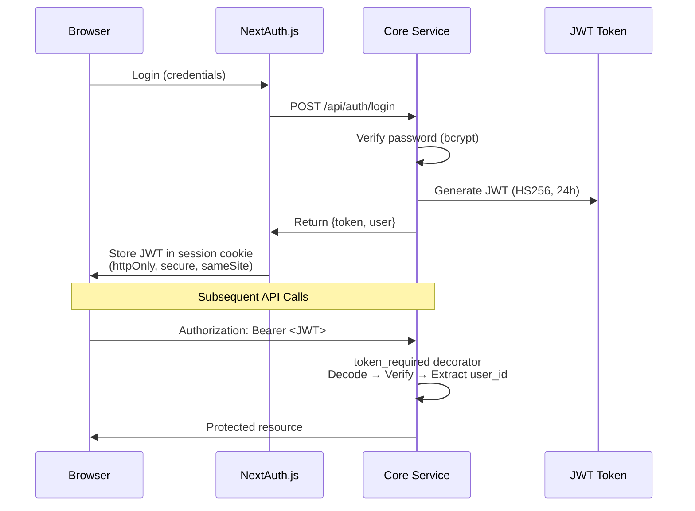
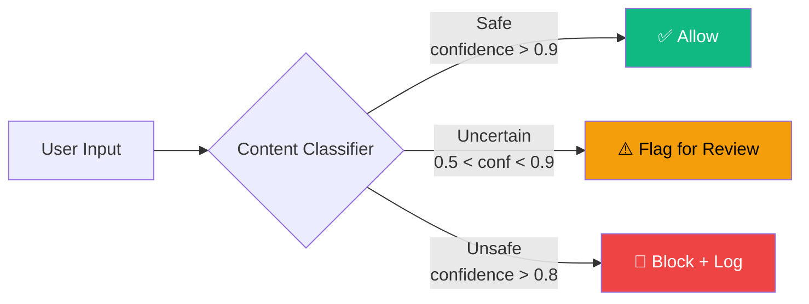

# Page 22: Security Architecture & Authentication

---

## 22.1 Overview

ensureStudy implements a **multi-layer security architecture** spanning JWT authentication, role-based access control, content moderation, TLS encryption, file upload validation, and secrets management.

---

## 22.2 Authentication Flow



### Password Hashing

```python
from werkzeug.security import generate_password_hash, check_password_hash

class User(db.Model):
    def set_password(self, password: str):
        self.password_hash = generate_password_hash(password)
    
    def check_password(self, password: str):
        return check_password_hash(self.password_hash, password)
```

- Algorithm: PBKDF2-SHA256 (Werkzeug default)
- Salt: Auto-generated per-password
- Iterations: 600,000 (Werkzeug default)

### JWT Configuration

| Parameter | Value |
|-----------|-------|
| Algorithm | HS256 |
| Expiration | 24 hours |
| Secret | `JWT_SECRET` env variable (min 32 chars) |
| Payload | `{user_id, username, role, exp}` |
| Library | PyJWT |

---

## 22.3 Role-Based Access Control (RBAC)

### User Roles

| Role | Key Permissions |
|------|----------------|
| **student** | View classrooms, take assessments, chat with tutor, upload notes, join meetings |
| **teacher** | Create classrooms, upload materials, generate quizzes, grade, host meetings, view analytics |
| **parent** | View child progress, receive notifications |
| **admin** | Full platform management, user management, organization settings |

### Route Protection

```python
# Level 1: Authentication required
@auth_bp.route('/me')
@token_required
def get_me(current_user):
    return jsonify(current_user.to_dict())

# Level 2: Role restriction
@teacher_bp.route('/classrooms', methods=['POST'])
@role_required('teacher', 'admin')
def create_classroom(current_user):
    ...

# Level 3: Resource ownership
@classroom_bp.route('/<classroom_id>/syllabus', methods=['POST'])
@token_required
def upload_syllabus(current_user, classroom_id):
    classroom = Classroom.query.get_or_404(classroom_id)
    if classroom.teacher_id != current_user.id:
        return jsonify({"error": "Not your classroom"}), 403
```

---

## 22.4 Content Moderation

### ModerationLog Model

```python
class ModerationLog(db.Model):
    __tablename__ = "moderation_logs"
    user_id = db.Column(db.String(36), db.ForeignKey("users.id"))
    content = db.Column(db.Text)           # Original content
    action = db.Column(db.String(50))      # "allow", "block", "flag"
    confidence = db.Column(db.Float)       # Model confidence
    was_blocked = db.Column(db.Boolean)    # Outcome
    reason = db.Column(db.Text)            # Why blocked
```

### Moderation Pipeline



---

## 22.5 CORS Policy

### Core Service (Flask)
```python
CORS(app, resources={r"/api/*": {"origins": "*"}})
```

### AI Service (FastAPI)
```python
app.add_middleware(
    CORSMiddleware,
    allow_origins=["*"],          # All origins (development)
    allow_credentials=False,      # Required for wildcard
    allow_methods=["*"],
    allow_headers=["*"],
)
```

### Production Recommendation
```python
# .env.production.example
FRONTEND_URL=https://yourdomain.com

# In production, restrict to:
allow_origins=[os.getenv("FRONTEND_URL")]
allow_credentials=True
```

---

## 22.6 TLS/HTTPS

### Development (mkcert)

Local TLS certificates generated with `mkcert`:

| File | Purpose |
|------|---------|
| `localhost+2-key.pem` | Private key for localhost |
| `localhost+2.pem` | Certificate for localhost |
| `192.168.4.60+2-key.pem` | Private key for LAN IP |
| `192.168.4.60+2.pem` | Certificate for LAN IP |
| `192.168.4.157+2-key.pem` | Private key for alt LAN IP |
| `192.168.4.157+2.pem` | Certificate for alt LAN IP |
| `rootCA.pem` | Root CA for mkcert |

### Production

```yaml
# docker-compose.prod.yml (commented Nginx config)
nginx:
  image: nginx:alpine
  ports:
    - "80:80"
    - "443:443"
  volumes:
    - ./nginx/nginx.conf:/etc/nginx/nginx.conf:ro
    - ./nginx/ssl:/etc/nginx/ssl:ro
```

---

## 22.7 File Upload Security

| Control | Implementation |
|---------|----------------|
| Max file size | 500 MB (`MAX_CONTENT_LENGTH`) |
| Filename sanitization | `werkzeug.utils.secure_filename()` |
| Unique naming | UUID prefix: `{uuid4()}_{filename}` |
| Type validation | MIME type checking |
| Storage isolation | Per-classroom directory structure |
| Access control | Upload requires authentication |

---

## 22.8 Secrets Management

### Environment Variables

| Secret | Location | Purpose |
|--------|----------|---------|
| `JWT_SECRET` | `.env` | JWT signing key |
| `DATABASE_URL` | `.env` | PostgreSQL connection string |
| `OPENAI_API_KEY` | `.env` | OpenAI API access |
| `GOOGLE_API_KEY` | `.env` | Google Gemini access |
| `GROQ_API_KEY` | `.env` | Groq LLM access |
| `AWS_ACCESS_KEY_ID` | `.env.production` | AWS S3 access |
| `AWS_SECRET_ACCESS_KEY` | `.env.production` | AWS S3 secret |
| `NEXTAUTH_SECRET` | `.env` | NextAuth session encryption |
| `MONGO_PASSWORD` | `.env.production` | MongoDB auth |

### .gitignore Protection

```gitignore
.env
.env.production
*.pem
*.key
```

All secrets are excluded from version control. `.env.production.example` provides a template with placeholder values.

---

## 22.9 Database Security

| Database | Auth Method | Encryption |
|----------|-------------|------------|
| PostgreSQL | Username/password | Connection pooling with `pool_pre_ping` |
| Redis | No auth (dev), password (prod) | — |
| MongoDB | Username/password (SCRAM-SHA-256) | — |
| Qdrant | No auth (dev), API key (prod option) | — |
| Cassandra | No auth (dev), password (prod) | — |
