# Page 27: AI Services Deep-Dive — 89-File Service Layer

---

## 27.1 Overview

The AI Service's `services/` directory contains **89 Python files** implementing every AI capability in ensureStudy. This page catalogs every service, grouped by functional domain.

### Source: `backend/ai-service/app/services/` (89 files)

---

## 27.2 Service Catalog by Domain

### Tutoring & Chat (9 services)

| Service | Purpose |
|---------|---------|
| `abcr_service.py` | ABCR (Assess-Build-Challenge-Reflect) tutoring cycle |
| `abcr_cache.py` | Redis caching layer for ABCR state |
| `chat_persistence.py` | Persist/retrieve chat sessions from PostgreSQL |
| `followup_generator.py` | Generate follow-up questions from responses |
| `context.py` | Maintain conversation context across turns |
| `mcp_context.py` | MCP (Model Context Protocol) integration |
| `llm_provider.py` | Multi-provider LLM abstraction (OpenAI, Gemini, Groq, Ollama) |
| `api_key_manager.py` | API key rotation and management |
| `debug_logger.py` | Structured debug logging for LLM calls |

### RAG & Search (8 services)

| Service | Purpose |
|---------|---------|
| `qdrant_service.py` | Qdrant vector database operations |
| `rag_service.py` | RAG retrieval pipeline (rewrite → search → synthesize) |
| `search_service.py` | Unified search across multiple sources |
| `semantic_search_service.py` | Semantic similarity search |
| `web_search_service.py` | External web search (Serper, DuckDuckGo) |
| `youtube_search_service.py` | YouTube video search + metadata |
| `phrase_extractor.py` | Extract key phrases for search queries |
| `query_rewriter.py` | LLM-based query rewriting for better retrieval |

### Document Processing (11 services)

| Service | Purpose |
|---------|---------|
| `document_processor.py` | Orchestrate 7-stage document pipeline |
| `document_preprocessor.py` | PDF/image cleaning and normalization |
| `pdf_extractor.py` | Extract text from PDFs (PyMuPDF) |
| `pdf_processor.py` | Advanced PDF processing with layout |
| `pdf_downloader.py` | Download PDFs from URLs |
| `pdf_generator.py` | Generate PDF study materials |
| `ocr_service.py` | OCR orchestration (Tesseract, EasyOCR, Surya) |
| `ocr_adapter.py` | Unified OCR adapter interface |
| `nanonets_ocr.py` | Nanonets cloud OCR integration |
| `hybrid_ocr.py` | Multi-backend hybrid OCR |
| `latex_converter.py` | LaTeX formula extraction and conversion |

### Image & Layout Processing (4 services)

| Service | Purpose |
|---------|---------|
| `image_service.py` | Image generation and manipulation |
| `image_enhancer.py` | Image preprocessing for OCR |
| `layout_service.py` | Document layout detection |
| `flowchart_generator.py` | Generate flowchart diagrams from text |

### Content & Curriculum (7 services)

| Service | Purpose |
|---------|---------|
| `curriculum_storage.py` | Store/retrieve curriculum data |
| `classroom_matcher.py` | Match content to classrooms |
| `content_crawler.py` | Crawl web URLs for content |
| `content_normalizer.py` | Normalize extracted content |
| `fast_content_fetcher.py` | Parallel async content fetching |
| `material_indexer.py` | Index classroom materials in Qdrant |
| `chunking_service.py` | Intelligent text chunking |

### Assessment & Grading (5 services)

| Service | Purpose |
|---------|---------|
| `assessment_service.py` | Generate assessments and quizzes |
| `answer_evaluator.py` | Evaluate student answers with LLM |
| `grading_service.py` | Automated grading pipeline |
| `interview_evaluator.py` | Evaluate mock interview responses |
| `exam_prep.py` | Exam preparation material generation |

### Speech & Audio (4 services)

| Service | Purpose |
|---------|---------|
| `speech_service.py` | Text-to-speech + speech-to-text |
| `audio_fluency_analyzer.py` | Analyze speech fluency metrics |
| `fluency_analyzer.py` | Advanced fluency analysis |
| `fluency_evaluator.py` | Score fluency evaluation |

### Soft Skills & Behavior (5 services)

| Service | Purpose |
|---------|---------|
| `gaze_analyzer.py` | Eye contact and gaze analysis |
| `gesture_analyzer.py` | Hand gesture recognition |
| `posture_analyzer.py` | Body posture evaluation |
| `grammar_analyzer.py` | Grammar and language quality |
| `behavior_analyzer.py` | Combined behavioral analysis |

### Meeting & Collaboration (4 services)

| Service | Purpose |
|---------|---------|
| `meeting_embedding_service.py` | Embed meeting transcripts |
| `meeting_rag.py` | RAG for meeting Q&A |
| `summarizer_service.py` | Text summarization |
| `tts_service.py` | Text-to-speech service |

### Notes & Embedding (3 services)

| Service | Purpose |
|---------|---------|
| `notes_embedding.py` | Embed student notes in Qdrant |
| `question_service.py` | Question generation service |
| `revision_service.py` | Spaced revision scheduling |

### Video & Media Analysis (4 services)

| Service | Purpose |
|---------|---------|
| `video_analyzer.py` | Analyze video for proctoring |
| `video_scoring.py` | Score video-based assessments |
| `video_feedback.py` | Generate video feedback |
| `filler_detector.py` | Detect filler words in speech |

### Moderation & Safety (1 service)

| Service | Purpose |
|---------|---------|
| `moderation.py` | Content moderation pipeline |

### Remaining Services (24 services)

| Service | Purpose |
|---------|---------|
| `student_performance.py` | Student performance analytics |
| `study_plan.py` | Generate personalized study plans |
| `topic_service.py` | Topic management operations |
| `vocabulary_service.py` | Vocabulary building features |
| `pronunciation_service.py` | Pronunciation assessment |
| `realtime_service.py` | Real-time WebSocket services |
| `resource_recommender.py` | Resource recommendation engine |
| `session_intelligence.py` | Intelligent session management |
| `session_manager.py` | Session lifecycle management |
| `spaced_repetition.py` | Spaced repetition scheduling |
| `speech_analytics.py` | Speech analytics dashboard data |
| `skill_analyzer.py` | Skill gap analysis |
| `subject_classifier.py` | Classify content by subject |
| `summary_service.py` | Session summary generation |
| `transcription_service.py` | Audio transcription management |
| `tutor_service.py` | Core tutoring service |
| `unified_report.py` | Unified student report generation |
| `upload_service.py` | File upload handling |
| `url_validator.py` | Validate and sanitize URLs |
| `web_ingest.py` | Web content ingestion pipeline |
| `weakness_service.py` | Student weakness identification |
| `websocket_manager.py` | WebSocket connection management |
| `whisper_service.py` | OpenAI Whisper integration |
| `worker_service.py` | Background worker tasks |

---

## 27.3 Service Dependencies

```mermaid
flowchart TB
    subgraph MAIN["Service Dependencies "]
        direction TB
        N0["llm_provider.py ◄ abcr_service.py, answer_evaluator.py,"]
        N1["followup_generator.py, tutor_service.py"]
        N2["openai (GPT-4)"]
        N3["google.generativeai (Gemini)"]
        N4["groq (Mixtral/LLaMA)"]
        N5["ollama (local Mistral)"]
        N6["qdrant_service.py ◄ rag_service.py, material_indexer.py,"]
        N7["notes_embedding.py, meeting_embedding_service.py"]
        N8["qdrant_client"]
        N9["speech_service.py ◄ audio_fluency_analyzer.py, fluency_evaluator.py"]
        N10["openai (Whisper)"]
        N11["boto3 (AWS Polly)"]
    end

    style MAIN fill:#3b82f6,color:#fff
```

---

## 27.4 Service Size Distribution

| Lines | Count | Examples |
|-------|-------|---------|
| < 100 | 35 | api_key_manager, debug_logger, url_validator |
| 100-300 | 30 | rag_service, assessment_service, gaze_analyzer |
| 300-500 | 15 | document_processor, behavior_analyzer, meeting_rag |
| > 500 | 9 | abcr_service, tutor_service, web_ingest |
