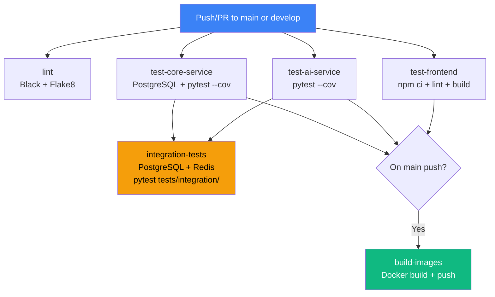
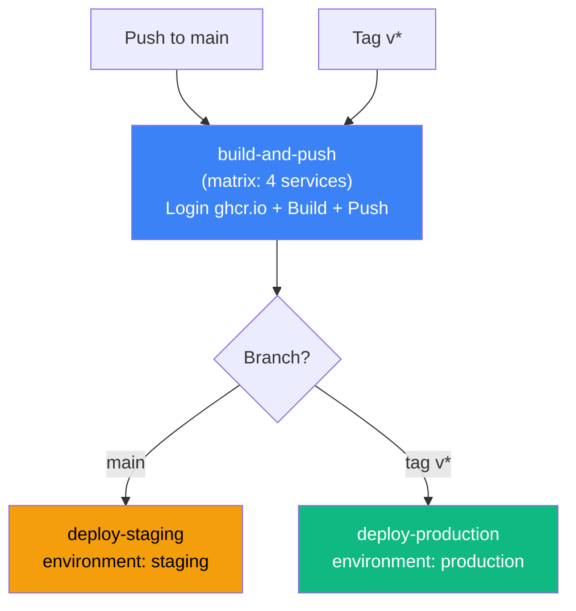

# Page 28: CI/CD Pipeline — GitHub Actions

---

## 28.1 Overview

ensureStudy uses **GitHub Actions** for continuous integration and deployment, with two workflow files implementing lint → test → build → deploy across three services.

### Source: `.github/workflows/`

| File | Lines | Trigger | Purpose |
|------|-------|---------|---------|
| `ci.yml` | 266 | Push/PR to `main`, `develop` | Test, lint, build |
| `deploy.yml` | 101 | Push to `main`, tags `v*` | Build, push, deploy |

---

## 28.2 CI Pipeline (`ci.yml`)

### Pipeline Visualization



### Job 1: Lint & Type Check

```yaml
lint:
  runs-on: ubuntu-latest
  steps:
    - pip install flake8 black mypy
    - black --check backend/           # Format check
    - flake8 backend/ --max-line-length=120 --ignore=E501,W503  # Style check
```

### Job 2: Core Service Tests

```yaml
test-core-service:
  services:
    postgres:
      image: postgres:15
      env:
        POSTGRES_USER: test
        POSTGRES_PASSWORD: test
        POSTGRES_DB: test_db
  steps:
    - pip install -r requirements.txt
    - pip install pytest pytest-cov pytest-flask
    - pytest tests/ -v --cov=app --cov-report=xml
    - codecov/codecov-action@v3    # Upload coverage
```

### Job 3: AI Service Tests

```yaml
test-ai-service:
  steps:
    - pip install -r requirements.txt
    - pip install pytest pytest-cov pytest-asyncio
    - pytest tests/ -v --cov=app --cov-report=xml
    - codecov/codecov-action@v3
```

### Job 4: Frontend Tests

```yaml
test-frontend:
  steps:
    - uses: actions/setup-node@v4 (Node 20)
    - npm ci
    - npm run lint
    - npm run build
```

### Job 5: Docker Image Builds

Only runs on `main` push after all tests pass:

```yaml
build-images:
  needs: [test-core-service, test-ai-service, test-frontend]
  if: github.event_name == 'push' && github.ref == 'refs/heads/main'
  steps:
    - docker/build-push-action@v5
      # core-service, ai-service, frontend
      # Uses GitHub Actions cache (type=gha)
```

### Job 6: Integration Tests

Spins up real services with PostgreSQL + Redis:

```yaml
integration-tests:
  needs: [test-core-service, test-ai-service]
  services:
    postgres: postgres:15
    redis: redis:7
  steps:
    - flask run --port 8000 &
    - uvicorn app.main:app --port 8001 &
    - sleep 10
    - pytest tests/integration/ -v -m integration
```

---

## 28.3 Deployment Pipeline (`deploy.yml`)

### Pipeline Visualization



### Matrix Strategy

```yaml
strategy:
  matrix:
    include:
      - service: core-service
        context: backend/core-service
      - service: ai-service
        context: backend/ai-service
      - service: frontend
        context: frontend
      - service: dashboards
        context: dashboards
```

### Container Registry

```
ghcr.io/${github.repository}/core-service:${sha}
ghcr.io/${github.repository}/ai-service:${sha}
ghcr.io/${github.repository}/frontend:${sha}
ghcr.io/${github.repository}/dashboards:${sha}
```

### Image Tagging

```yaml
tags: |
  type=ref,event=branch      # main, develop
  type=ref,event=tag          # v1.0.0
  type=sha,prefix=             # abc1234 (commit SHA)
```

---

## 28.4 Environment Configuration

| Environment | Trigger | Protection |
|-------------|---------|------------|
| `staging` | Push to `main` | Required reviewers (optional) |
| `production` | Tag `v*` | Required reviewers |

---

## 28.5 Tooling Versions

| Tool | Version | Purpose |
|------|---------|---------|
| Python | 3.11 | Backend services |
| Node.js | 20 | Frontend |
| PostgreSQL | 15 | Test service container |
| Redis | 7 | Integration test container |
| Docker Buildx | Latest | Multi-platform builds |
| Codecov | v3 | Coverage reporting |
| actions/checkout | v4 | Repository checkout |
| actions/setup-python | v5 | Python setup |
| actions/setup-node | v4 | Node.js setup |
| docker/build-push-action | v5 | Docker builds |
| docker/login-action | v3 | Registry auth |
| docker/metadata-action | v5 | Image tagging |
