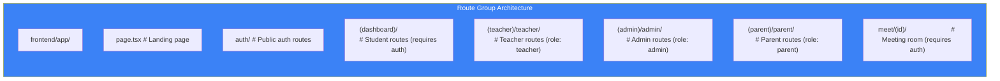

# Page 31: Frontend Page Routes — 51 Pages Across 5 Roles

---

## 31.1 Overview

The Next.js 14 App Router serves **51 pages** organized into 5 route groups based on user role: Student Dashboard, Teacher, Admin, Parent, and Auth. Each group has its own layout and middleware protection.

---

## 31.2 Route Group Architecture



---

## 31.3 Authentication Pages (4 pages)

| Route | File | Purpose |
|-------|------|---------|
| `/auth` | `auth/page.tsx` | Auth landing / redirect |
| `/auth/signin` | `auth/signin/page.tsx` | Login form (email + password) |
| `/auth/signup` | `auth/signup/page.tsx` | Registration form |
| `/auth/error` | `auth/error/page.tsx` | Authentication error display |

---

## 31.4 Student Dashboard (21 pages)

| Route | File | Purpose |
|-------|------|---------|
| `/dashboard` | `(dashboard)/dashboard/page.tsx` | Student home — progress overview, recent activity |
| `/chat` | `(dashboard)/chat/page.tsx` | AI Tutor chat interface |
| `/study` | `(dashboard)/study/page.tsx` | Study materials browser |
| `/classrooms` | `(dashboard)/classrooms/page.tsx` | List enrolled classrooms |
| `/classrooms/[id]` | `(dashboard)/classrooms/[id]/page.tsx` | Classroom detail — materials, topics, members |
| `/classrooms/[id]/notes` | `(dashboard)/classrooms/[id]/notes/page.tsx` | Classroom notes viewer/editor |
| `/join-classroom` | `(dashboard)/join-classroom/page.tsx` | Join classroom via code |
| `/curriculum` | `(dashboard)/curriculum/page.tsx` | Curriculum viewer + learning path |
| `/assessments` | `(dashboard)/assessments/page.tsx` | Assessment list |
| `/assessments/take/[id]` | `(dashboard)/assessments/take/[id]/page.tsx` | Take assessment (with proctoring) |
| `/assessments/proctored` | `(dashboard)/assessments/proctored/page.tsx` | Proctored exam mode |
| `/progress` | `(dashboard)/progress/page.tsx` | Detailed progress analytics |
| `/leaderboard` | `(dashboard)/leaderboard/page.tsx` | Classroom/global leaderboard |
| `/notifications` | `(dashboard)/notifications/page.tsx` | Notification center |
| `/settings` | `(dashboard)/settings/page.tsx` | User profile settings |
| `/interact` | `(dashboard)/interact/page.tsx` | Interactive learning mode |
| `/softskills` | `(dashboard)/softskills/page.tsx` | Soft skills hub |
| `/softskills/communication` | `(dashboard)/softskills/communication/page.tsx` | Communication skills practice |
| `/softskills/communication/session` | `(dashboard)/softskills/communication/session/page.tsx` | Live communication session |
| `/softskills/mock-interview` | `(dashboard)/softskills/mock-interview/page.tsx` | Mock interview setup |
| `/softskills/mock-interview/session` | `(dashboard)/softskills/mock-interview/session/page.tsx` | Live mock interview session |

---

## 31.5 Teacher Portal (8 pages)

| Route | File | Purpose |
|-------|------|---------|
| `/teacher/dashboard` | `(teacher)/teacher/dashboard/page.tsx` | Teacher home — classroom stats |
| `/teacher/classrooms` | `(teacher)/teacher/classrooms/page.tsx` | Manage classrooms |
| `/teacher/classroom/[id]` | `(teacher)/teacher/classroom/[id]/page.tsx` | Classroom management — materials, students |
| `/teacher/assessments` | `(teacher)/teacher/assessments/page.tsx` | Create/manage assessments |
| `/teacher/students` | `(teacher)/teacher/students/page.tsx` | Student progress overview |
| `/teacher/interact` | `(teacher)/teacher/interact/page.tsx` | AI teaching assistant |
| `/teacher/scan` | `(teacher)/teacher/scan/page.tsx` | Scan/digitize documents |
| `/teacher/settings` | `(teacher)/teacher/settings/page.tsx` | Teacher settings |

---

## 31.6 Admin Panel (7 pages)

| Route | File | Purpose |
|-------|------|---------|
| `/admin/dashboard` | `(admin)/admin/dashboard/page.tsx` | Platform analytics dashboard |
| `/admin/classrooms` | `(admin)/admin/classrooms/page.tsx` | All classrooms overview |
| `/admin/classrooms/[id]` | `(admin)/admin/classrooms/[id]/page.tsx` | Classroom administration |
| `/admin/teachers` | `(admin)/admin/teachers/page.tsx` | Teacher management |
| `/admin/students` | `(admin)/admin/students/page.tsx` | Student management |
| `/admin/billing` | `(admin)/admin/billing/page.tsx` | Billing/subscription management |
| `/admin/settings` | `(admin)/admin/settings/page.tsx` | Platform settings |

---

## 31.7 Parent Portal (8 pages)

| Route | File | Purpose |
|-------|------|---------|
| `/parent/dashboard` | `(parent)/parent/dashboard/page.tsx` | Parent home — children overview |
| `/parent/children` | `(parent)/parent/children/page.tsx` | List linked children |
| `/parent/children/[id]` | `(parent)/parent/children/[id]/page.tsx` | Child detail + activity |
| `/parent/progress` | `(parent)/parent/progress/page.tsx` | Academic progress reports |
| `/parent/reports` | `(parent)/parent/reports/page.tsx` | Downloadable reports |
| `/parent/interact` | `(parent)/parent/interact/page.tsx` | Communicate with teachers |
| `/parent/notifications` | `(parent)/parent/notifications/page.tsx` | Parent notifications |
| `/parent/settings` | `(parent)/parent/settings/page.tsx` | Parent settings |

---

## 31.8 Meeting Room (1 page)

| Route | File | Purpose |
|-------|------|---------|
| `/meet/[id]` | `meet/[id]/page.tsx` | LiveKit video conference room |

Dynamic route `[id]` maps to the meeting ID. Uses LiveKit components for video/audio/screen sharing.

---

## 31.9 Route Protection

```typescript
// middleware.ts
export function middleware(request: NextRequest) {
    const session = await getToken({ req: request });
    
    if (!session) {
        return NextResponse.redirect(new URL('/auth/signin', request.url));
    }
    
    // Role-based route protection
    if (request.nextUrl.pathname.startsWith('/admin') && session.role !== 'admin') {
        return NextResponse.redirect(new URL('/dashboard', request.url));
    }
    if (request.nextUrl.pathname.startsWith('/teacher') && session.role !== 'teacher') {
        return NextResponse.redirect(new URL('/dashboard', request.url));
    }
    if (request.nextUrl.pathname.startsWith('/parent') && session.role !== 'parent') {
        return NextResponse.redirect(new URL('/dashboard', request.url));
    }
}
```
