# Page 34: Data Model Schema Reference — 20 Model Files

---

## 34.1 Overview

The Core Service defines **40+ SQLAlchemy models** across 20 Python files, using PostgreSQL as the primary relational store. This page provides a complete field-level reference for every model.

### Source: `backend/core-service/app/models/` (20 files)

---

## 34.2 Model Files

| File | Models Defined | Purpose |
|------|---------------|---------|
| `user.py` | User, Progress, Assessment, AssessmentResult, ChatSession, ModerationLog, Leaderboard, StudyNote, AssessmentChallenge | Core user and learning models |
| `classroom.py` | Classroom, StudentClassroom, ClassroomMaterial | Classroom management |
| `curriculum.py` | Subject, Topic, Subtopic, Syllabus, QuestionBank, Question, Chapter, ClassroomTopic, StudentTopicScore, StudyScheduleEntry, QuestionEffectiveness, LearningAgentMemory | Learning content hierarchy |
| `meeting.py` | Meeting, MeetingParticipant, MeetingRecording | Video conferencing |
| `announcement.py` | Announcement | Classroom announcements |
| `assignment.py` | Assignment, AssignmentSubmission | Homework assignments |
| `chat.py` | ChatMessage, ChatHistory | Chat persistence |
| `document.py` | Document, DocumentChunk | Document storage |
| `document_intelligence.py` | DocumentIntelligence | AI-extracted document metadata |
| `exam_evaluation.py` | ExamEvaluation, ExamQuestion | Exam grading results |
| `feedback.py` | AgentInteraction, InteractionFeedback, LearningExample, AgentPerformanceMetrics | Agent analytics |
| `interact.py` | InteractiveSession | Interactive learning sessions |
| `interview_questions.py` | InterviewQuestion, InterviewResponse | Mock interview data |
| `notes.py` | PersonalNote, SharedNote | Note-taking |
| `notification.py` | Notification | Push notifications |
| `organization.py` | Organization, OrganizationMembership | Multi-tenant organizations |
| `progress.py` | DetailedProgress, ProgressHistory | Progress tracking |
| `student_profile.py` | StudentProfile, LearningPreference | Student preferences |
| `tutor_session.py` | TutorSession, SessionMessage | Tutoring session history |

---

## 34.3 Key Model Schemas

### User Model

```python
class User(db.Model):
    __tablename__ = "users"
    
    id         = Column(String(36), primary_key=True, default=uuid4)
    username   = Column(String(80), unique=True, nullable=False)
    email      = Column(String(120), unique=True, nullable=False)
    password_hash = Column(String(256), nullable=False)
    role       = Column(String(20), default="student")  # student, teacher, parent, admin
    first_name = Column(String(50))
    last_name  = Column(String(50))
    class_id   = Column(String(36))
    school_id  = Column(String(36))
    is_active  = Column(Boolean, default=True)
    profile_image = Column(String(500))
    created_at = Column(DateTime, default=datetime.utcnow)
    updated_at = Column(DateTime, onupdate=datetime.utcnow)
```

### Classroom Model

```python
class Classroom(db.Model):
    __tablename__ = "classrooms"
    
    id         = Column(String(36), primary_key=True, default=uuid4)
    name       = Column(String(200), nullable=False)
    description = Column(Text)
    teacher_id = Column(String(36), ForeignKey("users.id"))
    join_code  = Column(String(8), unique=True)   # Random 8-char code
    subject    = Column(String(100))
    grade_level = Column(String(50))
    syllabus_url = Column(String(500))
    is_active  = Column(Boolean, default=True)
    max_students = Column(Integer, default=100)
    created_at = Column(DateTime, default=datetime.utcnow)
```

### Progress Model

```python
class Progress(db.Model):
    __tablename__ = "progress"
    
    id               = Column(String(36), primary_key=True)
    user_id          = Column(String(36), ForeignKey("users.id"))
    topic            = Column(String(200))
    subject          = Column(String(100))
    confidence_score = Column(Float, default=0.0)        # 0-100
    times_studied    = Column(Integer, default=0)
    last_studied     = Column(DateTime)
    is_weak          = Column(Boolean, default=False)
    tal_level        = Column(Integer, default=1)         # 1-5 TAL
    created_at       = Column(DateTime, default=datetime.utcnow)
    updated_at       = Column(DateTime, onupdate=datetime.utcnow)
```

### Meeting Model

```python
class Meeting(db.Model):
    __tablename__ = "meetings"
    
    id             = Column(String(36), primary_key=True)
    classroom_id   = Column(String(36), ForeignKey("classrooms.id"))
    host_id        = Column(String(36), ForeignKey("users.id"))
    title          = Column(String(200))
    description    = Column(Text)
    status         = Column(String(20), default="scheduled")  # scheduled, live, ended
    scheduled_time = Column(DateTime)
    start_time     = Column(DateTime)
    end_time       = Column(DateTime)
    duration_seconds = Column(Integer)
    livekit_room   = Column(String(200))
    max_participants = Column(Integer, default=50)
```

### Curriculum Models

```python
class Subject(db.Model):
    id   = Column(String(36), primary_key=True)
    name = Column(String(200), nullable=False)
    description = Column(Text)
    classroom_id = Column(String(36), ForeignKey("classrooms.id"))

class Topic(db.Model):
    id         = Column(String(36), primary_key=True)
    name       = Column(String(200), nullable=False)
    subject_id = Column(String(36), ForeignKey("subjects.id"))
    difficulty = Column(String(20))      # easy, medium, hard
    order      = Column(Integer)
    prerequisites = Column(JSON)         # List of prerequisite topic IDs
    content    = Column(Text)

class StudentTopicScore(db.Model):
    id         = Column(String(36), primary_key=True)
    student_id = Column(String(36), ForeignKey("users.id"))
    topic_id   = Column(String(36), ForeignKey("classroom_topics.id"))
    mcq_score     = Column(Float, default=0.0)
    desc_score    = Column(Float, default=0.0)
    combined_score = Column(Float, default=0.0)
    attempts      = Column(Integer, default=0)

class LearningAgentMemory(db.Model):
    id         = Column(String(36), primary_key=True)
    topic_id   = Column(String(36))
    strategy   = Column(JSON)            # Current strategy state
    critic_scores = Column(JSON)         # Historical critic evaluations
    iteration  = Column(Integer, default=0)
```

---

## 34.4 Entity Relationships

```mermaid
flowchart TB
    subgraph MAIN["Entity Relationships "]
        direction TB
        N0["User 1:N Progress"]
        N1["User 1:N Assessment"]
        N2["User 1:N ChatSession"]
        N3["User 1:N StudyNote"]
        N4["User 1:1 Leaderboard"]
        N5["User 1:N ModerationLog"]
        N6["User 1:1 StudentProfile"]
        N7["Classroom 1:N ClassroomMaterial"]
        N8["Classroom N:M User (via StudentClassroom)"]
        N9["Classroom 1:N Meeting"]
        N10["Classroom 1:N Subject"]
        N11["Subject 1:N Topic"]
        N12["Topic 1:N Subtopic"]
        N13["Topic 1:N Question (via QuestionBank)"]
        N14["Meeting 1:N MeetingParticipant"]
    end

    style MAIN fill:#3b82f6,color:#fff
```



---

## 34.5 Index Strategy

| Table | Indexed Columns | Index Type |
|-------|----------------|------------|
| `users` | email, username | UNIQUE |
| `progress` | user_id + topic | Composite |
| `classrooms` | join_code | UNIQUE |
| `assessments` | user_id, topic | Individual |
| `leaderboard` | user_id | UNIQUE |
| `meetings` | classroom_id, status | Individual |
| `student_topic_scores` | student_id + topic_id | Composite |
