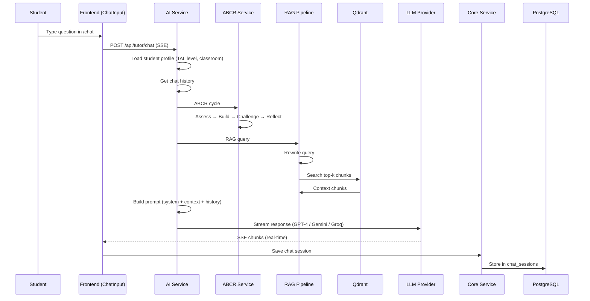
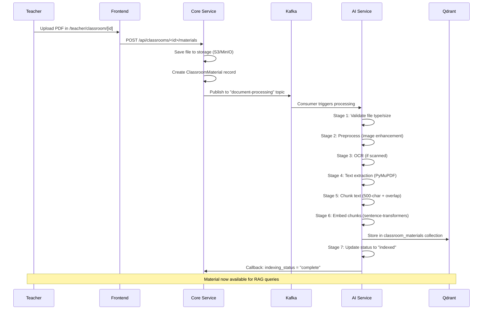
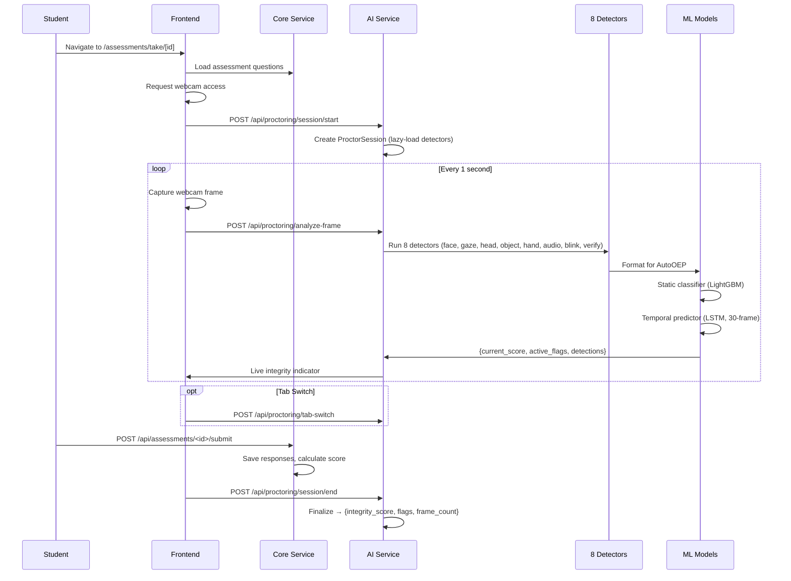
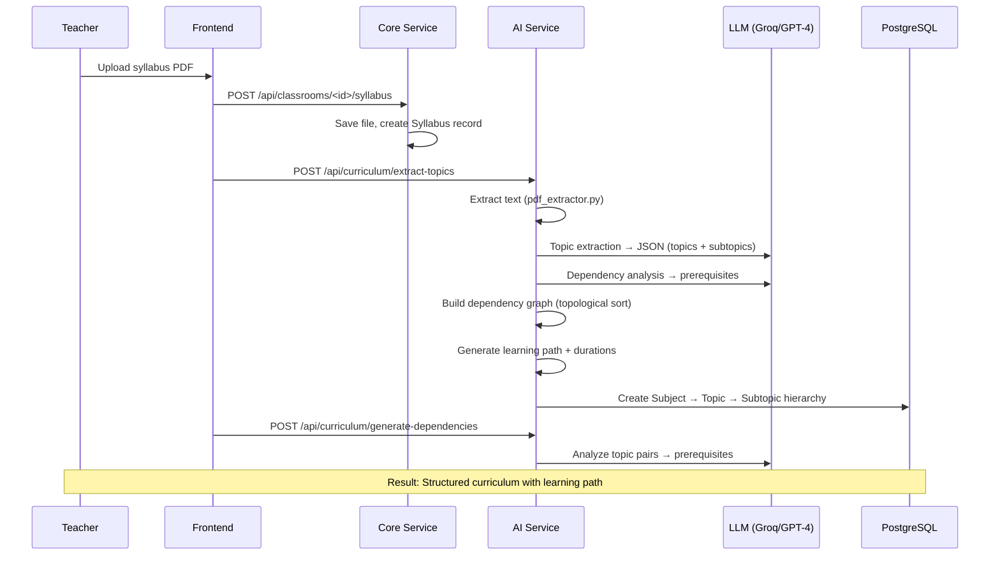
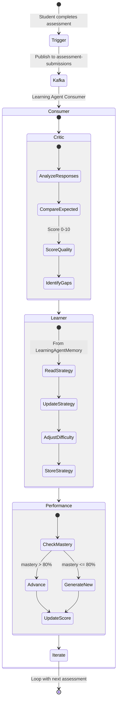
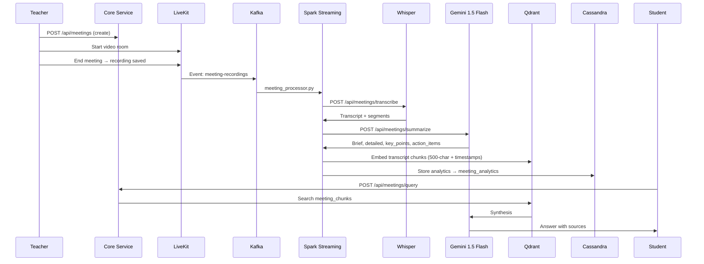
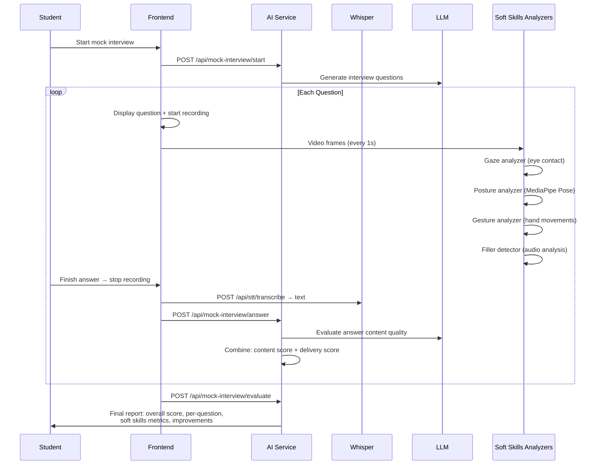

# Page 35: Agent Interaction Flows & System Sequences

---

## 35.1 Overview

This page documents the **end-to-end interaction sequences** between agents, services, and databases for the most important user flows in ensureStudy.

---

## 35.2 Flow 1: Student Asks Tutor a Question

---

## 35.3 Flow 2: Teacher Uploads Material → RAG Indexing

---

## 35.4 Flow 3: Student Takes Proctored Assessment

---

## 35.5 Flow 4: Curriculum Generation from Syllabus

---

## 35.6 Flow 5: Learning Agent (Type 5) Self-Improving Cycle

---

## 35.7 Flow 6: Meeting → Transcription → Q&A

---

## 35.8 Flow 7: Soft Skills Mock Interview

---

## 35.9 Cross-Cutting Patterns

| Pattern | Used By | Mechanism |
|---------|---------|-----------|
| **SSE Streaming** | Tutor chat, agent responses | `StreamingResponse` + `text/event-stream` |
| **Async via Kafka** | Document processing, learning agent, meeting transcription | Produce → Topic → Consumer |
| **Redis Caching** | ABCR state, web resources, RAG queries | Cache with TTL (1h-7d) |
| **Lazy Loading** | Proctoring detectors, ML models | `@property` with `_instance is None` check |
| **Fallback Chain** | LLM calls | Try OpenAI → Gemini → Groq → Ollama |
| **Webhook Callbacks** | Grading, indexing status | AI Service → Core Service HTTP callback |
