# Page 37: Caching Architecture — Redis, In-Memory & Embedding Caches

---

## 37.1 Overview

ensureStudy uses a **multi-tier caching strategy** combining Redis for distributed caching, in-memory caches for ML model instances, and specialized caches for embeddings, ABCR state, and web resources. This reduces LLM API calls, speeds up vector search, and avoids redundant ML inference.

---

## 37.2 Cache Tiers

```mermaid
flowchart TB
    subgraph MAIN["Cache Tiers "]
        direction TB
        N0["Tier 1: In-Memory (per-process)"]
        N1["ML model instances (lazy loading)"]
        N2["Embedding model (sentence-transformers)"]
        N3["Proctoring detector instances"]
        N4["Tier 2: Redis (distributed, persistent)"]
        N5["Response cache (LLM answers)"]
        N6["Session cache (ABCR state)"]
        N7["Embedding cache (vector results)"]
        N8["Web resource cache (crawled pages)"]
        N9["Curriculum cache (extracted topics)"]
        N10["Tier 3: Qdrant (persistent vectors)"]
        N11["Document chunk embeddings"]
    end

    style MAIN fill:#3b82f6,color:#fff
```



---

## 37.3 Redis Cache Services

### Response Cache (`services/response_cache.py`)

Caches LLM-generated responses to avoid redundant API calls:

```python
class ResponseCache:
    def __init__(self, redis_url: str):
        self.redis = Redis.from_url(redis_url)
        self.default_ttl = 3600  # 1 hour
    
    def get_cached_response(self, query_hash: str) -> Optional[str]:
        return self.redis.get(f"response:{query_hash}")
    
    def cache_response(self, query_hash: str, response: str, ttl: int = None):
        self.redis.setex(
            f"response:{query_hash}",
            ttl or self.default_ttl,
            response
        )
    
    @staticmethod
    def hash_query(query: str, context: str = "") -> str:
        return hashlib.sha256(f"{query}:{context}".encode()).hexdigest()
```

| Key Pattern | TTL | Content |
|-------------|-----|---------|
| `response:{hash}` | 1 hour | Cached LLM response text |

### Session Cache (`services/session_cache.py`)

Caches ABCR tutoring session state:

```python
class SessionCache:
    KEY_PREFIX = "session:"
    TTL = 86400  # 24 hours
    
    def save_state(self, session_id: str, state: dict):
        self.redis.setex(
            f"{self.KEY_PREFIX}{session_id}",
            self.TTL,
            json.dumps(state)
        )
    
    def load_state(self, session_id: str) -> Optional[dict]:
        data = self.redis.get(f"{self.KEY_PREFIX}{session_id}")
        return json.loads(data) if data else None
```

| Key Pattern | TTL | Content |
|-------------|-----|---------|
| `session:{id}` | 24 hours | ABCR phase, TAL level, history summary |

### ABCR Cache (`services/abcr_cache.py`)

Specialized cache for ABCR tutoring cycle:

| Key Pattern | TTL | Content |
|-------------|-----|---------|
| `abcr:{user_id}:{topic}` | 1 hour | Current ABCR phase (assess/build/challenge/reflect) |
| `abcr:history:{user_id}` | 24 hours | Topic history and transitions |

### Curriculum Storage Cache (`services/curriculum_storage.py`)

| Key Pattern | TTL | Content |
|-------------|-----|---------|
| `curriculum:{classroom_id}` | 7 days | Extracted topic hierarchy |
| `topics:{subject_id}` | 1 day | Topic list for subject |

---

## 37.4 Web Resource Caching

### Content Fetching Cache

```python
class FastContentFetcher:
    def __init__(self):
        self.cache = {}  # In-memory URL → content cache
        self.cache_ttl = 3600  # 1 hour
    
    async def fetch_with_cache(self, url: str) -> str:
        cache_key = hashlib.md5(url.encode()).hexdigest()
        
        # Check Redis first
        cached = self.redis.get(f"web:{cache_key}")
        if cached:
            return json.loads(cached)
        
        # Fetch and cache
        content = await self._fetch(url)
        self.redis.setex(f"web:{cache_key}", self.cache_ttl, json.dumps(content))
        return content
```

| Key Pattern | TTL | Content |
|-------------|-----|---------|
| `web:{url_hash}` | 1 hour | Extracted web page text |
| `web:search:{query_hash}` | 30 min | Search results |

---

## 37.5 In-Memory Model Caching

### Lazy-Loaded Singleton Pattern

```python
class EmbeddingService:
    _model = None
    
    @property
    def model(self):
        if self._model is None:
            self._model = SentenceTransformer('all-mpnet-base-v2')
        return self._model
```

| Model | Memory | Load Time | Lazy-Loaded |
|-------|--------|-----------|-------------|
| Sentence-Transformers | ~400 MB | 3-5s | Yes |
| Whisper (medium) | ~1.5 GB | 5-10s | Yes |
| YOLOv11n | ~6 MB | 1s | Yes |
| dlib face detector | ~50 MB | 1s | Yes |
| MediaPipe Pose | ~30 MB | 1s | Yes |
| LightGBM classifier | ~1 MB | <1s | Yes |
| LSTM temporal | ~5 MB | <1s | Yes |

### Proctoring Detector Caching

```python
class ProctorSession:
    def _initialize_detectors(self, frame):
        """Lazy-load only needed detectors on first frame"""
        self.detectors = {
            'face': FaceDetector(),      # Always loaded
            'gaze': GazeDetector(),      # Always loaded
            'object': ObjectDetector(),  # Loaded if webcam detected
            # ... remaining detectors loaded conditionally
        }
```

---

## 37.6 Embedding Cache

### Redis-based Vector Cache

```python
class EmbeddingCache:
    def get_embedding(self, text: str) -> Optional[List[float]]:
        key = f"emb:{hashlib.sha256(text.encode()).hexdigest()}"
        cached = self.redis.get(key)
        if cached:
            return json.loads(cached)
        return None
    
    def cache_embedding(self, text: str, embedding: List[float]):
        key = f"emb:{hashlib.sha256(text.encode()).hexdigest()}"
        self.redis.setex(key, 604800, json.dumps(embedding))  # 7 days
```

| Key Pattern | TTL | Content |
|-------------|-----|---------|
| `emb:{text_hash}` | 7 days | 768-dim float vector |

---

## 37.7 Cache Eviction & Sizing

| Cache | Max Memory | Eviction Policy | Persistence |
|-------|-----------|-----------------|-------------|
| Redis (global) | 256 MB | `allkeys-lru` | AOF + RDB |
| Response cache | ~50 MB | TTL-based (1h) | Redis |
| Embedding cache | ~100 MB | TTL-based (7d) | Redis |
| Session cache | ~10 MB | TTL-based (24h) | Redis |
| Model instances | ~2.5 GB | Never evicted | In-memory |
| Web cache | ~50 MB | TTL-based (1h) | Redis |
