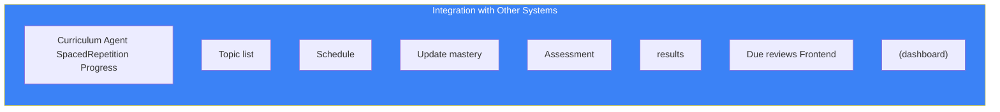

# Page 43: Spaced Repetition & Adaptive Learning

---

## 43.1 Overview

ensureStudy implements the **SM-2 (SuperMemo 2) algorithm** with VARK learning style adaptation, generating personalized study sessions with optimal review intervals. The system tracks per-topic mastery decay and schedules reviews to maximize long-term retention.

### Source: `backend/ai-service/app/services/spaced_repetition.py` (548 lines)

---

## 43.2 SM-2 Algorithm

### Core Formula

```
if quality >= 3 (correct response):
    if repetitions == 0:  interval = 1 day
    elif repetitions == 1: interval = 6 days
    else: interval = interval × easiness_factor
    
    repetitions += 1
else (incorrect response):
    repetitions = 0
    interval = 1 day

# Easiness Factor update (EF must stay ≥ 1.3)
EF' = EF + (0.1 - (5 - quality) × (0.08 + (5 - quality) × 0.02))
```

### Quality Scale (`ReviewQuality`)

| Value | Label | Meaning |
|-------|-------|---------|
| 0 | BLACKOUT | Complete failure, no recall |
| 1 | INCORRECT | Wrong answer after effort |
| 2 | HARD | Correct but with great difficulty |
| 3 | MEDIUM | Correct after some thought |
| 4 | EASY | Correct with little effort |
| 5 | PERFECT | Instant, effortless recall |

---

## 43.3 Data Models

### ReviewItem

```python
@dataclass
class ReviewItem:
    topic_id: str
    topic_name: str
    easiness_factor: float = 2.5    # Default EF
    interval: int = 1               # Days until next review
    repetitions: int = 0            # Successful consecutive reviews
    next_review: str = ""           # ISO date string
    last_review: str = ""           # ISO date string
    mastery: float = 0.0            # 0-100 mastery score
```

### LearningProfile

```python
@dataclass
class LearningProfile:
    user_id: str
    primary_style: LearningStyle = LearningStyle.VISUAL
    secondary_style: Optional[LearningStyle] = None
    preferred_session_minutes: int = 30
    best_study_time: str = "morning"
    retention_strength: float = 1.0      # Multiplier for intervals
    topics_per_session: int = 3
    review_items: Dict[str, ReviewItem]  # topic_id → ReviewItem
```

---

## 43.4 VARK Learning Styles

| Style | Description | Preferred Resources |
|-------|-------------|-------------------|
| **Visual** | Learns through seeing | Diagrams, flowcharts, videos, infographics |
| **Auditory** | Learns through hearing | Podcasts, lectures, discussions |
| **Reading** | Learns through text | Articles, notes, documentation |
| **Kinesthetic** | Learns through doing | Exercises, labs, interactive demos |

### Learning Style Detection

```python
def analyze_learning_style_quiz(self, responses: Dict[str, str]):
    """
    Analyze VARK quiz responses to determine primary/secondary styles.
    
    Returns: Tuple of (primary_style, secondary_style or None)
    """
```

---

## 43.5 Key Functions

### `calculate_next_review()`

```python
def calculate_next_review(self, item: ReviewItem, quality: ReviewQuality):
    """
    SM-2 core algorithm. Updates:
    - easiness_factor: min 1.3, adjusted by quality
    - interval: 1, 6, or interval × EF
    - repetitions: reset on failure, increment on success
    - next_review: today + interval days
    - mastery: quality × 20 (maps 0-5 → 0-100)
    """
```

### `get_due_reviews()`

```python
def get_due_reviews(self, user_id: str, limit: int = 10):
    """
    Get topics due for review today or overdue.
    
    Sorted by urgency:
    1. Overdue items (most overdue first)
    2. Due today
    3. Low mastery items
    """
```

### `get_optimal_study_session()`

```python
def get_optimal_study_session(self, user_id: str, available_minutes: int = None):
    """
    Generate personalized study session:
    1. Get due reviews (highest priority)
    2. Add new topics if time permits
    3. Suggest resources based on learning style
    4. Respect topics_per_session limit
    
    Returns:
    {
        "review_topics": [...],       # Topics to review
        "new_topics": [...],          # New topics to learn
        "resources": [...],           # Learning style resources
        "estimated_minutes": 30,      # Session duration
        "session_type": "mixed"       # review, new, or mixed
    }
    """
```

### `record_review()`

```python
def record_review(self, user_id, topic_id, topic_name, quality: int):
    """
    Record a completed review.
    
    Steps:
    1. Get or create ReviewItem for this topic
    2. Apply SM-2 algorithm
    3. Update mastery score
    4. Save to profile
    5. Return updated ReviewItem with next review date
    """
```

---

## 43.6 Resource Suggestion Engine

```python
@dataclass
class ResourceSuggestion:
    topic: str
    resource_type: str       # "video", "article", "exercise", etc.
    title: str
    url: str
    description: str
    duration_min: int
    difficulty: str
    learning_styles: List[str]   # Which styles this suits
    relevance_score: float       # 0-1 match score
```

Resources are filtered and ranked based on the student's VARK profile:

```
Visual student → Prioritize: videos, diagrams, flowcharts
Auditory student → Prioritize: audio lectures, podcasts
Reading student → Prioritize: articles, documentation
Kinesthetic student → Prioritize: coding exercises, labs
```

---

## 43.7 Integration with Other Systems


