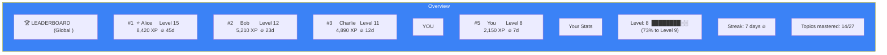

# Page 44: Gamification — Leaderboard, XP, Streaks & Rewards

---

## 44.1 Overview

ensureStudy implements a **comprehensive gamification system** with experience points (XP), levels, study streaks, global and classroom leaderboards, and achievement tracking. This system drives student engagement through visible progress and competition.

---

## 44.2 Data Models

### Leaderboard Model

```python
class Leaderboard(db.Model):
    __tablename__ = "leaderboard"
    
    id             = Column(String(36), primary_key=True)
    user_id        = Column(String(36), ForeignKey("users.id"), unique=True)
    global_points  = Column(Integer, default=0)     # Total XP
    class_points   = Column(Integer, default=0)     # Classroom-specific XP
    study_streak   = Column(Integer, default=0)     # Consecutive days studied
    level          = Column(Integer, default=1)     # Current level
    xp             = Column(Integer, default=0)     # XP within current level
    created_at     = Column(DateTime, default=datetime.utcnow)
    updated_at     = Column(DateTime, onupdate=datetime.utcnow)
```

---

## 44.3 XP System

### XP Award Events

| Action | XP Awarded | Frequency |
|--------|-----------|-----------|
| Complete assessment | 50-200 | Per assessment |
| Score > 80% | +50 bonus | Per assessment |
| Study a topic | 10 | Per topic/day |
| Complete review session | 25 | Per session |
| First login of day | 5 | Daily |
| Reach study streak milestone | 100 | Weekly |
| Upload notes | 15 | Per upload |
| Answer tutor question correctly | 10 | Per answer |
| Complete curriculum topic | 30 | Per topic |

### Level Progression

```
Level 1: 0 XP
Level 2: 100 XP
Level 3: 250 XP
Level 4: 500 XP
Level 5: 1,000 XP
Level N: previous_threshold × 1.5

XP_for_level(n) = floor(100 × 1.5^(n-2))
```

---

## 44.4 Study Streak

### Streak Rules

- **Increment**: Any study activity (quiz, notes, tutor chat, review)
- **Reset**: Missing a calendar day
- **Protection**: Streak freeze (future feature — not yet implemented)

### Streak Milestones

| Streak | Reward |
|--------|--------|
| 3 days | 🔥 Fire badge |
| 7 days | ⭐ Weekly warrior badge + 100 XP |
| 14 days | 🏆 Two-week champion + 250 XP |
| 30 days | 💎 Monthly master + 500 XP |
| 100 days | 🎯 Century champion + 2,000 XP |

---

## 44.5 Leaderboard API

### Endpoints

| Method | Endpoint | Purpose |
|--------|----------|---------|
| GET | `/api/leaderboard` | Global top-N leaderboard |
| GET | `/api/leaderboard/classroom/<id>` | Classroom leaderboard |
| GET | `/api/leaderboard/me` | Current user's rank and stats |

### Response Format

```json
{
    "leaderboard": [
        {
            "rank": 1,
            "username": "student_1",
            "global_points": 5420,
            "level": 12,
            "study_streak": 23,
            "profile_image": "/avatars/1.png"
        }
    ],
    "my_rank": 5,
    "total_students": 42
}
```

---

## 44.6 Frontend Display

### `/leaderboard` Page



### `/progress` Page — Gamification Widgets

- **XP Progress Bar**: Visual level progress
- **Streak Calendar**: Heat-map of study activity
- **Achievement Badges**: Unlocked milestones
- **Subject Radar**: Multi-subject strength visualization

---

## 44.7 Progress Tracking

### Progress Model Integration

```python
class Progress(db.Model):
    confidence_score = Column(Float)      # 0-100, affects mastery display
    times_studied    = Column(Integer)    # Increments per study action
    is_weak          = Column(Boolean)    # Flagged for extra attention
    tal_level        = Column(Integer)    # 1-5, Teaching Adaptation Level
```

### Weak Topic Detection

```python
# A topic is marked "weak" when:
is_weak = (confidence_score < 50) or (
    times_studied > 3 and confidence_score < 70
)
```

---

## 44.8 Analytics Dashboard Data

The gamification data flows to the teacher dashboard:

| Metric | Source | Dashboard Widget |
|--------|--------|-----------------|
| Average class XP | Leaderboard | Class overview |
| Streak distribution | Leaderboard | Engagement chart |
| Weak topic count | Progress | Attention needed |
| Assessment completion | AssessmentResult | Completion rate |
| Top performers | Leaderboard | Top-5 students |
