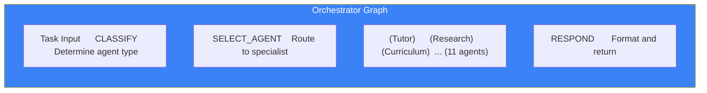

# Page 46: LangGraph State Machines — 11 Agent Workflows

---

## 46.1 Overview

ensureStudy uses **LangGraph** (from LangChain) to build **11 stateful, graph-based agent workflows**. Each agent is modeled as a directed state graph where nodes are processing steps and edges represent transitions based on the current state.

### Core Concept

```python
from langgraph.graph import StateGraph, END

graph = StateGraph(AgentState)
graph.add_node("research", research_node)
graph.add_node("synthesize", synthesis_node)
graph.add_edge("research", "synthesize")
graph.add_edge("synthesize", END)
app = graph.compile()
```

---

## 46.2 Agents Using StateGraph

| Agent File | Nodes | Purpose |
|-----------|-------|---------|
| `orchestrator.py` | 3 | Route task → Select agent → Execute |
| `tutor_agent.py` | 5 | ABCR cycle: Assess → Build → Challenge → Reflect → Respond |
| `research_agent.py` | 4 | Query → Search → Extract → Summarize |
| `curriculum_agent.py` | 4 | Extract → Dependencies → Order → Path |
| `learning_agent.py` | 4 | Critic → Learner → Performance → Iterate |
| `web_enrichment_agent.py` | 3 | Search → Fetch → Enrich |
| `document_agent.py` | 5 | Validate → Extract → OCR → Chunk → Index |
| `assessment_agent.py` | 3 | Generate → Validate → Score |
| `interview_question_agent.py` | 3 | Topic → Generate → Format |
| `revision_assessment_agent.py` | 3 | Review → Assess → Schedule |
| `study_planner.py` | 4 | Analyze → Plan → Schedule → Suggest |

---

## 46.3 State Schema Pattern

Every agent defines a typed state dictionary:

```python
from typing import TypedDict, Annotated
from langgraph.graph import add_messages

class TutorState(TypedDict):
    messages: Annotated[list, add_messages]   # Chat history
    student_id: str
    topic: str
    tal_level: int                              # 1-5
    abcr_phase: str                            # assess/build/challenge/reflect
    context: list                              # RAG chunks
    response: str                              # Final answer
    moderation_flag: bool                      # Content safety
```

---

## 46.4 Orchestrator Graph



---

## 46.5 Tutor Agent Graph (ABCR Cycle)

```python
graph = StateGraph(TutorState)

# Nodes
graph.add_node("assess", assess_student_level)
graph.add_node("build", build_context_and_prompt)
graph.add_node("challenge", generate_challenge)
graph.add_node("reflect", reflect_on_interaction)
graph.add_node("respond", generate_response)

# Edges
graph.add_edge("assess", "build")
graph.add_conditional_edges(
    "build",
    should_challenge,
    {"yes": "challenge", "no": "respond"}
)
graph.add_edge("challenge", "respond")
graph.add_edge("respond", "reflect")
graph.add_edge("reflect", END)
```

### Conditional Edge: `should_challenge`

```python
def should_challenge(state: TutorState) -> str:
    # Challenge every 3rd interaction for engaged students
    if state["tal_level"] >= 3 and interaction_count % 3 == 0:
        return "yes"
    return "no"
```

---

## 46.6 Learning Agent Graph (Type 5 Self-Improving)

```python
graph = StateGraph(LearningState)

graph.add_node("critic", critic_evaluate)
graph.add_node("learner", learner_update)
graph.add_node("performance", check_performance)
graph.add_node("iterate", decide_next)

graph.add_edge("critic", "learner")
graph.add_edge("learner", "performance")
graph.add_conditional_edges(
    "performance",
    should_iterate,
    {"continue": "iterate", "stop": END}
)
graph.add_edge("iterate", "critic")  # Loop back
```

### Convergence Condition

```python
def should_iterate(state: LearningState) -> str:
    if state["iteration"] >= MAX_ITERATIONS:
        return "stop"
    if state["improvement_delta"] < CONVERGENCE_THRESHOLD:
        return "stop"
    return "continue"
```

---

## 46.7 Research Agent Graph

```python
graph = StateGraph(ResearchState)

graph.add_node("plan_queries", generate_search_queries)
graph.add_node("search", execute_web_searches)
graph.add_node("extract", extract_key_information)
graph.add_node("synthesize", synthesize_findings)

graph.add_edge("plan_queries", "search")
graph.add_edge("search", "extract")
graph.add_conditional_edges(
    "extract",
    needs_more_search,
    {"yes": "plan_queries", "no": "synthesize"}
)
graph.add_edge("synthesize", END)
```

---

## 46.8 Error Handling in Graphs

```python
# Each node wraps execution in try/except
def research_node(state: ResearchState) -> ResearchState:
    try:
        results = web_search(state["query"])
        return {**state, "results": results, "error": None}
    except Exception as e:
        logger.error(f"Research failed: {e}")
        return {**state, "results": [], "error": str(e)}

# Conditional edges handle errors
graph.add_conditional_edges(
    "research",
    lambda s: "fallback" if s.get("error") else "synthesize",
    {"fallback": "fallback_node", "synthesize": "synthesize"}
)
```
