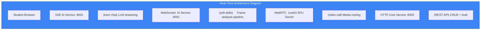

# Page 47: Real-Time Communication — SSE, WebSocket & LiveKit

---

## 47.1 Overview

ensureStudy uses **three real-time communication protocols** for different use cases: Server-Sent Events (SSE) for streaming LLM responses, WebSocket for soft skills video analysis, and LiveKit (WebRTC) for video conferencing.

---

## 47.2 Protocol Comparison

| Feature | SSE | WebSocket | LiveKit (WebRTC) |
|---------|-----|-----------|-----------------|
| Direction | Server → Client (one-way) | Bidirectional | Bidirectional |
| Use Case | LLM streaming | Soft skills frames | Video conferencing |
| Protocol | HTTP/1.1 | WS/WSS | WebRTC + SFU |
| Reconnection | Auto (browser native) | Manual | Managed by SDK |
| Data Format | `text/event-stream` | Binary/JSON | Media tracks |

---

## 47.3 SSE — LLM Response Streaming

### AI Service Implementation

```python
from sse_starlette.sse import EventSourceResponse

@router.post("/tutor/chat")
async def tutor_chat(request: ChatRequest):
    async def event_generator():
        try:
            async for chunk in llm.astream(messages):
                yield {
                    "event": "message",
                    "data": json.dumps({
                        "content": chunk.content,
                        "type": "text"
                    })
                }
            # Send completion signal
            yield {
                "event": "message", 
                "data": json.dumps({"type": "done"})
            }
        except Exception as e:
            yield {
                "event": "error",
                "data": json.dumps({"error": str(e)})
            }
    
    return EventSourceResponse(event_generator())
```

### Frontend Consumer

```typescript
const eventSource = new EventSource('/api/tutor/chat', {
    method: 'POST',
    headers: { 'Content-Type': 'application/json' },
    body: JSON.stringify({ message, session_id })
});

eventSource.onmessage = (event) => {
    const data = JSON.parse(event.data);
    
    if (data.type === 'done') {
        eventSource.close();
        return;
    }
    
    // Append chunk to message
    useChatStore.getState().appendToLastMessage(data.content);
};

eventSource.onerror = (error) => {
    eventSource.close();
    setError('Connection lost');
};
```

### SSE Endpoints

| Endpoint | Data | Rate |
|----------|------|------|
| `/api/tutor/chat` | LLM response tokens | ~50 tokens/sec |
| `/api/sse/events` | General event stream | Variable |
| `/api/chat/stream` | Chat events | Variable |

---

## 47.4 WebSocket — Soft Skills Analysis

### AI Service WebSocket Endpoint

```python
from fastapi import WebSocket, WebSocketDisconnect

@router.websocket("/ws/softskills")
async def softskills_ws(websocket: WebSocket):
    await websocket.accept()
    session = SoftSkillsSession()
    
    try:
        while True:
            # Receive video frame as binary
            data = await websocket.receive_bytes()
            frame = decode_frame(data)
            
            # Analyze frame (gaze, posture, gestures)
            analysis = session.analyze_frame(frame)
            
            # Send results back
            await websocket.send_json({
                "gaze_score": analysis.gaze_score,
                "posture_score": analysis.posture_score,
                "gesture_count": analysis.gesture_count,
                "filler_detected": analysis.filler_detected,
                "overall_score": analysis.overall_score
            })
            
    except WebSocketDisconnect:
        results = session.finalize()
        # Store results for later retrieval
```

### Frontend WebSocket Client

```typescript
const ws = new WebSocket('ws://localhost:8001/ws/softskills');

ws.onopen = () => {
    // Start sending video frames
    const interval = setInterval(() => {
        const frame = captureWebcamFrame();
        ws.send(frame);  // Binary data
    }, 1000);  // 1 FPS
};

ws.onmessage = (event) => {
    const analysis = JSON.parse(event.data);
    updateGazeIndicator(analysis.gaze_score);
    updatePostureFeedback(analysis.posture_score);
};
```

---

## 47.5 LiveKit — Video Conferencing

### Room Management (Core Service)

```python
from livekit import api

class LiveKitService:
    def __init__(self):
        self.lk_api = api.LiveKitAPI(
            os.getenv('LIVEKIT_URL'),
            os.getenv('LIVEKIT_API_KEY'),
            os.getenv('LIVEKIT_API_SECRET')
        )
    
    def create_room(self, meeting_id: str, max_participants: int = 50):
        return self.lk_api.room.create_room(
            api.CreateRoomRequest(
                name=f"meeting_{meeting_id}",
                max_participants=max_participants,
                empty_timeout=300
            )
        )
    
    def generate_token(self, user_id: str, room_name: str, is_host: bool):
        token = api.AccessToken(
            os.getenv('LIVEKIT_API_KEY'),
            os.getenv('LIVEKIT_API_SECRET')
        )
        token.with_identity(user_id)
        token.with_grants(api.VideoGrants(
            room=room_name,
            room_join=True,
            can_publish=True,
            can_subscribe=True,
            can_publish_data=is_host
        ))
        return token.to_jwt()
```

### Frontend LiveKit Integration

```typescript
import { LiveKitRoom, VideoConference } from '@livekit/components-react';

function MeetingRoom({ meetingId }: { meetingId: string }) {
    const { token, url } = useMeetingToken(meetingId);
    
    return (
        <LiveKitRoom
            token={token}
            serverUrl={url}
            connect={true}
        >
            <VideoConference />
            <ChatSidebar />
        </LiveKitRoom>
    );
}
```

---

## 47.6 Real-Time Architecture Diagram


