# Page 49: Test Data & Experimental Files

---

## 49.1 Overview

The `try/` directory contains **12 test files** used during development and demonstration, covering PDFs, images, videos, and exam materials. These files exercise the document processing, OCR, and meeting transcription pipelines.

---

## 49.2 Test File Inventory

### Assignment Submissions

| File | Path | Purpose |
|------|------|---------|
| `assignment-2-linux.pdf` | `try/assignment-submissions/` | Linux assignment PDF — tests document extraction |
| `trimmed-submission-for-linux.pdf` | `try/assignment-submissions/` | Trimmed version — tests partial document handling |

### Assignment Templates

| File | Path | Purpose |
|------|------|---------|
| `Linux-Assignment-2.pdf` | `try/assignments/` | Assignment template — tests teacher upload flow |

### Exam Answer Sheets

| File | Path | Purpose |
|------|------|---------|
| `PG-DBDA Aug 2024 Syllabus and Marks Distribution.pdf` | `try/exam-answers/` | Syllabus — tests curriculum extraction |
| `answer-physics.png` | `try/exam-answers/` | Handwritten answer — tests OCR pipeline |
| `unnamed.jpg` | `try/exam-answers/` | Scanned exam page — tests image → text extraction |

### Test Images

| File | Path | Purpose |
|------|------|---------|
| `d.jpeg` | `try/images/` | Test image — tests image processing pipeline |

### Test PDFs

| File | Path | Purpose |
|------|------|---------|
| `frenchrevolution.pdf` | `try/pdfs/` | History textbook chapter — tests RAG indexing |
| `pythagoras theorem.pdf` | `try/pdfs/` | Math content — tests LaTeX rendering in notes |

### Question Papers

| File | Path | Purpose |
|------|------|---------|
| `cbse-sample-paper-class-9-science-set-4-1.pdf` | `try/questionpaper/` | CBSE exam — tests question extraction |

### Syllabi

| File | Path | Purpose |
|------|------|---------|
| `syllabus1.pdf` | `try/syllabus/` | Test syllabus — tests curriculum agent |

### Videos

| File | Path | Purpose |
|------|------|---------|
| `notes1.mp4` | `try/videos/` | Handwritten notes video — tests frame extraction + OCR |

---

## 49.3 Root-Level Test Scripts

### 14 test scripts in project root:

| Script | Purpose | Tests |
|--------|---------|-------|
| `test_full_pipeline.py` | End-to-end document → RAG pipeline | Upload → Process → Chunk → Embed → Query |
| `test_chunking.py` | Text chunking algorithms | Semantic chunking, overlap, size limits |
| `test_chunk_only.py` | Isolated chunk function tests | Edge cases, Unicode, empty input |
| `test_qdrant.py` | Qdrant vector operations | Insert, search, delete, collection management |
| `test_cache.py` | Redis cache operations | Set, get, TTL, eviction |
| `test_cache_api.py` | Cache through API endpoints | Response caching, cache invalidation |
| `test_agentic_crawl.py` | Web crawling agent | URL fetch, content extraction, caching |
| `test_groq_classifier.py` | Groq LLM classification | Subject classification via Groq API |
| `test_subject_classifier.py` | Subject detection | Input → Subject label mapping |
| `test_topic_chaining.py` | Topic dependency detection | Prerequisite chain calculation |
| `test_learning_agent_standalone.py` | Learning agent (isolated) | Critic → Learner → Performance loop |
| `test_ocr_model.py` | OCR model accuracy | Handwritten text recognition |
| `test_worker6.py` | Kafka consumer worker | Message consumption, processing |
| `test_workers.py` | Multiple Kafka workers | Concurrent consumer testing |

---

## 49.4 Pipeline Testing Flow

```mermaid
flowchart TB
    subgraph MAIN["Pipeline Testing Flow "]
        direction TB
        N0["test_full_pipeline.py"]
        N1["1. Upload test PDF (frenchrevolution.pdf)"]
        N2["2. Process via document pipeline"]
        N3["Text extraction (PyMuPDF)"]
        N4["Chunking (500-char, 50 overlap)"]
        N5["Embedding (sentence-transformers)"]
        N6["3. Store in Qdrant"]
        N7["4. Query: 'What caused the French Revolution?'"]
        N8["5. Verify: response contains relevant chunks"]
        N9["6. Cleanup: delete test collection"]
    end

    style MAIN fill:#3b82f6,color:#fff
```



---

## 49.5 pytest Configuration

### Source: `pytest.ini`

```ini
[pytest]
testpaths = tests
python_files = test_*.py
python_classes = Test*
python_functions = test_*
markers =
    slow: marks tests as slow
    integration: marks integration tests
    ml: marks ML model tests
```
