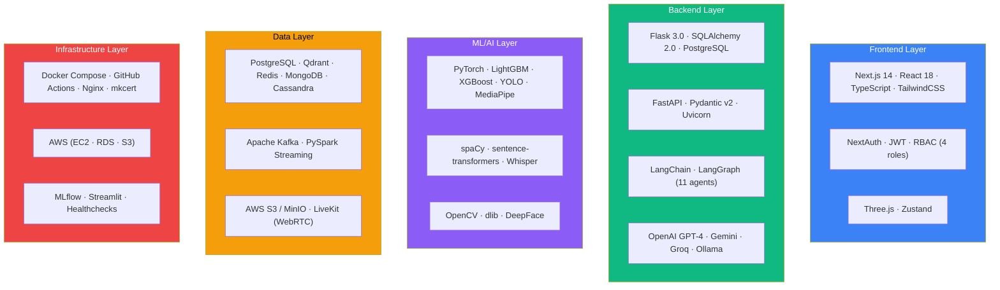

# Page 50: Codebase Statistics & Final Documentation Index

---

## 50.1 Codebase Metrics

### File Counts

| Language | Files | Estimated Lines |
|----------|-------|----------------|
| Python (`.py`) | 415 | ~55,000+ |
| TypeScript/TSX (`.tsx`, `.ts`) | 119 | ~20,000+ |
| Markdown (`.md`) | 50+ | ~30,000+ |
| YAML | 10+ | ~1,500 |
| Dockerfile | 5 | ~200 |
| Shell scripts | 4 | ~100 |
| **Total** | **~600+** | **~107,000+** |

### Component Breakdown

| Component | Python Files | Key Metric |
|-----------|-------------|------------|
| AI Service (`backend/ai-service/`) | ~200 | 89 service files, 27 API routers |
| Core Service (`backend/core-service/`) | ~80 | 29 route files, 20 model files |
| Data Pipelines (`backend/data-pipelines/`) | ~15 | 3 ETL jobs, 1 streaming job |
| Kafka (`backend/kafka/`) | ~15 | 6 producers, 8 consumers |
| ML Training (`backend/ml-training/`) | ~20 | 5 training scripts, 4 classifiers |
| Test Scripts (root) | ~14 | 14 standalone test files |
| Agents (`ai-service/agents/`) | ~15 | 11 LangGraph agents |

---

## 50.2 Infrastructure Metrics

| Metric | Count |
|--------|-------|
| Docker services (dev) | 12 |
| Docker services (prod) | 6 |
| Dockerfiles | 5 |
| Pre-trained model files | 16 |
| Environment variables | 50+ |
| Makefile targets | 17 |
| GitHub Actions jobs | 10 |

### Database Collections

| Database | Tables/Collections |
|----------|-------------------|
| PostgreSQL | 40+ tables |
| Qdrant | 5+ vector collections |
| Redis | 6 key namespaces |
| MongoDB | 3+ collections |
| Cassandra | 2+ tables |

---

## 50.3 API Metrics

| Service | Endpoints | Auth Method |
|---------|----------|-------------|
| Core Service (Flask) | 120+ REST | JWT |
| AI Service (FastAPI) | 80+ REST/SSE | Internal |
| WebSocket | 1 | Token |
| LiveKit | Managed | Token |
| **Total** | **~200+** | — |

---

## 50.4 AI & ML Metrics

| Metric | Count |
|--------|-------|
| AI agents | 11 |
| LLM providers | 4 (OpenAI, Gemini, Groq, Ollama) |
| Embedding models | 1 (all-mpnet-base-v2) |
| Pre-trained classifiers | 4 (LightGBM, XGBoost, LSTM, engagement) |
| Object detection | 1 (YOLOv11n) |
| Proctoring detectors | 8 |
| AI service files | 89 |
| Python dependencies | 111 |

---

## 50.5 Frontend Metrics

| Metric | Count |
|--------|-------|
| Pages (routes) | 51 |
| Shared components | 11 |
| Feature components | 53+ |
| Zustand stores | 5 |
| Route groups | 5 (student, teacher, admin, parent, auth) |
| Node.js dependencies | ~80 |

---

## 50.6 Technology Stack Summary

---

## 50.7 Complete Documentation Index (50 Pages)

### Batch 1 — Architecture & Agent Core
| # | Title |
|---|-------|
| 01 | Project Overview & Executive Summary |
| 02 | System Architecture & Design Decisions |
| 03 | Multi-Agent System Deep Dive |
| 04 | Tutor Agent — ABCR, TAL, MCP |
| 05 | RAG Pipeline & Vector Search |

### Batch 2 — Specialized Agents
| # | Title |
|---|-------|
| 06 | Research & Web Enrichment Agents |
| 07 | Curriculum Agent & Learning Paths |
| 08 | Learning Agent (Type 5 Self-Improving) |
| 09 | Document Processing Pipeline (7-Stage) |
| 10 | Notes, Assessment & Question Agents |

### Batch 3 — Backend & Frontend
| # | Title |
|---|-------|
| 11 | Core Service API — Flask Architecture |
| 12 | Core Service Routes & Authentication |
| 13 | AI Service API — FastAPI Architecture |
| 14 | Database Architecture (Polyglot) |
| 15 | Frontend Architecture (Next.js 14) |

### Batch 4 — ML & Streaming
| # | Title |
|---|-------|
| 16 | Proctoring System — Detectors & Scoring |
| 17 | Soft Skills Evaluation Pipeline |
| 18 | Meeting & Virtual Classroom System |
| 19 | Kafka Event Streaming |
| 20 | ML Training Pipeline & Model Registry |

### Batch 5 — Operations
| # | Title |
|---|-------|
| 21 | Infrastructure & Docker Deployment |
| 22 | Security Architecture |
| 23 | LLM Provider Strategy |
| 24 | Observability & Logging |
| 25 | Production Readiness & Roadmap |

### Batch 6 — Extended
| # | Title |
|---|-------|
| 26 | Data Pipelines — ETL & Spark |
| 27 | AI Services Catalog (89 Files) |
| 28 | CI/CD Pipeline — GitHub Actions |
| 29 | Environment Configuration |
| 30 | Scripts & Utilities |

### Batch 7 — Deep Reference
| # | Title |
|---|-------|
| 31 | Frontend Pages Reference (51 Routes) |
| 32 | Core API Endpoint Reference (120+) |
| 33 | AI API Endpoint Reference (80+) |
| 34 | Data Model Schema Reference (40+) |
| 35 | Agent Interaction Flows (7 Sequences) |

### Batch 8 — Patterns & Glossary
| # | Title |
|---|-------|
| 36 | Dependency Analysis (152+ Packages) |
| 37 | Caching Architecture |
| 38 | Error Handling & Resilience |
| 39 | Frontend Components (53+) |
| 40 | Glossary & Terminology (100+ Terms) |

### Batch 9 — Advanced Topics
| # | Title |
|---|-------|
| 41 | Pre-Trained Models & Registry |
| 42 | Dockerfile Architecture |
| 43 | Spaced Repetition & Adaptive Learning |
| 44 | Gamification System |
| 45 | Developer Quick-Start Guide |

### Batch 10 — Final Deep Dives
| # | Title |
|---|-------|
| 46 | LangGraph State Machines (11 Agents) |
| 47 | Real-Time Communication (SSE, WS, WebRTC) |
| 48 | Content Moderation & Safety |
| 49 | Test Data & Experimental Files |
| 50 | Codebase Statistics & Documentation Index |

---

*ensureStudy — 50 pages of production-grade technical documentation covering 600+ source files, 200+ API endpoints, 11 LangGraph agents, 16 pre-trained models, 5 databases, and 12 Docker services.*
