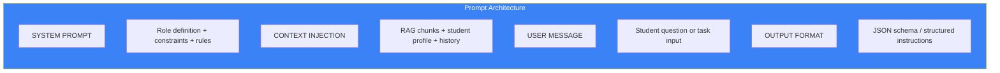

# Page 51: Prompt Engineering Patterns & LLM Orchestration

---

## 51.1 Overview

ensureStudy uses **structured prompt engineering** across all LLM-powered features: tutoring, question generation, grading, summarization, curriculum extraction, and content moderation. This page catalogs every prompt template, composition pattern, and output parsing strategy.

---

## 51.2 Prompt Architecture



---

## 51.3 Tutor Agent System Prompt

```python
TUTOR_SYSTEM_PROMPT = """
You are an expert AI tutor on the ensureStudy platform.

## Your Teaching Method (ABCR Cycle):
1. ASSESS: Evaluate the student's current understanding level
2. BUILD: Provide clear, structured explanations with examples
3. CHALLENGE: Ask follow-up questions to deepen understanding
4. REFLECT: Summarize key takeaways

## Student Profile:
- TAL Level: {tal_level}/5 (1=Beginner, 5=Expert)
- Subject: {subject}
- Weak Topics: {weak_topics}
- Learning Style: {learning_style}

## Rules:
1. Adapt complexity to TAL level
2. Use analogies and real-world examples
3. Never give direct answers without explanation
4. Ask one follow-up question per response
5. Use LaTeX for mathematical formulas: $formula$
6. Keep responses concise but thorough
7. Reference specific materials when available
8. Encourage the student
"""
```

---

## 51.4 Question Generation Prompts

### MCQ Generation

```python
MCQ_PROMPT = """
Generate {count} multiple-choice questions on the topic: {topic}

Difficulty: {difficulty} (easy/medium/hard)
Subject: {subject}

Format each question as JSON:
{{
    "question": "...",
    "options": ["A) ...", "B) ...", "C) ...", "D) ..."],
    "correct_answer": "A",
    "explanation": "...",
    "difficulty": "medium",
    "bloom_level": "application"
}}

Rules:
- All distractors must be plausible
- Avoid "all of the above" / "none of the above"
- Include explanations for correct answers
- Cover different Bloom's taxonomy levels
"""
```

### Descriptive Question Generation

```python
DESCRIPTIVE_PROMPT = """
Generate {count} descriptive/essay questions on: {topic}

Format as JSON:
{{
    "question": "...",
    "expected_answer": "...",
    "marking_rubric": {{
        "criteria": [...],
        "max_marks": 10
    }},
    "difficulty": "hard"
}}
"""
```

---

## 51.5 Answer Grading Prompts

```python
GRADING_PROMPT = """
You are an expert examiner. Grade the following student answer.

Question: {question}
Expected Answer: {expected_answer}
Student's Answer: {student_answer}
Maximum Marks: {max_marks}

Evaluate based on:
1. Accuracy of content (40%)
2. Completeness of explanation (30%)
3. Use of relevant examples (15%)
4. Clarity and structure (15%)

Return JSON:
{{
    "score": <number>,
    "max_score": {max_marks},
    "feedback": "Detailed feedback...",
    "strengths": ["..."],
    "improvements": ["..."],
    "grade": "A/B/C/D/F"
}}
"""
```

---

## 51.6 Curriculum Extraction Prompts

```python
TOPIC_EXTRACTION_PROMPT = """
Analyze this syllabus text and extract a structured curriculum.

Syllabus: {syllabus_text}

Return JSON:
{{
    "subjects": [{{
        "name": "...",
        "topics": [{{
            "name": "...",
            "subtopics": ["..."],
            "difficulty": "easy/medium/hard",
            "estimated_hours": <number>,
            "prerequisites": ["topic names"]
        }}]
    }}]
}}

Rules:
- Identify logical dependencies between topics
- Estimate study hours based on complexity
- Group related concepts under topics
"""
```

---

## 51.7 Meeting Summarization Prompts

```python
MEETING_SUMMARY_PROMPT = """
Summarize this meeting transcript for students.

Transcript: {transcript}

Return JSON:
{{
    "brief_summary": "2-3 sentence overview",
    "detailed_summary": "Comprehensive summary",
    "key_points": ["..."],
    "action_items": ["..."],
    "questions_discussed": ["..."],
    "topics_covered": ["..."]
}}
"""
```

---

## 51.8 RAG Context Injection

```python
def build_rag_prompt(query: str, context_chunks: list, history: list) -> str:
    context_str = "\n---\n".join([
        f"[Source: {c.metadata.get('source', 'unknown')}]\n{c.text}"
        for c in context_chunks
    ])
    
    return f"""
    Use the following context to answer the student's question.
    If the answer is not in the context, say so and provide what you know.
    
    ## Context from Study Materials:
    {context_str}
    
    ## Recent Chat History:
    {format_history(history[-5:])}
    
    ## Student's Question:
    {query}
    
    Answer clearly and reference the materials when possible.
    """
```

---

## 51.9 Output Parsing Strategies

| Strategy | Use Case | Implementation |
|----------|----------|----------------|
| JSON mode | Structured data (questions, grades) | `response_format={"type": "json_object"}` |
| Regex extraction | Scores from text | `re.search(r'Score:\s*(\d+)', response)` |
| SSE streaming | Real-time chat | Chunk-by-chunk token streaming |
| Markdown parsing | Notes generation | Parse headers, lists, code blocks |

```python
# JSON output parsing with fallback
def parse_llm_json(response: str) -> dict:
    try:
        return json.loads(response)
    except json.JSONDecodeError:
        # Try to extract JSON from markdown code block
        match = re.search(r'```json\s*(.*?)\s*```', response, re.DOTALL)
        if match:
            return json.loads(match.group(1))
        raise ValueError(f"Could not parse JSON from response")
```

---

## 51.10 Provider-Specific Adaptations

| Provider | Max Tokens | JSON Support | Streaming | Best Use |
|----------|-----------|-------------|-----------|----------|
| OpenAI GPT-4 | 128K | Native | Yes | Complex reasoning, grading |
| Gemini 1.5 Flash | 1M | Yes | Yes | Long documents, summarization |
| Groq (Llama) | 32K | Via prompt | Yes | Fast classification |
| Ollama (local) | Model-dependent | Via prompt | Yes | Development, fallback |

```python
# Provider-specific temperature settings
PROVIDER_CONFIGS = {
    "openai": {"temperature": 0.3, "max_tokens": 4096},
    "gemini": {"temperature": 0.2, "max_tokens": 8192},
    "groq":   {"temperature": 0.1, "max_tokens": 2048},
    "ollama": {"temperature": 0.5, "max_tokens": 2048}
}
```
