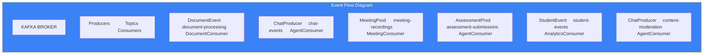

# Page 53: Kafka Event Architecture — Topics, Producers & Consumers

---

## 53.1 Overview

ensureStudy uses **Apache Kafka** as the central event bus for asynchronous processing. The system has **5 producers**, **4 consumers**, and **6+ topics** handling document processing, chat events, meetings, assessments, analytics, and student activity.

---

## 53.2 Kafka Configuration

### Source: `backend/kafka/config/kafka_config.py`

```python
KAFKA_CONFIG = {
    "bootstrap_servers": os.getenv("KAFKA_BROKER", "localhost:9092"),
    "client_id": "ensurestudy",
    "group_id": "ensurestudy-consumers",
    "auto_offset_reset": "earliest",
    "enable_auto_commit": True,
    "max_poll_records": 10,
    "session_timeout_ms": 30000
}
```

### Docker Configuration

```yaml
kafka:
    image: confluentinc/cp-kafka:7.5.0
    environment:
        KAFKA_ZOOKEEPER_CONNECT: zookeeper:2181
        KAFKA_ADVERTISED_LISTENERS: PLAINTEXT://kafka:29092,HOST://localhost:9092
        KAFKA_NUM_PARTITIONS: 3
        KAFKA_DEFAULT_REPLICATION_FACTOR: 1
        KAFKA_LOG_RETENTION_HOURS: 168    # 7 days
```

---

## 53.3 Topic Registry

| Topic | Partitions | Producers | Consumers | Purpose |
|-------|-----------|-----------|-----------|---------|
| `document-processing` | 3 | document_event_producer | document_consumer | PDF/PPTX indexing pipeline |
| `chat-events` | 3 | chat_producer | agent_consumer | Chat messages → AI processing |
| `meeting-recordings` | 2 | meeting_producer | meeting_consumer | Recording → transcription |
| `assessment-submissions` | 3 | assessment_producer | agent_consumer | Answer grading |
| `student-events` | 3 | student_event_producer | analytics_consumer | Activity tracking |
| `content-moderation` | 1 | chat_producer | agent_consumer | Flagged content |

---

## 53.4 Producers (5 files)

### Document Event Producer

```python
# producers/document_event_producer.py
class DocumentEventProducer:
    def emit_document_uploaded(self, document_id, classroom_id, file_path):
        self.producer.send("document-processing", {
            "event": "document_uploaded",
            "document_id": document_id,
            "classroom_id": classroom_id,
            "file_path": file_path,
            "timestamp": datetime.utcnow().isoformat()
        })
    
    def emit_indexing_complete(self, document_id, chunks_count):
        self.producer.send("document-processing", {
            "event": "indexing_complete",
            "document_id": document_id,
            "chunks_indexed": chunks_count
        })
```

### Chat Producer

```python
# producers/chat_producer.py
class ChatProducer:
    def emit_message(self, session_id, user_id, message, context):
        self.producer.send("chat-events", {
            "event": "user_message",
            "session_id": session_id,
            "user_id": user_id,
            "message": message,
            "classroom_id": context.get("classroom_id"),
            "subject": context.get("subject")
        })
    
    def emit_moderation_flag(self, user_id, content, category):
        self.producer.send("content-moderation", {
            "event": "content_flagged",
            "user_id": user_id,
            "content_hash": hashlib.sha256(content.encode()).hexdigest(),
            "category": category
        })
```

### Meeting Producer

```python
# producers/meeting_producer.py
class MeetingProducer:
    def emit_recording_available(self, meeting_id, recording_url):
        self.producer.send("meeting-recordings", {
            "event": "recording_available",
            "meeting_id": meeting_id,
            "recording_url": recording_url
        })
```

### Assessment Producer

```python
# producers/assessment_producer.py
class AssessmentProducer:
    def emit_submission(self, assessment_id, user_id, responses):
        self.producer.send("assessment-submissions", {
            "event": "assessment_submitted",
            "assessment_id": assessment_id,
            "user_id": user_id,
            "responses": responses,
            "submitted_at": datetime.utcnow().isoformat()
        })
```

### Student Event Producer

```python
# producers/student_event_producer.py
class StudentEventProducer:
    def emit_study_session(self, user_id, topic, duration_minutes):
        self.producer.send("student-events", {
            "event": "study_session",
            "user_id": user_id,
            "topic": topic,
            "duration_minutes": duration_minutes
        })
    
    def emit_login(self, user_id):
        self.producer.send("student-events", {
            "event": "user_login",
            "user_id": user_id
        })
```

---

## 53.5 Consumers (4 files)

### Document Consumer

```python
# consumers/document_consumer.py
class DocumentConsumer:
    """Listens to 'document-processing' topic"""
    
    def handle_document_uploaded(self, event):
        # 1. Download file
        # 2. Run 7-stage document pipeline
        # 3. Chunk and embed into Qdrant
        # 4. Update document status via callback
        pass
```

### Agent Consumer

```python
# consumers/agent_consumer.py
class AgentConsumer:
    """Listens to 'chat-events', 'assessment-submissions', 'content-moderation'"""
    
    def handle_event(self, topic, event):
        if topic == "chat-events":
            self.process_chat_message(event)
        elif topic == "assessment-submissions":
            self.process_assessment(event)
        elif topic == "content-moderation":
            self.review_flagged_content(event)
```

### Meeting Consumer

```python
# consumers/meeting_consumer.py
class MeetingConsumer:
    """Listens to 'meeting-recordings' topic"""
    
    def handle_recording(self, event):
        # 1. Transcribe with Whisper
        # 2. Summarize with Gemini
        # 3. Embed into Qdrant
        # 4. Store analytics in Cassandra
        pass
```

### Analytics Consumer

```python
# consumers/analytics_consumer.py
class AnalyticsConsumer:
    """Listens to 'student-events' topic"""
    
    def handle_event(self, event):
        # 1. Update progress tables
        # 2. Update leaderboard
        # 3. Check streak status
        # 4. Trigger notifications
        pass
```

---

## 53.6 Event Flow Diagram



---

## 53.7 Kafka UI

```yaml
kafka-ui:
    image: provectuslabs/kafka-ui:latest
    ports:
        - "8080:8080"
    environment:
        KAFKA_CLUSTERS_0_BOOTSTRAPSERVERS: kafka:29092
```

Accessible at `http://localhost:8080` — shows topics, partitions, consumer groups, and message browsing.
