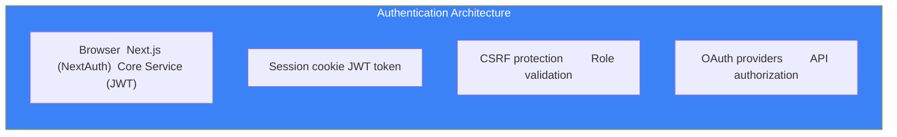

# Page 55: Authentication & Middleware Deep Dive

---

## 55.1 Overview

ensureStudy implements **dual authentication systems**: JWT-based auth for the Core Service (Flask) and NextAuth for the Frontend (Next.js), with RBAC (Role-Based Access Control) across 4 user roles.

---

## 55.2 Authentication Architecture



---

## 55.3 JWT Implementation (Core Service)

### Token Generation

```python
import jwt
from datetime import datetime, timedelta

SECRET_KEY = os.getenv("JWT_SECRET_KEY")
ALGORITHM = "HS256"
ACCESS_TOKEN_EXPIRE = timedelta(hours=24)
REFRESH_TOKEN_EXPIRE = timedelta(days=7)

def generate_tokens(user_id: str, role: str) -> dict:
    access_payload = {
        "sub": user_id,
        "role": role,
        "type": "access",
        "iat": datetime.utcnow(),
        "exp": datetime.utcnow() + ACCESS_TOKEN_EXPIRE
    }
    
    refresh_payload = {
        "sub": user_id,
        "type": "refresh",
        "iat": datetime.utcnow(),
        "exp": datetime.utcnow() + REFRESH_TOKEN_EXPIRE
    }
    
    return {
        "access_token": jwt.encode(access_payload, SECRET_KEY, algorithm=ALGORITHM),
        "refresh_token": jwt.encode(refresh_payload, SECRET_KEY, algorithm=ALGORITHM),
        "token_type": "bearer",
        "expires_in": int(ACCESS_TOKEN_EXPIRE.total_seconds())
    }
```

### Token Verification

```python
def verify_token(token: str) -> dict:
    try:
        payload = jwt.decode(token, SECRET_KEY, algorithms=[ALGORITHM])
        if payload.get("type") != "access":
            raise InvalidTokenError("Not an access token")
        return payload
    except jwt.ExpiredSignatureError:
        raise TokenExpiredError("Token has expired")
    except jwt.InvalidTokenError:
        raise InvalidTokenError("Invalid token")
```

---

## 55.4 Flask Middleware

### Authentication Decorator

```python
from functools import wraps

def jwt_required(f):
    @wraps(f)
    def decorated(*args, **kwargs):
        token = request.headers.get("Authorization", "").replace("Bearer ", "")
        
        if not token:
            return jsonify({"error": "Token missing"}), 401
        
        try:
            payload = verify_token(token)
            g.current_user_id = payload["sub"]
            g.current_user_role = payload["role"]
        except TokenExpiredError:
            return jsonify({"error": "Token expired"}), 401
        except InvalidTokenError:
            return jsonify({"error": "Invalid token"}), 401
        
        return f(*args, **kwargs)
    return decorated
```

### Role-Based Access Control

```python
def role_required(*roles):
    def decorator(f):
        @wraps(f)
        @jwt_required
        def decorated(*args, **kwargs):
            if g.current_user_role not in roles:
                return jsonify({"error": "Insufficient permissions"}), 403
            return f(*args, **kwargs)
        return decorated
    return decorator

# Usage
@app.route("/api/admin/users")
@role_required("admin")
def list_all_users():
    ...

@app.route("/api/classrooms", methods=["POST"])
@role_required("teacher", "admin")
def create_classroom():
    ...
```

---

## 55.5 RBAC Role Matrix

| Resource | Student | Teacher | Parent | Admin |
|----------|---------|---------|--------|-------|
| View dashboard | ✅ Own | ✅ Own | ✅ Children | ✅ All |
| Create classroom | ❌ | ✅ | ❌ | ✅ |
| Join classroom | ✅ | ❌ | ❌ | ✅ |
| Upload materials | ❌ | ✅ | ❌ | ✅ |
| Create assessment | ❌ | ✅ | ❌ | ✅ |
| Take assessment | ✅ | ❌ | ❌ | ❌ |
| View progress | ✅ Own | ✅ Students | ✅ Children | ✅ All |
| Chat with tutor | ✅ | ✅ | ❌ | ✅ |
| Manage users | ❌ | ❌ | ❌ | ✅ |
| View billing | ❌ | ❌ | ❌ | ✅ |
| View reports | ❌ | ✅ Class | ✅ Children | ✅ All |

---

## 55.6 NextAuth Configuration (Frontend)

```typescript
// app/api/auth/[...nextauth]/route.ts
import NextAuth from "next-auth";
import CredentialsProvider from "next-auth/providers/credentials";

export const authOptions = {
    providers: [
        CredentialsProvider({
            name: "Credentials",
            credentials: {
                email: { label: "Email", type: "email" },
                password: { label: "Password", type: "password" }
            },
            async authorize(credentials) {
                // Call Core Service login endpoint
                const res = await fetch(`${API_URL}/api/auth/login`, {
                    method: "POST",
                    body: JSON.stringify(credentials),
                    headers: { "Content-Type": "application/json" }
                });
                
                const data = await res.json();
                
                if (res.ok && data.access_token) {
                    return {
                        id: data.user.id,
                        name: data.user.username,
                        email: data.user.email,
                        role: data.user.role,
                        accessToken: data.access_token
                    };
                }
                return null;
            }
        })
    ],
    callbacks: {
        async jwt({ token, user }) {
            if (user) {
                token.role = user.role;
                token.accessToken = user.accessToken;
            }
            return token;
        },
        async session({ session, token }) {
            session.user.role = token.role;
            session.accessToken = token.accessToken;
            return session;
        }
    },
    pages: {
        signIn: "/auth/signin",
        error: "/auth/error"
    }
};
```

---

## 55.7 Next.js Middleware (Route Protection)

```typescript
// middleware.ts
import { withAuth } from "next-auth/middleware";

export default withAuth({
    callbacks: {
        authorized({ req, token }) {
            const path = req.nextUrl.pathname;
            
            // Public routes
            if (path.startsWith("/auth")) return true;
            if (path === "/") return true;
            
            // Must be logged in
            if (!token) return false;
            
            // Role-based protection
            if (path.startsWith("/admin") && token.role !== "admin") return false;
            if (path.startsWith("/teacher") && token.role !== "teacher") return false;
            if (path.startsWith("/parent") && token.role !== "parent") return false;
            
            return true;
        }
    }
});

export const config = {
    matcher: ["/((?!api|_next/static|_next/image|favicon.ico).*)"]
};
```

---

## 55.8 CORS Configuration

```python
# Core Service
from flask_cors import CORS

CORS(app, resources={
    r"/api/*": {
        "origins": [
            "http://localhost:3000",
            "https://localhost:3000",
            os.getenv("FRONTEND_URL", "")
        ],
        "methods": ["GET", "POST", "PUT", "DELETE", "OPTIONS"],
        "allow_headers": ["Content-Type", "Authorization"],
        "supports_credentials": True
    }
})
```

---

## 55.9 Password Security

```python
from werkzeug.security import generate_password_hash, check_password_hash

# Registration
password_hash = generate_password_hash(password, method="pbkdf2:sha256")

# Login verification
if check_password_hash(user.password_hash, password):
    return generate_tokens(user.id, user.role)
```

| Parameter | Value |
|-----------|-------|
| Algorithm | PBKDF2-SHA256 |
| Iterations | 260,000 (Werkzeug default) |
| Salt | Random per-password |
| Token Algorithm | HS256 |
| Access Token TTL | 24 hours |
| Refresh Token TTL | 7 days |
