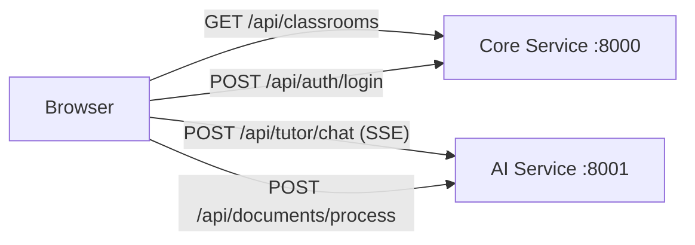
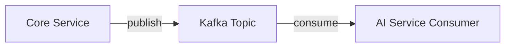
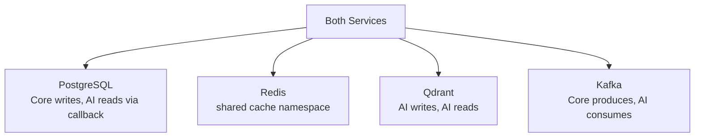
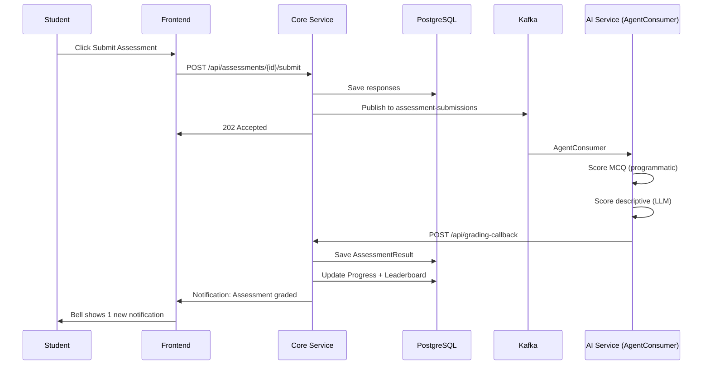

# Page 58: Inter-Service Communication Patterns

---

## 58.1 Overview

ensureStudy's microservices communicate via **4 patterns**: synchronous HTTP, asynchronous Kafka events, callback webhooks, and shared database access. This page documents every communication path between services.

---

## 58.2 Communication Matrix

| From | To | Pattern | Purpose |
|------|----|---------|---------|
| Frontend → Core | REST HTTP | CRUD, auth, classroom ops |
| Frontend → AI | REST HTTP + SSE | Tutor chat, document upload |
| Core → AI | REST HTTP | Trigger processing, get results |
| AI → Core | HTTP Callback | Report grading, indexing status |
| Core → Kafka | Async Event | Publish document/chat/meeting events |
| Kafka → AI | Async Consumer | Process documents, grade assessments |
| AI → Qdrant | gRPC/HTTP | Vector operations |
| Core → PostgreSQL | SQL (SQLAlchemy) | Data persistence |
| AI → Redis | Redis Protocol | Caching |
| Core → Redis | Redis Protocol | Session state |

---

## 58.3 Pattern 1: Frontend → Backend (REST)



### Frontend API Client

```typescript
const API_URL = process.env.NEXT_PUBLIC_API_URL || 'http://localhost:8000';
const AI_URL = process.env.NEXT_PUBLIC_AI_URL || 'http://localhost:8001';

// Core Service calls
const coreApi = axios.create({
    baseURL: `${API_URL}/api`,
    headers: { Authorization: `Bearer ${session.accessToken}` }
});

// AI Service calls  
const aiApi = axios.create({
    baseURL: `${AI_URL}/api`
});
```

---

## 58.4 Pattern 2: AI → Core (Callbacks)

The AI Service calls back to the Core Service to update records after async processing:

```python
# AI Service: services/grading_service.py
CORE_SERVICE_URL = os.getenv("CORE_SERVICE_URL", "http://core-service:8000")

async def submit_grading_result(assessment_id, user_id, score, feedback):
    await httpx.post(
        f"{CORE_SERVICE_URL}/api/grading-callback",
        json={
            "assessment_id": assessment_id,
            "user_id": user_id,
            "score": score,
            "feedback": feedback
        }
    )
```

### Callback Endpoints (Core Service)

| Endpoint | Caller | Purpose |
|----------|--------|---------|
| `/api/grading-callback` | AI Service | Report assessment grading result |
| `/api/documents/<id>/status` | AI Service | Update document indexing status |
| `/api/progress/<id>` | AI Service | Update student progress |

---

## 58.5 Pattern 3: Kafka Async Events



| Event Flow | Topic | Trigger | Handler |
|-----------|-------|---------|---------|
| Material upload → processing | `document-processing` | Teacher uploads PDF | DocumentConsumer |
| Chat message → AI response | `chat-events` | Student sends message | AgentConsumer |
| Meeting end → transcription | `meeting-recordings` | Teacher ends meeting | MeetingConsumer |
| Answer submit → grading | `assessment-submissions` | Student submits | AgentConsumer |
| Activity → analytics | `student-events` | Any student action | AnalyticsConsumer |

---

## 58.6 Pattern 4: Shared Infrastructure



### Docker Networking

```yaml
# docker-compose.yml
networks:
    ensurestudy-network:
        driver: bridge

services:
    core-service:
        networks: [ensurestudy-network]
    ai-service:
        networks: [ensurestudy-network]
    postgres:
        networks: [ensurestudy-network]
    redis:
        networks: [ensurestudy-network]
```

All services on the same Docker bridge network → internal DNS resolution (`core-service:8000`, `ai-service:8001`, `postgres:5432`).

---

## 58.7 Service Discovery

| Service | Internal URL | External URL |
|---------|-------------|-------------|
| Core Service | `http://core-service:8000` | `http://localhost:8000` |
| AI Service | `http://ai-service:8001` | `http://localhost:8001` |
| PostgreSQL | `postgres:5432` | `localhost:5432` |
| Redis | `redis:6379` | `localhost:6379` |
| Qdrant | `qdrant:6333` | `localhost:6333` |
| Kafka | `kafka:29092` | `localhost:9092` |
| MongoDB | `mongodb:27017` | `localhost:27017` |

---

## 58.8 Error Handling in Inter-Service Calls

```python
import httpx
from tenacity import retry, stop_after_attempt, wait_exponential

@retry(stop=stop_after_attempt(3), wait=wait_exponential(min=1, max=10))
async def call_core_service(endpoint: str, data: dict):
    async with httpx.AsyncClient(timeout=30) as client:
        response = await client.post(
            f"{CORE_SERVICE_URL}/{endpoint}",
            json=data
        )
        response.raise_for_status()
        return response.json()
```

---

## 58.9 Request Flow: Complete Example


