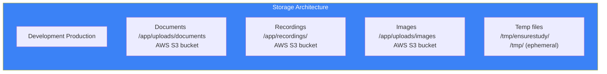
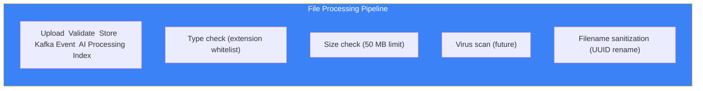

# Page 59: File Upload & Storage Architecture

---

## 59.1 Overview

ensureStudy handles file uploads across **4 content types** (documents, recordings, images, videos) with a dual-backend storage strategy: local filesystem in development and AWS S3/MinIO in production.

---

## 59.2 Storage Architecture



---

## 59.3 Upload Routes

### Source: `backend/core-service/app/routes/files.py`

```python
UPLOAD_FOLDER = os.getenv("UPLOAD_FOLDER", "/app/uploads")
MAX_FILE_SIZE = 50 * 1024 * 1024  # 50 MB
ALLOWED_EXTENSIONS = {
    "documents": {"pdf", "docx", "pptx", "txt", "md"},
    "images": {"png", "jpg", "jpeg", "gif", "webp"},
    "videos": {"mp4", "webm", "mov"},
    "audio": {"mp3", "wav", "m4a"}
}

@files_bp.route("/upload", methods=["POST"])
@jwt_required
def upload_file():
    file = request.files.get("file")
    
    # Validate
    if not file or not allowed_file(file.filename):
        return jsonify({"error": "Invalid file"}), 400
    
    # Check size
    if request.content_length > MAX_FILE_SIZE:
        return jsonify({"error": "File too large (max 50MB)"}), 413
    
    # Generate unique filename
    ext = file.filename.rsplit('.', 1)[1].lower()
    filename = f"{uuid4()}.{ext}"
    
    # Save
    filepath = os.path.join(UPLOAD_FOLDER, filename)
    file.save(filepath)
    
    return jsonify({
        "file_id": filename,
        "url": f"/api/files/{filename}",
        "size": os.path.getsize(filepath)
    }), 201
```

### Classroom Material Upload

```python
@classroom_bp.route("/<id>/materials", methods=["POST"])
@role_required("teacher", "admin")
def upload_material(id):
    file = request.files["file"]
    
    # Save file
    file_id = save_file(file)
    
    # Create record
    material = ClassroomMaterial(
        classroom_id=id,
        name=file.filename,
        file_url=f"/api/files/{file_id}",
        file_type=get_file_type(file.filename),
        uploaded_by=g.current_user_id
    )
    db.session.add(material)
    db.session.commit()
    
    # Trigger document processing via Kafka
    document_producer.emit_document_uploaded(
        document_id=material.id,
        classroom_id=id,
        file_path=get_absolute_path(file_id)
    )
    
    return jsonify(material.to_dict()), 201
```

---

## 59.4 S3/MinIO Integration

### Source: via `boto3` in Core Service

```python
import boto3

class StorageService:
    def __init__(self):
        self.s3 = boto3.client(
            's3',
            endpoint_url=os.getenv("S3_ENDPOINT", "http://minio:9000"),
            aws_access_key_id=os.getenv("AWS_ACCESS_KEY_ID"),
            aws_secret_access_key=os.getenv("AWS_SECRET_ACCESS_KEY"),
            region_name=os.getenv("AWS_REGION", "us-east-1")
        )
        self.bucket = os.getenv("S3_BUCKET", "ensurestudy-uploads")
    
    def upload(self, file_obj, key: str) -> str:
        self.s3.upload_fileobj(file_obj, self.bucket, key)
        return f"s3://{self.bucket}/{key}"
    
    def download(self, key: str) -> bytes:
        response = self.s3.get_object(Bucket=self.bucket, Key=key)
        return response['Body'].read()
    
    def get_presigned_url(self, key: str, expires: int = 3600) -> str:
        return self.s3.generate_presigned_url(
            'get_object',
            Params={'Bucket': self.bucket, 'Key': key},
            ExpiresIn=expires
        )
```

### MinIO Docker Configuration

```yaml
minio:
    image: minio/minio:latest
    command: server /data --console-address ":9101"
    ports:
        - "9000:9000"     # S3 API
        - "9101:9101"     # Web console
    environment:
        MINIO_ROOT_USER: minioadmin
        MINIO_ROOT_PASSWORD: minioadmin
    volumes:
        - minio_data:/data
```

---

## 59.5 File Processing Pipeline



---

## 59.6 Meeting Recording Storage

```python
# Recording saved after LiveKit session ends
recording_path = f"recordings/{meeting_id}/{uuid4()}.webm"

# In production: upload to S3
storage.upload(recording_file, recording_path)

# Create record
recording = MeetingRecording(
    meeting_id=meeting_id,
    file_url=recording_path,
    duration_seconds=duration,
    file_size=file_size
)
```

---

## 59.7 Docker Volumes

```yaml
volumes:
    uploads_data:     # /app/uploads — documents, images
    recordings_data:  # /app/recordings — meeting recordings
    minio_data:       # /data — MinIO object storage
```

---

## 59.8 Security Measures

| Measure | Implementation |
|---------|---------------|
| Extension whitelist | Only allowed file types accepted |
| Size limit | 50 MB max per file |
| UUID filenames | Original names never stored on disk |
| Auth required | All upload endpoints require JWT |
| Role check | Only teachers can upload materials |
| CORS restricted | Only frontend origin allowed |
| No directory traversal | `secure_filename()` applied |
