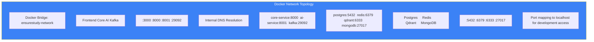

# Page 60: Network Architecture & TLS Configuration

---

## 60.1 Overview

ensureStudy implements **TLS encryption** for both local development (via mkcert) and LAN access, with Nginx reverse proxy in production. The system supports 3 networking modes: localhost, LAN, and production cloud.

---

## 60.2 Network Modes

| Mode | Script | Frontend URL | TLS |
|------|--------|-------------|-----|
| Local | `run-local.sh` | `https://localhost:3000` | mkcert (self-signed) |
| LAN | `run-lan.sh` | `https://192.168.4.x:3000` | mkcert (LAN cert) |
| Production | Docker Compose | `https://domain.com` | Let's Encrypt / AWS ACM |

---

## 60.3 TLS Certificate Files

### mkcert-Generated Certificates

| File | Purpose |
|------|---------|
| `localhost+2.pem` | Localhost TLS certificate |
| `localhost+2-key.pem` | Localhost TLS private key |
| `192.168.4.60+2.pem` | LAN IP TLS certificate |
| `192.168.4.60+2-key.pem` | LAN IP TLS private key |
| `192.168.4.157+2.pem` | Second LAN IP certificate |
| `192.168.4.157+2-key.pem` | Second LAN IP private key |
| `rootCA.pem` | Root CA for mkcert trust |

### Certificate Generation

```bash
# Install mkcert
brew install mkcert

# Install local CA
mkcert -install

# Generate certificates
mkcert localhost 127.0.0.1 ::1
mkcert 192.168.4.60 192.168.4.60 localhost
mkcert 192.168.4.157 192.168.4.157 localhost
```

---

## 60.4 Local Development (`run-local.sh`)

```bash
#!/bin/bash
# Start all services with HTTPS on localhost

export NEXT_PUBLIC_API_URL=https://localhost:8000
export NEXT_PUBLIC_AI_URL=https://localhost:8001

# Start infrastructure
docker-compose up -d postgres redis qdrant kafka zookeeper mongodb minio

# Start backend services
cd backend/core-service && flask run --cert=../../localhost+2.pem \
    --key=../../localhost+2-key.pem --port 8000 &

cd backend/ai-service && uvicorn app.main:app --port 8001 \
    --ssl-certfile ../../localhost+2.pem \
    --ssl-keyfile ../../localhost+2-key.pem &

# Start frontend with HTTPS
cd frontend && npm run dev -- --experimental-https
```

---

## 60.5 LAN Development (`run-lan.sh`)

```bash
#!/bin/bash
# Start services accessible from any device on the local network

LAN_IP=$(ipconfig getifaddr en0)
export NEXT_PUBLIC_API_URL=https://${LAN_IP}:8000
export NEXT_PUBLIC_AI_URL=https://${LAN_IP}:8001

# Use LAN-specific certificates
CERT="192.168.4.60+2.pem"
KEY="192.168.4.60+2-key.pem"

# Start backend with LAN binding
cd backend/core-service && flask run --host 0.0.0.0 --port 8000 \
    --cert=../../${CERT} --key=../../${KEY} &

cd backend/ai-service && uvicorn app.main:app --host 0.0.0.0 --port 8001 \
    --ssl-certfile ../../${CERT} --ssl-keyfile ../../${KEY} &

# Frontend binds to all interfaces
cd frontend && npm run dev -- --hostname 0.0.0.0
```

This allows testing from mobile devices, tablets, and other machines on the same network.

---

## 60.6 Production Network

### Nginx Reverse Proxy

```nginx
# /etc/nginx/sites-available/ensurestudy
server {
    listen 443 ssl http2;
    server_name ensurestudy.example.com;
    
    ssl_certificate /etc/letsencrypt/live/ensurestudy.example.com/fullchain.pem;
    ssl_certificate_key /etc/letsencrypt/live/ensurestudy.example.com/privkey.pem;
    
    # Frontend
    location / {
        proxy_pass http://localhost:3000;
        proxy_http_version 1.1;
        proxy_set_header Upgrade $http_upgrade;
        proxy_set_header Connection 'upgrade';
    }
    
    # Core API
    location /api/ {
        proxy_pass http://localhost:8000;
        proxy_set_header X-Real-IP $remote_addr;
        proxy_set_header Host $host;
    }
    
    # AI Service
    location /ai/ {
        proxy_pass http://localhost:8001;
        proxy_read_timeout 300;  # Long timeout for AI
    }
    
    # SSE (no buffering)
    location /api/tutor/chat {
        proxy_pass http://localhost:8001;
        proxy_buffering off;
        proxy_cache off;
        proxy_set_header Connection '';
        proxy_http_version 1.1;
        chunked_transfer_encoding off;
    }
    
    # WebSocket
    location /ws/ {
        proxy_pass http://localhost:8001;
        proxy_http_version 1.1;
        proxy_set_header Upgrade $http_upgrade;
        proxy_set_header Connection "upgrade";
    }
}
```

---

## 60.7 Docker Network Topology



---

## 60.8 Port Map

| Port | Service | Protocol |
|------|---------|----------|
| 3000 | Frontend (Next.js) | HTTP/HTTPS |
| 8000 | Core Service (Flask) | HTTP/HTTPS |
| 8001 | AI Service (FastAPI) | HTTP/HTTPS |
| 5432 | PostgreSQL | TCP |
| 6333 | Qdrant (HTTP API) | HTTP |
| 6334 | Qdrant (gRPC) | gRPC |
| 6379 | Redis | TCP |
| 9000 | MinIO (S3 API) | HTTP |
| 9092 | Kafka (external) | TCP |
| 29092 | Kafka (internal) | TCP |
| 2181 | ZooKeeper | TCP |
| 27017 | MongoDB | TCP |
| 9042 | Cassandra | TCP |
| 8080 | Kafka UI | HTTP |
| 9101 | MinIO Console | HTTP |
| 5000 | MLflow | HTTP |

---

## 60.9 .gitignore — Secrets Protection

```gitignore
# Environment secrets
.env
.env.local
.env.production

# TLS certificates
*.pem
*.key
*.crt
```
