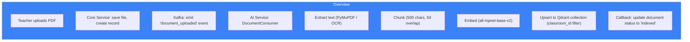
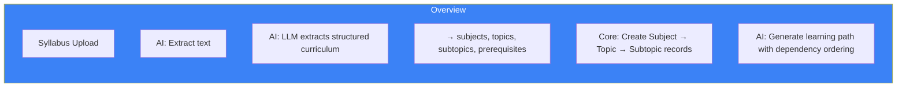

# Page 61: Classroom & Subject Management

---

## 61.1 Overview

The classroom system is the **organizational backbone** of ensureStudy, connecting teachers, students, subjects, and materials. Classrooms enable scoped access — all materials, assessments, progress tracking, and AI interactions are contextually tied to a classroom.

---

## 61.2 Data Models

### Classroom

```python
class Classroom(db.Model):
    __tablename__ = "classrooms"
    
    id          = Column(String(36), primary_key=True, default=uuid4)
    name        = Column(String(200), nullable=False)
    description = Column(Text)
    teacher_id  = Column(String(36), ForeignKey("users.id"))
    join_code   = Column(String(8), unique=True)     # Auto-generated
    subject     = Column(String(100))
    grade_level = Column(String(50))
    is_active   = Column(Boolean, default=True)
    max_students = Column(Integer, default=100)
    created_at  = Column(DateTime, default=datetime.utcnow)
    
    # Relationships
    teacher   = relationship("User", backref="owned_classrooms")
    students  = relationship("ClassroomStudent", back_populates="classroom")
    materials = relationship("ClassroomMaterial", back_populates="classroom")
    subjects  = relationship("Subject", back_populates="classroom")
```

### ClassroomStudent (Join Table)

```python
class ClassroomStudent(db.Model):
    __tablename__ = "classroom_students"
    
    id            = Column(String(36), primary_key=True)
    classroom_id  = Column(String(36), ForeignKey("classrooms.id"))
    student_id    = Column(String(36), ForeignKey("users.id"))
    joined_at     = Column(DateTime, default=datetime.utcnow)
    is_active     = Column(Boolean, default=True)
```

### Subject

```python
class Subject(db.Model):
    __tablename__ = "subjects"
    
    id            = Column(String(36), primary_key=True)
    name          = Column(String(100), nullable=False)
    classroom_id  = Column(String(36), ForeignKey("classrooms.id"))
    description   = Column(Text)
    color         = Column(String(7))    # Hex color for UI
    icon          = Column(String(50))   # Icon identifier
    created_at    = Column(DateTime, default=datetime.utcnow)
    
    topics = relationship("Topic", back_populates="subject")
```

### Topic

```python
class Topic(db.Model):
    __tablename__ = "topics"
    
    id            = Column(String(36), primary_key=True)
    name          = Column(String(200), nullable=False)
    subject_id    = Column(String(36), ForeignKey("subjects.id"))
    description   = Column(Text)
    order         = Column(Integer)       # Sequence in curriculum
    difficulty    = Column(String(20))    # easy, medium, hard
    estimated_hours = Column(Float)
    prerequisites = Column(JSON)          # List of prerequisite topic IDs
```

---

## 61.3 Classroom API

| Method | Endpoint | Role | Purpose |
|--------|----------|------|---------|
| POST | `/api/classrooms` | Teacher | Create classroom |
| GET | `/api/classrooms` | Any | List user's classrooms |
| GET | `/api/classrooms/<id>` | Member | Get classroom details |
| PUT | `/api/classrooms/<id>` | Teacher | Update classroom |
| DELETE | `/api/classrooms/<id>` | Teacher | Archive classroom |
| POST | `/api/classrooms/join` | Student | Join via code |
| GET | `/api/classrooms/<id>/students` | Teacher | List students |
| DELETE | `/api/classrooms/<id>/students/<sid>` | Teacher | Remove student |

### Join Flow

```python
@classroom_bp.route("/join", methods=["POST"])
@jwt_required
def join_classroom():
    join_code = request.json.get("join_code")
    
    classroom = Classroom.query.filter_by(
        join_code=join_code, is_active=True
    ).first_or_404()
    
    # Check capacity
    current = ClassroomStudent.query.filter_by(
        classroom_id=classroom.id, is_active=True
    ).count()
    
    if current >= classroom.max_students:
        return jsonify({"error": "Classroom is full"}), 409
    
    # Create enrollment
    enrollment = ClassroomStudent(
        classroom_id=classroom.id,
        student_id=g.current_user_id
    )
    db.session.add(enrollment)
    db.session.commit()
    
    return jsonify({"message": "Joined successfully"})
```

---

## 61.4 Material Management

| Method | Endpoint | Purpose |
|--------|----------|---------|
| POST | `/api/classrooms/<id>/materials` | Upload material |
| GET | `/api/classrooms/<id>/materials` | List materials |
| DELETE | `/api/classrooms/<id>/materials/<mid>` | Delete material |

### Upload → Processing Flow



---

## 61.5 Syllabus Processing

When a syllabus PDF is uploaded to a classroom:



---

## 61.6 Classroom Context for AI

Every tutor chat session is scoped to a classroom context:

```python
# AI Service: chat routes
@router.post("/chat")
async def chat(request: ChatRequest):
    # Retrieve RAG context from classroom-specific materials
    context = qdrant.search(
        collection="classroom_materials",
        query=request.message,
        filters={"classroom_id": request.classroom_id}
    )
    
    # Include classroom subject and student progress
    prompt = build_rag_prompt(
        query=request.message,
        context=context,
        subject=request.subject,
        tal_level=student_progress.tal_level
    )
```
