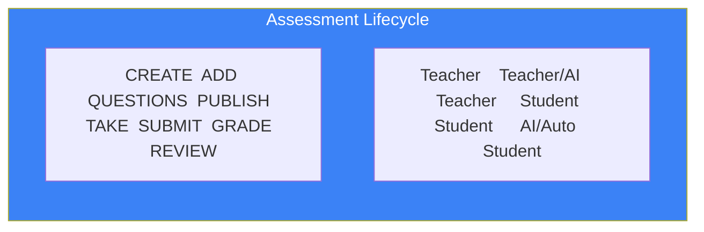

# Page 62: Assessment Engine Deep Dive

---

## 62.1 Overview

The assessment engine supports **4 question types**, AI-powered question generation, automated grading (MCQ + descriptive), proctored exam sessions, and detailed analytics. Teachers create assessments; students take them with optional proctoring; AI grades automated sections.

---

## 62.2 Data Models

### Assessment

```python
class Assessment(db.Model):
    __tablename__ = "assessments"
    
    id              = Column(String(36), primary_key=True)
    title           = Column(String(200), nullable=False)
    classroom_id    = Column(String(36), ForeignKey("classrooms.id"))
    teacher_id      = Column(String(36), ForeignKey("users.id"))
    subject         = Column(String(100))
    description     = Column(Text)
    total_marks     = Column(Integer, default=100)
    duration_minutes = Column(Integer, default=60)
    is_proctored    = Column(Boolean, default=False)
    is_published    = Column(Boolean, default=False)
    due_date        = Column(DateTime)
    created_at      = Column(DateTime, default=datetime.utcnow)
    
    questions = relationship("AssessmentQuestion", back_populates="assessment")
    results   = relationship("AssessmentResult", back_populates="assessment")
```

### AssessmentQuestion

```python
class AssessmentQuestion(db.Model):
    __tablename__ = "assessment_questions"
    
    id              = Column(String(36), primary_key=True)
    assessment_id   = Column(String(36), ForeignKey("assessments.id"))
    question_text   = Column(Text, nullable=False)
    question_type   = Column(String(20))    # 'mcq', 'descriptive', 'true_false', 'fill_blank'
    options         = Column(JSON)           # For MCQ: ["A) ...", "B) ...", ...]
    correct_answer  = Column(Text)           # For MCQ: "A", For others: answer text
    marks           = Column(Integer, default=1)
    difficulty      = Column(String(20))     # easy, medium, hard
    bloom_level     = Column(String(30))     # remember, understand, apply, analyze, evaluate, create
    explanation     = Column(Text)
    order           = Column(Integer)
```

### AssessmentResult

```python
class AssessmentResult(db.Model):
    __tablename__ = "assessment_results"
    
    id              = Column(String(36), primary_key=True)
    assessment_id   = Column(String(36), ForeignKey("assessments.id"))
    student_id      = Column(String(36), ForeignKey("users.id"))
    responses       = Column(JSON)           # {question_id: student_answer}
    score           = Column(Float)
    total_marks     = Column(Integer)
    percentage      = Column(Float)
    grade           = Column(String(5))      # A, B, C, D, F
    feedback        = Column(JSON)           # Per-question feedback
    time_taken      = Column(Integer)        # Seconds
    submitted_at    = Column(DateTime)
    graded_at       = Column(DateTime)
    grading_method  = Column(String(20))     # 'auto', 'ai', 'manual'
```

---

## 62.3 Question Types

| Type | Auto-Gradable | AI-Gradable | Example |
|------|--------------|-------------|---------|
| MCQ | ✅ (exact match) | — | 4-option single answer |
| True/False | ✅ | — | Binary choice |
| Fill in Blank | ✅ (fuzzy match) | — | Single word/phrase |
| Descriptive | — | ✅ (LLM grading) | Short/long essay |

---

## 62.4 Assessment Lifecycle



### Step 1: Create & Add Questions (Teacher)

```
POST /api/assessments
POST /api/assessments/{id}/questions
  or
POST /api/assessments/{id}/generate (AI-generated)
```

### Step 2: AI Question Generation

```python
# AI Service generates questions from classroom materials
@router.post("/assessments/generate")
async def generate_questions(request: GenerateRequest):
    # Get classroom context
    context = qdrant.search("classroom_materials", request.topic)
    
    # LLM generates questions
    questions = await llm.generate(
        MCQ_PROMPT.format(
            topic=request.topic,
            count=request.count,
            difficulty=request.difficulty,
            context=context
        )
    )
    
    return parse_questions(questions)
```

### Step 3: Student Takes Assessment

```
GET /api/assessments/{id}/take
  → Returns questions (without correct answers)
  → Starts timer
  → Activates proctoring if is_proctored=True
```

### Step 4: Auto + AI Grading

```python
def grade_assessment(result: AssessmentResult, questions: list):
    total_score = 0
    feedback = {}
    
    for q in questions:
        student_answer = result.responses.get(q.id)
        
        if q.question_type == "mcq":
            # Exact match
            score = q.marks if student_answer == q.correct_answer else 0
            
        elif q.question_type == "true_false":
            score = q.marks if student_answer == q.correct_answer else 0
            
        elif q.question_type == "fill_blank":
            # Fuzzy match (Levenshtein distance)
            score = q.marks if fuzzy_match(student_answer, q.correct_answer) else 0
            
        elif q.question_type == "descriptive":
            # LLM grading
            grading_result = await grade_descriptive(
                question=q.question_text,
                expected=q.correct_answer,
                student_answer=student_answer,
                max_marks=q.marks
            )
            score = grading_result.score
            feedback[q.id] = grading_result.feedback
        
        total_score += score
    
    result.score = total_score
    result.percentage = (total_score / result.total_marks) * 100
    result.grade = calculate_grade(result.percentage)
```

---

## 62.5 Bloom's Taxonomy Integration

Questions are tagged with Bloom's taxonomy levels:

| Level | Keywords | Example |
|-------|----------|---------|
| Remember | Define, list, recall | "What is photosynthesis?" |
| Understand | Explain, summarize | "Explain the water cycle" |
| Apply | Solve, demonstrate | "Calculate the moles in 50g NaCl" |
| Analyze | Compare, contrast | "Compare mitosis and meiosis" |
| Evaluate | Justify, critique | "Evaluate the impact of deforestation" |
| Create | Design, propose | "Design an experiment to test..." |

---

## 62.6 Assessment Analytics

| Metric | Calculation | API |
|--------|-------------|-----|
| Class average | Mean of all scores | `/api/assessments/{id}/analytics` |
| Difficulty index | % correct per question | Per-question stats |
| Discrimination index | Top 27% vs bottom 27% | Question quality |
| Score distribution | Histogram of scores | Chart data |
| Time analysis | Average time per question | /analytics |
| Bloom coverage | % at each taxonomy level | Report |
