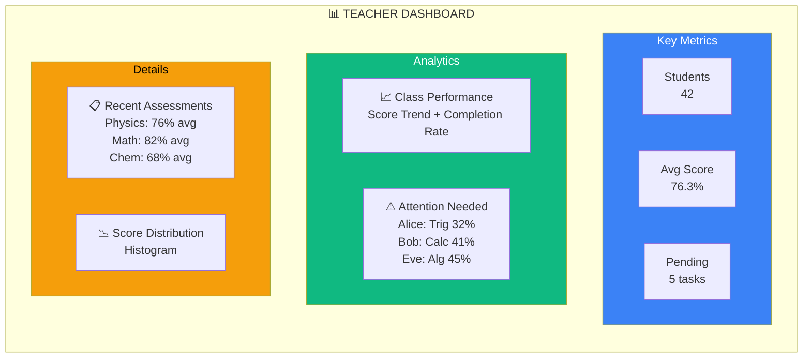
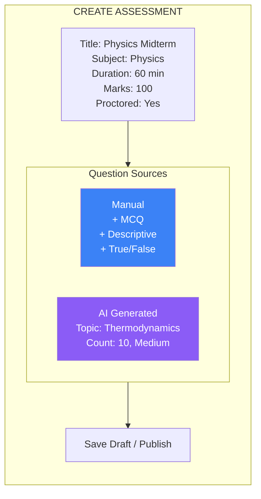
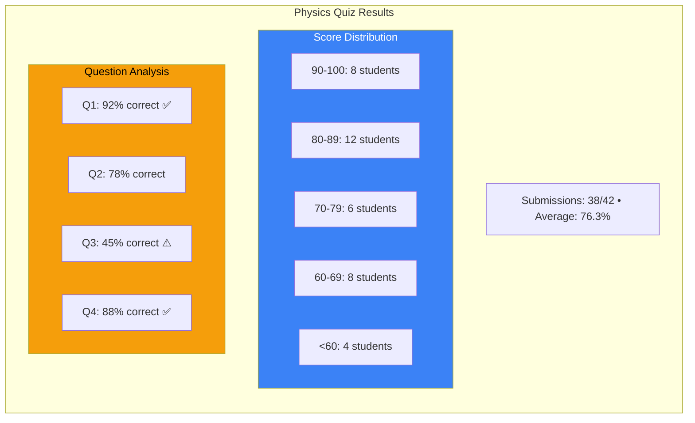

# Page 63: Teacher Dashboard & Analytics

---

## 63.1 Overview

The teacher dashboard provides **real-time classroom analytics**, student progress monitoring, assessment management, material uploads, and AI-powered insights. It is the primary interface for educators.

---

## 63.2 Dashboard Routes

| Route | Purpose |
|-------|---------|
| `/teacher/dashboard` | Main dashboard with overview widgets |
| `/teacher/classrooms` | Classroom management |
| `/teacher/classrooms/[id]` | Individual classroom view |
| `/teacher/assessments` | Assessment creation and management |
| `/teacher/assessments/[id]` | Assessment details and results |
| `/teacher/students` | Student list and progress |
| `/teacher/analytics` | Detailed analytics and reports |
| `/teacher/materials` | Material management |
| `/teacher/meetings` | Meeting scheduling |

---

## 63.3 Dashboard Widgets



---

## 63.4 Analytics API

### Class-Level Analytics

```json
GET /api/analytics/classroom/{id}

{
    "total_students": 42,
    "active_students": 38,
    "average_score": 76.3,
    "completion_rate": 0.85,
    "average_streak": 5.2,
    "topics_covered": 18,
    "total_topics": 27,
    "weak_topics": [
        {"topic": "Trigonometry", "students_weak": 8, "avg_score": 42},
        {"topic": "Calculus", "students_weak": 5, "avg_score": 51}
    ],
    "top_performers": [
        {"name": "Alice", "score": 95.2, "streak": 23},
        {"name": "Bob", "score": 91.7, "streak": 15}
    ],
    "score_trend": [
        {"date": "2025-01-01", "average": 68},
        {"date": "2025-02-01", "average": 76}
    ]
}
```

### Student-Level Analytics

```json
GET /api/analytics/student/{id}

{
    "student": {"name": "Alice", "email": "alice@..."},
    "overall_score": 85.2,
    "topics_mastered": 14,
    "topics_total": 27,
    "weak_topics": ["Trigonometry", "Integration"],
    "study_streak": 23,
    "total_study_hours": 45.5,
    "assessment_history": [
        {"title": "Physics Quiz", "score": 92, "date": "2025-02-15"},
        {"title": "Math Test", "score": 78, "date": "2025-02-20"}
    ],
    "progress_over_time": [...]
}
```

---

## 63.5 Assessment Management

### Assessment Creation UI



---

## 63.6 Results Review



---

## 63.7 Meeting Scheduling

| Feature | Implementation |
|---------|---------------|
| Schedule meeting | Form with date/time picker |
| Notify students | Automatic notification on creation |
| Start meeting | Generate LiveKit room + tokens |
| Record meeting | Optional; triggers transcription |
| Share summary | AI-generated meeting summary + notes |
