# Page 64: Parent Portal & Child Monitoring

---

## 64.1 Overview

The parent portal provides **read-only monitoring** of a child's academic progress, study habits, assessment results, and engagement metrics. Parents can track multiple children and receive notifications.

---

## 64.2 Parent Routes

| Route | Purpose |
|-------|---------|
| `/parent/dashboard` | Overview of all children's progress |
| `/parent/children` | List of linked children |
| `/parent/children/[id]` | Individual child's detailed progress |
| `/parent/notifications` | Notification center |
| `/parent/reports` | Downloadable progress reports |

---

## 64.3 Parent-Child Linking

### Data Model

```python
class ParentChild(db.Model):
    __tablename__ = "parent_children"
    
    id          = Column(String(36), primary_key=True)
    parent_id   = Column(String(36), ForeignKey("users.id"))
    child_id    = Column(String(36), ForeignKey("users.id"))
    relationship = Column(String(20))    # parent, guardian
    verified    = Column(Boolean, default=False)
    linked_at   = Column(DateTime, default=datetime.utcnow)
```

### Linking Flow

```
Parent registers → Admin/Teacher approves child linking → Parent sees child data
```

---

## 64.4 Parent Dashboard

```mermaid
flowchart TB
    subgraph MAIN["Parent Dashboard "]
        direction TB
        N0["👨‍👩‍👧‍👦 PARENT DASHBOARD"]
        N1["Alice (Class 10-A)"]
        N2["Overall: 85%  Streak: 23 days  Level: 12"]
        N3["Recent: Physics Quiz — 92%"]
        N4["⚠️ Weak: Trigonometry (32%)"]
        N5["(View Details)"]
        N6["Bob (Class 8-B)"]
        N7["Overall: 72%  Streak: 5 days  Level: 7"]
        N8["Recent: Math Test — 68%"]
        N9["⚠️ Weak: Algebra (45%), Geometry (51%)"]
        N10["(View Details)"]
        N11["📋 Recent Notifications:"]
    end

    style MAIN fill:#3b82f6,color:#fff
```



---

## 64.5 Parent API

| Method | Endpoint | Purpose |
|--------|----------|---------|
| GET | `/api/parent/children` | List linked children |
| GET | `/api/parent/children/<id>/progress` | Child's progress |
| GET | `/api/parent/children/<id>/assessments` | Assessment results |
| GET | `/api/parent/children/<id>/attendance` | Study activity log |
| GET | `/api/parent/notifications` | Parent notifications |

### Progress Response

```json
GET /api/parent/children/{id}/progress

{
    "child": {
        "name": "Alice",
        "classroom": "Class 10-A",
        "teacher": "Mrs. Smith"
    },
    "overall_score": 85.2,
    "study_streak": 23,
    "level": 12,
    "subjects": [
        {
            "name": "Physics",
            "score": 92,
            "topics_mastered": 8,
            "topics_total": 10
        },
        {
            "name": "Mathematics",
            "score": 78,
            "weak_topics": ["Trigonometry"]
        }
    ],
    "recent_assessments": [...],
    "weekly_study_hours": 12.5,
    "engagement_trend": "improving"
}
```

---

## 64.6 Parent Notifications

| Event | Notification |
|-------|-------------|
| Assessment graded | "Alice scored 92% on Physics Quiz" |
| Streak broken | "Bob's study streak ended at 12 days" |
| New assessment | "Chemistry Midterm due Feb 28" |
| Weak topic detected | "Alice needs help with Trigonometry" |
| Meeting scheduled | "Class meeting tomorrow at 3 PM" |
| Achievement earned | "Alice reached Level 12! 🎉" |

---

## 64.7 Privacy & Access Control

| Rule | Implementation |
|------|---------------|
| Parents see only linked children | `ParentChild` join table filter |
| No access to chat content | Tutor conversations are private |
| Read-only access | No POST/PUT/DELETE on student data |
| Admin-verified linking | Prevents unauthorized access |
| No PII of other students | Leaderboard shows child's rank only |
