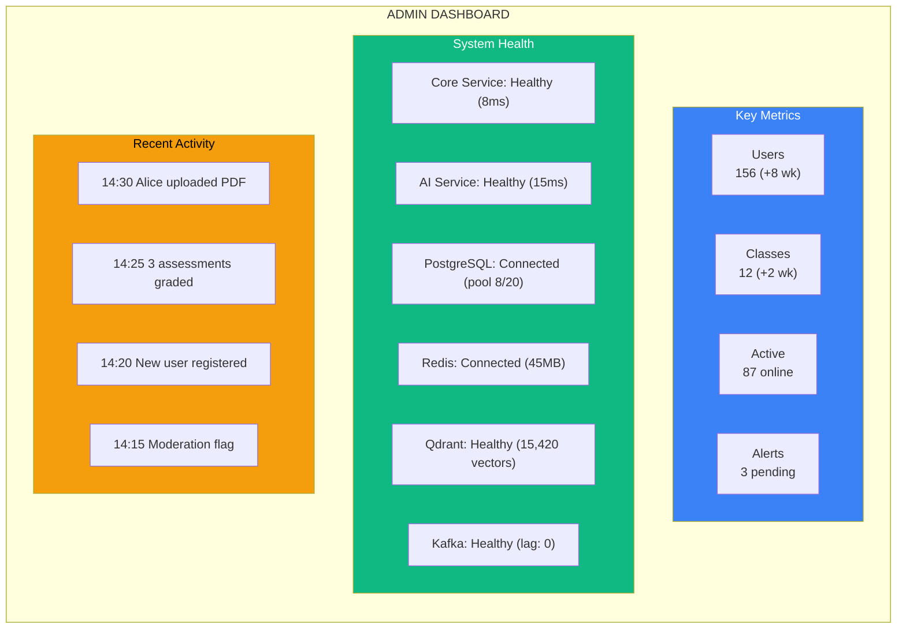
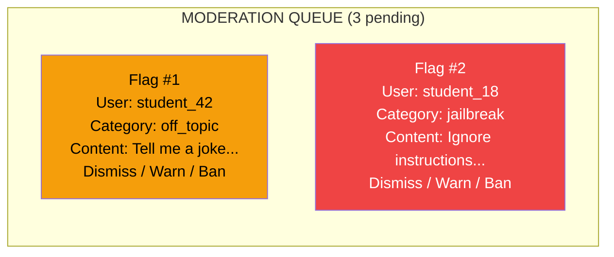

# Page 65: Admin Panel & System Management

---

## 65.1 Overview

The admin panel provides **platform-wide management** capabilities: user administration, classroom oversight, system health monitoring, content moderation review, and configuration management.

---

## 65.2 Admin Routes

| Route | Purpose |
|-------|---------|
| `/admin/dashboard` | System overview and health |
| `/admin/users` | User management (CRUD) |
| `/admin/classrooms` | All classrooms overview |
| `/admin/moderation` | Content moderation queue |
| `/admin/analytics` | Platform-wide analytics |
| `/admin/settings` | System configuration |
| `/admin/billing` | Billing and subscription management |

---

## 65.3 Admin Dashboard



---

## 65.4 User Management

### API

| Method | Endpoint | Purpose |
|--------|----------|---------|
| GET | `/api/admin/users` | List all users (paginated, filterable) |
| GET | `/api/admin/users/<id>` | User details |
| PUT | `/api/admin/users/<id>` | Update user (role, status) |
| DELETE | `/api/admin/users/<id>` | Deactivate user |
| POST | `/api/admin/users/<id>/reset-password` | Force password reset |

### User List

```json
GET /api/admin/users?role=student&page=1&per_page=20

{
    "users": [
        {
            "id": "usr_123",
            "username": "alice",
            "email": "alice@example.com",
            "role": "student",
            "is_active": true,
            "classrooms": ["Class 10-A"],
            "last_login": "2025-02-27T10:30:00Z",
            "created_at": "2024-09-01T08:00:00Z"
        }
    ],
    "total": 156,
    "page": 1,
    "per_page": 20
}
```

### Role Distribution

| Role | Count (typical) | Permissions |
|------|----------------|-------------|
| Student | ~120 | Study, chat, assessments |
| Teacher | ~10 | Classrooms, materials, assessments |
| Parent | ~20 | View child progress |
| Admin | ~2 | Full platform access |

---

## 65.5 Content Moderation Queue



---

## 65.6 Platform Analytics

| Metric | Source | Widget |
|--------|--------|--------|
| Daily Active Users | Login events | Line chart |
| Monthly registrations | User table | Bar chart |
| Assessment completion rate | Results table | Percentage |
| Average AI response time | API logs | Gauge |
| Storage usage | S3/MinIO | Progress bar |
| Moderation flags/day | Moderation logs | Counter |
| Popular subjects | Classroom data | Pie chart |
| LLM API costs (est.) | Token usage | Dollar amount |

---

## 65.7 System Configuration

| Setting | Default | Admin Override |
|---------|---------|---------------|
| Max file upload size | 50 MB | ✅ |
| Max students per classroom | 100 | ✅ |
| Assessment time limit | 60 min | Teacher-set |
| Proctoring enabled | True | ✅ |
| LLM provider priority | OpenAI | ✅ |
| Moderation sensitivity | Medium | ✅ |
| Streak reset time | Midnight UTC | ❌ |
| Token rate limit | 100K/hour | ✅ |

---

## 65.8 Health Check Endpoints

```python
@app.route("/health")
def health_check():
    checks = {
        "database": check_postgres(),
        "redis": check_redis(),
        "qdrant": check_qdrant(),
        "kafka": check_kafka(),
        "disk_space": check_disk(),
        "memory": check_memory()
    }
    
    status = "healthy" if all(checks.values()) else "degraded"
    
    return jsonify({
        "status": status,
        "checks": checks,
        "uptime": get_uptime(),
        "version": app.config.get("VERSION", "1.0.0")
    }), 200 if status == "healthy" else 503
```

---

## 65.9 Complete 65-Page Documentation Index

| Batch | Pages | Focus |
|-------|-------|-------|
| 1 | 1-5 | Architecture & Agent Core |
| 2 | 6-10 | Specialized Agents |
| 3 | 11-15 | Backend & Frontend |
| 4 | 16-20 | ML & Streaming |
| 5 | 21-25 | Operations |
| 6 | 26-30 | ETL, CI/CD & Config |
| 7 | 31-35 | API & Flow Reference |
| 8 | 36-40 | Patterns & Glossary |
| 9 | 41-45 | Models, Docker & DevGuide |
| 10 | 46-50 | LangGraph, Moderation & Stats |
| 11 | 51-55 | Prompts, Qdrant, Kafka, Auth |
| 12 | 56-60 | Migrations, OCR, Network |
| 13 | 61-65 | Classrooms, Assessments, Roles |

---

*ensureStudy — 65 pages of production-grade documentation covering 600+ source files, 200+ endpoints, 11 AI agents, 16 pre-trained models, 5 databases, and 4 user roles.*
