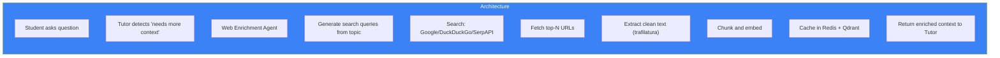

# Page 68: Web Crawling & Resource Enrichment

---

## 68.1 Overview

ensureStudy's **Web Enrichment Agent** and **Web Ingest Service** automatically discover, crawl, and index educational resources from the web to supplement classroom materials. The system uses multi-provider search, intelligent extraction, and caching.

---

## 68.2 Architecture



---

## 68.3 Search Providers

```python
class WebSearchService:
    PROVIDERS = {
        "serpapi": SerpAPISearch,        # Google via SerpAPI
        "duckduckgo": DuckDuckGoSearch,  # Free, no API key
        "tavily": TavilySearch,          # AI-optimized search
    }
    
    def search(self, query: str, num_results: int = 5) -> list:
        for provider in self.priority_order:
            try:
                return self.PROVIDERS[provider].search(query, num_results)
            except Exception:
                continue  # Fallback to next provider
        return []
```

---

## 68.4 Content Extraction

### Source: `services/web_ingest_service.py`

```python
import trafilatura

class WebIngestService:
    def fetch_and_extract(self, url: str) -> dict:
        # 1. Fetch HTML
        html = trafilatura.fetch_url(url)
        
        # 2. Extract main content (removes nav, ads, headers)
        text = trafilatura.extract(
            html,
            include_comments=False,
            include_tables=True,
            output_format='text'
        )
        
        # 3. Extract metadata
        metadata = trafilatura.extract_metadata(html)
        
        return {
            "text": text,
            "title": metadata.title if metadata else url,
            "author": metadata.author if metadata else None,
            "date": metadata.date if metadata else None,
            "url": url,
            "word_count": len(text.split()) if text else 0
        }
```

---

## 68.5 Agentic Crawling

### Source: `test_agentic_crawl.py`, `agents/web_enrichment_agent.py`

```python
class AgenticCrawler:
    """
    LLM-guided web crawling:
    1. LLM generates targeted search queries
    2. Fetch and extract top results
    3. LLM evaluates relevance of each result
    4. If insufficient, LLM generates follow-up queries
    5. Repeat until quality threshold met
    """
    
    async def crawl(self, topic: str, depth: int = 2) -> list:
        queries = await self.llm.generate_queries(topic)
        
        all_results = []
        for query in queries:
            results = self.search.search(query)
            for url in results:
                content = self.ingest.fetch_and_extract(url)
                relevance = await self.llm.score_relevance(topic, content)
                
                if relevance > 0.7:
                    all_results.append(content)
        
        return all_results
```

---

## 68.6 Web Cache Service

### Source: `services/web_cache_service.py`

```python
class WebCacheService:
    """Cache crawled web content to avoid re-fetching"""
    
    CACHE_TTL = 86400 * 7  # 7 days
    
    def get_or_fetch(self, url: str) -> dict:
        # Check Redis cache
        cached = redis.get(f"web:{url_hash(url)}")
        if cached:
            return json.loads(cached)
        
        # Fetch fresh
        content = self.ingest.fetch_and_extract(url)
        
        # Cache in Redis
        redis.setex(
            f"web:{url_hash(url)}",
            self.CACHE_TTL,
            json.dumps(content)
        )
        
        # Index in Qdrant for semantic search
        chunks = self.chunker.chunk(content["text"])
        self.qdrant.index(
            collection="web_resources",
            chunks=chunks,
            metadata={"url": url, "title": content["title"]}
        )
        
        return content
```

---

## 68.7 Resource Suggestion

The curriculum agent uses crawled content to suggest resources:

```python
class ResourceSuggestionEngine:
    def suggest(self, topic: str, learning_style: str) -> list:
        # Search existing web resources
        web_results = self.qdrant.search(
            collection="web_resources",
            query=topic,
            limit=10
        )
        
        # Filter by relevance and learning style
        suggestions = []
        for result in web_results:
            resource_type = self.classify_resource(result)
            if self.matches_style(resource_type, learning_style):
                suggestions.append(ResourceSuggestion(
                    topic=topic,
                    resource_type=resource_type,
                    title=result.payload.get("title"),
                    url=result.payload.get("url"),
                    relevance_score=result.score
                ))
        
        return sorted(suggestions, key=lambda s: s.relevance_score, reverse=True)
```
