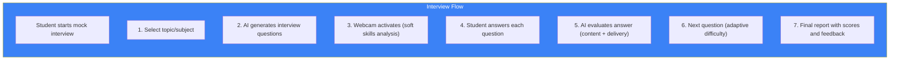
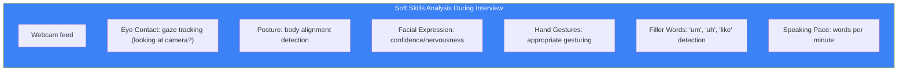

# Page 69: Mock Interview System

---

## 69.1 Overview

ensureStudy's **mock interview system** provides AI-driven practice interviews with real-time soft skills analysis, question generation based on the student's subject, and detailed performance feedback.

---

## 69.2 Interview Flow



---

## 69.3 Question Generation

### Source: `agents/interview_question_agent.py`

```python
class InterviewQuestionAgent:
    """Generate interview questions using LangGraph StateGraph"""
    
    async def generate(self, topic: str, difficulty: str, count: int):
        prompt = f"""
        Generate {count} interview questions for: {topic}
        Difficulty: {difficulty}
        
        Mix of:
        - Technical knowledge questions (60%)
        - Scenario-based questions (25%)
        - Behavioral questions (15%)
        
        For each, provide:
        - question: The interview question
        - expected_points: Key points to cover
        - follow_up: A follow-up question
        - difficulty: easy/medium/hard
        - time_limit: seconds
        """
        return await self.llm.generate(prompt)
```

---

## 69.4 Soft Skills Analysis During Interview



### Scoring

| Metric | Weight | Measurement |
|--------|--------|-------------|
| Eye contact | 20% | % time looking at camera |
| Posture | 15% | Upright vs slouched |
| Confidence | 20% | Facial expression analysis |
| Content quality | 30% | LLM evaluation of answer |
| Communication | 15% | Clarity, pace, filler words |

---

## 69.5 Answer Evaluation

```python
INTERVIEW_GRADING_PROMPT = """
You are an expert interviewer evaluating a candidate's answer.

Question: {question}
Expected Points: {expected_points}
Student's Answer: {student_answer}

Evaluate:
1. Content accuracy (0-10): Did they cover key points?
2. Depth (0-10): How thorough was the explanation?
3. Examples (0-10): Did they use relevant examples?
4. Clarity (0-10): Was the answer well-structured?

Return JSON:
{{
    "content_score": <0-10>,
    "depth_score": <0-10>,
    "examples_score": <0-10>,
    "clarity_score": <0-10>,
    "overall_score": <0-10>,
    "feedback": "Specific improvement suggestions",
    "missed_points": ["points they didn't cover"],
    "strengths": ["what they did well"]
}}
"""
```

---

## 69.6 API Endpoints

| Method | Endpoint | Purpose |
|--------|----------|---------|
| POST | `/api/mock-interview/start` | Start interview session |
| GET | `/api/mock-interview/question` | Get next question |
| POST | `/api/mock-interview/answer` | Submit answer for grading |
| POST | `/api/mock-interview/end` | End session, get report |
| GET | `/api/mock-interview/history` | Past interview results |

---

## 69.7 Final Report

```json
{
    "session_id": "interview_123",
    "topic": "Data Structures",
    "duration_minutes": 25,
    "questions_asked": 8,
    "scores": {
        "content_knowledge": 78,
        "communication": 72,
        "eye_contact": 85,
        "posture": 90,
        "confidence": 68,
        "overall": 77
    },
    "recommendations": [
        "Practice explaining tree traversal algorithms",
        "Reduce filler words (counted 12 'um's)",
        "Good eye contact — maintain this",
        "Try using more concrete examples"
    ],
    "question_breakdown": [
        {
            "question": "Explain the difference between a stack and queue",
            "score": 9,
            "feedback": "Excellent explanation with real-world examples"
        }
    ]
}
```
