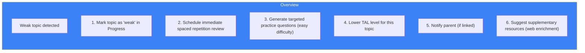

# Page 70: Learning Element Framework & Revision System

---

## 70.1 Overview

The **Learning Element Framework** is the atomic unit of ensureStudy's adaptive learning system. Every piece of knowledge is modeled as a Learning Element with properties for difficulty, prerequisites, mastery tracking, and personalized delivery based on the student's VARK learning style.

---

## 70.2 Learning Element Model

### Source: `ai-service/app/learning/learning_element.py`

```python
class LearningElement:
    """Atomic unit of knowledge in the ensureStudy system"""
    
    def __init__(self):
        self.id: str                        # Unique identifier
        self.topic_id: str                  # Parent topic
        self.content: str                   # Core concept text
        self.difficulty: float              # 0.0-1.0
        self.bloom_level: str               # Taxonomy level
        self.prerequisites: List[str]       # Element IDs
        self.learning_styles: Dict[str, str] # VARK → content variant
        self.assessable: bool               # Can be tested?
        self.estimated_minutes: int         # Time to learn
        self.keywords: List[str]            # Search keywords
```

---

## 70.3 VARK Content Variants

Each learning element can have multiple content presentations:

```python
learning_element.learning_styles = {
    "visual": "diagram_url or structured visual explanation",
    "auditory": "audio_explanation_url or verbal walkthrough",
    "reading": "detailed text explanation with references",
    "kinesthetic": "interactive exercise or coding challenge"
}
```

### Delivery Logic

```python
def deliver_content(element: LearningElement, student: LearningProfile):
    primary = student.primary_style.value   # e.g., "visual"
    secondary = student.secondary_style.value if student.secondary_style else None
    
    # Build multi-modal response
    content = element.learning_styles.get(primary, element.content)
    
    if secondary:
        supplement = element.learning_styles.get(secondary)
        if supplement:
            content += f"\n\n**Additional perspective:**\n{supplement}"
    
    return content
```

---

## 70.4 Revision Assessment Agent

### Source: `agents/revision_assessment_agent.py`

```python
class RevisionAssessmentAgent:
    """Generates revision assessments based on spaced repetition schedule"""
    
    async def create_revision(self, user_id: str):
        # 1. Get due review items from spaced repetition
        due_items = self.spaced_rep.get_due_reviews(user_id)
        
        # 2. For each due topic, generate review questions
        questions = []
        for item in due_items:
            q = await self.question_agent.generate(
                topic=item.topic_name,
                count=2,
                difficulty=self._difficulty_from_mastery(item.mastery)
            )
            questions.extend(q)
        
        # 3. Create revision assessment
        return RevisionAssessment(
            user_id=user_id,
            questions=questions,
            topics=due_items,
            estimated_minutes=len(questions) * 2
        )
    
    def _difficulty_from_mastery(self, mastery: float) -> str:
        if mastery < 40: return "easy"      # Rebuild foundations
        if mastery < 70: return "medium"    # Reinforce
        return "hard"                         # Challenge
```

---

## 70.5 Mastery Calculation

```python
def calculate_topic_mastery(user_id: str, topic_id: str) -> float:
    """
    Mastery is a weighted combination of:
    - Assessment scores (40%)
    - Review quality in spaced repetition (30%)
    - Study frequency and recency (20%)
    - Tutor interaction quality (10%)
    """
    assessment_score = get_avg_assessment_score(user_id, topic_id)
    review_quality = get_avg_review_quality(user_id, topic_id)
    study_recency = get_study_recency_score(user_id, topic_id)
    tutor_quality = get_tutor_interaction_score(user_id, topic_id)
    
    mastery = (
        assessment_score * 0.4 +
        review_quality * 0.3 +
        study_recency * 0.2 +
        tutor_quality * 0.1
    )
    
    return min(100.0, max(0.0, mastery))
```

---

## 70.6 TAL (Teaching Adaptation Level)

TAL adjusts the tutor's teaching complexity based on demonstrated mastery:

| TAL | Mastery Range | Teaching Style |
|-----|-------------|---------------|
| 1 | 0-20% | Simple definitions, lots of examples |
| 2 | 20-40% | Explanations with analogies |
| 3 | 40-60% | Standard academic level |
| 4 | 60-80% | Advanced concepts, connections |
| 5 | 80-100% | Expert-level, edge cases, criticism |

```python
def get_tal_level(mastery: float) -> int:
    if mastery < 20: return 1
    if mastery < 40: return 2
    if mastery < 60: return 3
    if mastery < 80: return 4
    return 5
```

---

## 70.7 Weak Topic Detection & Recovery

```python
def detect_weak_topics(user_id: str) -> list:
    """
    A topic is weak when:
    1. confidence_score < 50%, OR
    2. times_studied > 3 AND confidence_score < 70%, OR
    3. Spaced repetition easiness_factor < 1.5
    """
    progress = Progress.query.filter_by(user_id=user_id).all()
    
    weak = []
    for p in progress:
        if p.confidence_score < 50:
            weak.append(p)
        elif p.times_studied > 3 and p.confidence_score < 70:
            weak.append(p)
    
    return weak
```

### Recovery Strategy



---

## 70.8 Final Documentation Summary (70 Pages)

| Batch | Pages | Focus Area |
|-------|-------|-----------|
| 1 | 1-5 | Architecture & Core Agents |
| 2 | 6-10 | Specialized Agents |
| 3 | 11-15 | Backend & Frontend Services |
| 4 | 16-20 | ML, Streaming & Proctoring |
| 5 | 21-25 | Operations & Production |
| 6 | 26-30 | ETL, CI/CD & Configuration |
| 7 | 31-35 | API & Sequence Reference |
| 8 | 36-40 | Patterns, Components & Glossary |
| 9 | 41-45 | Models, Docker & Quick-Start |
| 10 | 46-50 | LangGraph, Moderation & Stats |
| 11 | 51-55 | Prompts, Qdrant, Kafka & Auth |
| 12 | 56-60 | Migrations, OCR & Networking |
| 13 | 61-65 | Classrooms, Assessments & Roles |
| 14 | 66-70 | State Mgmt, Chunking & Learning |

---

*ensureStudy — 70 pages of production-grade technical documentation.*
