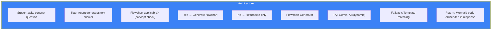

# Page 71: Flowchart Generator & Visual Learning Aids

---

## 71.1 Overview

ensureStudy generates **dynamic Mermaid flowcharts** within tutor chat responses to visually explain concepts. The system uses a **dual strategy**: Gemini AI for dynamic generation with template-based fallback when the API is unavailable.

### Source: `backend/ai-service/app/services/flowchart_generator.py` (355 lines)

---

## 71.2 Architecture



---

## 71.3 Gemini AI Generation

```python
def _generate_with_gemini(topic: str, context: str = "") -> Optional[str]:
    """Generate a Mermaid flowchart using Gemini API"""
    
    client = _get_gemini_client()
    if not client:
        return None
    
    prompt = f"""
    Create a Mermaid flowchart diagram for: {topic}
    
    Context: {context}
    
    Requirements:
    - Use 'graph TD' (top-down) direction
    - Maximum 8-12 nodes for clarity
    - Use descriptive node labels
    - Show logical flow and decision points
    - Use shapes: rectangles, diamonds (decisions), rounded
    - Return ONLY the Mermaid code, no explanation
    
    Example format:
    graph TD
        A[Start] --> B{{Decision?}}
        B -->|Yes| C[Action 1]
        B -->|No| D[Action 2]
    """
    
    response = client.generate_content(prompt)
    mermaid_code = _extract_mermaid(response.text)
    
    return mermaid_code if _validate_mermaid(mermaid_code) else None
```

---

## 71.4 Template Fallback System

When Gemini is unavailable, the system matches the topic against pre-built templates:

```python
def _generate_topic_flowchart(question: str, answer: str, 
                               subject: Optional[str]) -> Optional[str]:
    # Subject-specific templates
    templates = {
        "photosynthesis": """
            graph TD
                A[Sunlight ☀️] --> B[Chloroplast]
                C[CO₂] --> B
                D[H₂O] --> B
                B --> E[Light Reactions]
                E --> F[ATP + NADPH]
                F --> G[Calvin Cycle]
                G --> H[Glucose C₆H₁₂O₆]
                G --> I[O₂ Released]
        """,
        "water_cycle": """
            graph TD
                A[Evaporation] --> B[Condensation]
                B --> C[Cloud Formation]
                C --> D[Precipitation]
                D --> E[Collection]
                E --> F[Groundwater/Rivers]
                F --> A
        """,
        # 20+ more templates for common topics
    }
    
    # Fuzzy match question to template
    for key, template in templates.items():
        if key in question.lower() or key in answer.lower():
            return template
    
    return None
```

---

## 71.5 Main Entry Point

```python
def generate_concept_flowchart(question: str, answer: str, 
                                subject: Optional[str] = None) -> Optional[str]:
    """
    Generate a Mermaid flowchart to visualize the concept.
    
    Strategy:
    1. Try Gemini AI (dynamic, high quality)
    2. Fall back to topic templates (reliable, limited)
    3. Return None if not applicable
    """
    
    # Step 1: Try Gemini AI
    flowchart = _generate_with_gemini(
        topic=question, 
        context=answer[:500]
    )
    
    if flowchart:
        return flowchart
    
    # Step 2: Template fallback
    return _generate_topic_flowchart(question, answer, subject)
```

---

## 71.6 Frontend Rendering

```typescript
// Mermaid.js renders flowcharts in the chat UI
import mermaid from 'mermaid';

mermaid.initialize({ 
    theme: 'dark',
    securityLevel: 'loose'
});

function FlowchartBlock({ code }: { code: string }) {
    const ref = useRef<HTMLDivElement>(null);
    
    useEffect(() => {
        if (ref.current) {
            mermaid.render('flowchart', code).then(({ svg }) => {
                ref.current!.innerHTML = svg;
            });
        }
    }, [code]);
    
    return <div ref={ref} className="flowchart-container" />;
}
```

---

## 71.7 Supported Diagram Types

| Type | Mermaid Syntax | Use Case |
|------|---------------|----------|
| Flowchart | `graph TD` | Processes, algorithms |
| Sequence | `sequenceDiagram` | API flows, interactions |
| Class | `classDiagram` | OOP concepts |
| State | `stateDiagram-v2` | State machines |
| ER | `erDiagram` | Database relationships |
| Mindmap | `mindmap` | Topic overviews |
