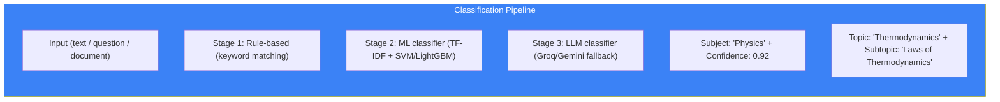

# Page 72: Subject Classifier & Topic Detection

---

## 72.1 Overview

ensureStudy uses **ML-based subject classification** to automatically categorize uploaded documents, student questions, and content into academic subjects. The system uses both LLM-based and traditional ML classifiers.

---

## 72.2 Classification Pipeline



---

## 72.3 Subject Classifier

### Source: `services/classroom_matcher.py`, `test_subject_classifier.py`

```python
class SubjectClassifier:
    """Multi-stage subject classification"""
    
    SUBJECTS = [
        "Mathematics", "Physics", "Chemistry", "Biology",
        "Computer Science", "English", "History", "Geography",
        "Economics", "Psychology", "Political Science"
    ]
    
    def classify(self, text: str) -> ClassificationResult:
        # Stage 1: Keyword matching (fast)
        keyword_result = self._keyword_classify(text)
        if keyword_result.confidence > 0.9:
            return keyword_result
        
        # Stage 2: ML model
        ml_result = self._ml_classify(text)
        if ml_result.confidence > 0.8:
            return ml_result
        
        # Stage 3: LLM (most accurate, slowest)
        return self._llm_classify(text)
    
    def _keyword_classify(self, text: str) -> ClassificationResult:
        keywords = {
            "Physics": ["force", "velocity", "acceleration", "momentum", 
                       "energy", "wave", "thermodynamics", "quantum"],
            "Chemistry": ["molecule", "reaction", "element", "compound",
                         "acid", "base", "oxidation", "bond"],
            "Mathematics": ["equation", "integral", "derivative", "matrix",
                          "theorem", "polynomial", "probability"],
            "Biology": ["cell", "DNA", "evolution", "photosynthesis",
                       "enzyme", "mitosis", "ecology"],
            # ... more subjects
        }
        
        scores = {}
        for subject, words in keywords.items():
            score = sum(1 for w in words if w in text.lower())
            scores[subject] = score / len(words)
        
        best = max(scores, key=scores.get)
        return ClassificationResult(subject=best, confidence=scores[best])
```

---

## 72.4 Groq LLM Classifier

### Source: `test_groq_classifier.py`

```python
class GroqClassifier:
    """Fast LLM classification using Groq (Llama)"""
    
    def classify(self, text: str) -> ClassificationResult:
        response = groq_client.chat.completions.create(
            model="llama3-8b-8192",
            messages=[{
                "role": "system",
                "content": f"""Classify the following text into one of these 
                subjects: {', '.join(SUBJECTS)}.
                Also identify the specific topic and subtopic.
                Return JSON: {{"subject": "...", "topic": "...", 
                "subtopic": "...", "confidence": 0.0-1.0}}"""
            }, {
                "role": "user",
                "content": text[:1000]
            }],
            temperature=0.1
        )
        
        return parse_classification(response.choices[0].message.content)
```

---

## 72.5 Topic Chaining

### Source: `test_topic_chaining.py`

```python
class TopicChainer:
    """
    Detect topic transitions in student conversations.
    When a student shifts topics, update the context accordingly.
    """
    
    def detect_shift(self, current_topic: str, new_message: str) -> bool:
        """Returns True if the student has changed topics"""
        new_topic = self.classifier.classify(new_message)
        
        if new_topic.topic != current_topic:
            similarity = self.embedding_similarity(current_topic, new_topic.topic)
            return similarity < 0.5  # Significant shift
        
        return False
    
    def chain_topics(self, history: list) -> list:
        """Build a chain of topics discussed in order"""
        chain = []
        for msg in history:
            topic = self.classifier.classify(msg.content)
            if not chain or chain[-1].topic != topic.topic:
                chain.append(topic)
        return chain
```

---

## 72.6 Document Auto-Tagging

When a document is uploaded, the classifier automatically tags it:

```python
def auto_tag_document(document_text: str) -> dict:
    classification = classifier.classify(document_text[:2000])
    
    return {
        "subject": classification.subject,
        "topics": extract_topics(document_text),
        "difficulty": estimate_difficulty(document_text),
        "grade_level": estimate_grade_level(document_text),
        "language": detect_language(document_text)
    }
```

---

## 72.7 Classroom Matcher

### Source: `services/classroom_matcher.py`

```python
class ClassroomMatcher:
    """Match content to the appropriate classroom based on subject"""
    
    def match(self, content: str, user_classrooms: list) -> Optional[str]:
        classification = self.classifier.classify(content)
        
        for classroom in user_classrooms:
            if classroom.subject.lower() == classification.subject.lower():
                return classroom.id
        
        # Fuzzy match if exact match fails
        for classroom in user_classrooms:
            similarity = self.subject_similarity(
                classroom.subject, classification.subject
            )
            if similarity > 0.7:
                return classroom.id
        
        return None  # No matching classroom
```
