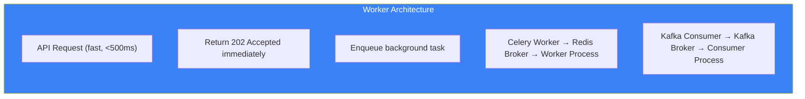

# Page 73: Background Workers & Celery Task Queue

---

## 73.1 Overview

ensureStudy uses **background workers** for long-running tasks that cannot block API responses: document processing, embedding generation, meeting transcription, ML training, and batch analytics. These are implemented via Celery (with Redis as broker) and Kafka consumers.

---

## 73.2 Worker Architecture



---

## 73.3 Worker Files

### Source: `backend/ai-service/app/workers/`

| File | Tasks | Typical Duration |
|------|-------|-----------------|
| `document_tasks.py` | PDF processing, OCR, chunking, embedding | 10s-5min |
| (Kafka consumers) | Meeting transcription | 2-10min |
| (Kafka consumers) | Assessment grading | 5-30s |
| (Kafka consumers) | Analytics aggregation | 1-5s |

---

## 73.4 Document Processing Worker

```python
# workers/document_tasks.py
from celery import Celery

celery_app = Celery(
    'ensurestudy',
    broker=os.getenv('REDIS_URL', 'redis://redis:6379/0'),
    backend=os.getenv('REDIS_URL', 'redis://redis:6379/0')
)

@celery_app.task(bind=True, max_retries=3, default_retry_delay=60)
def process_document(self, document_id: str, file_path: str, 
                     classroom_id: str):
    """
    Full document processing pipeline:
    1. Extract text (digital or OCR)
    2. Detect layout (tables, images, formulas)
    3. Chunk text (500 chars, 50 overlap)
    4. Generate embeddings (all-mpnet-base-v2)
    5. Upsert to Qdrant
    6. Callback to core service with status
    """
    try:
        # Update status: processing
        callback_status(document_id, "processing")
        
        # Stage 1: Extract
        text = pdf_processor.process(file_path)
        
        # Stage 2: Chunk
        chunks = text_chunker.chunk(text, chunk_size=500)
        
        # Stage 3: Embed
        embeddings = embedding_model.encode(
            [c.text for c in chunks], batch_size=32
        )
        
        # Stage 4: Index
        qdrant.upsert_batch(
            collection="classroom_materials",
            chunks=chunks,
            embeddings=embeddings,
            metadata={"classroom_id": classroom_id}
        )
        
        # Stage 5: Callback
        callback_status(document_id, "indexed", 
                       chunks_count=len(chunks))
        
    except Exception as exc:
        callback_status(document_id, "failed", error=str(exc))
        self.retry(exc=exc)
```

---

## 73.5 Celery Configuration

```python
celery_app.conf.update(
    task_serializer='json',
    accept_content=['json'],
    result_serializer='json',
    timezone='UTC',
    enable_utc=True,
    
    # Concurrency
    worker_concurrency=4,
    worker_prefetch_multiplier=1,
    
    # Rate limiting
    task_default_rate_limit='10/m',
    
    # Task time limits
    task_soft_time_limit=300,    # 5 min soft limit
    task_time_limit=600,         # 10 min hard limit
    
    # Result expiry
    result_expires=3600,         # 1 hour
    
    # Retry policy
    task_acks_late=True,
    task_reject_on_worker_lost=True
)
```

---

## 73.6 Test Scripts

The root-level test scripts validate worker functionality:

| Script | Purpose |
|--------|---------|
| `test_workers.py` | Test all worker tasks end-to-end |
| `test_worker6.py` | Test specific worker task (chunking) |
| `test_full_pipeline.py` | Full document → index pipeline |
| `test_chunk_only.py` | Chunking step in isolation |
| `test_chunking.py` | Chunking strategy comparison |

---

## 73.7 Worker Monitoring

```python
# Check task status
result = process_document.AsyncResult(task_id)
print(result.state)    # PENDING, STARTED, SUCCESS, FAILURE, RETRY
print(result.result)   # Return value or exception

# Monitor via Flower (Celery web UI)
# celery -A workers.celery_app flower --port=5555
```

---

## 73.8 Kafka vs Celery: When to Use Each

| Criteria | Celery | Kafka |
|----------|--------|-------|
| Best for | One-off tasks | Event streams |
| Retry | Built-in | Manual |
| Result tracking | Yes | No |
| Ordering | No guarantee | Per-partition |
| Fan-out | No | Yes (multiple consumers) |
| Persistence | Redis (volatile) | Disk (7 days) |
| Use in ensureStudy | Document processing | Chat, meetings, analytics |
