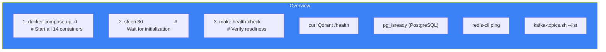

# Page 74: Makefile & Development Automation

---

## 74.1 Overview

The project Makefile provides **17 targets** for common development operations: starting/stopping Docker services, running tests, training ML models, managing databases, and creating Kafka topics.

### Source: `Makefile` (92 lines)

---

## 74.2 Complete Target Reference

| Target | Command | Purpose |
|--------|---------|---------|
| `help` | Prints available commands | Quick reference |
| `up` | `docker-compose up -d` + health check | Start all services |
| `down` | `docker-compose down` | Stop all services |
| `logs` | `docker-compose logs -f` | Tail service logs |
| `health-check` | curl/exec health probes | Verify all services |
| `db-init` | `flask db upgrade` | Run migrations |
| `load-docs` | `python scripts/load_documents.py` | Seed Qdrant |
| `test` | pytest across 3 services | Run all tests |
| `test-ml` | pytest on ml-training | ML-specific tests |
| `dev-frontend` | `npm run dev` | Start Next.js dev |
| `dev-ai-service` | `uvicorn --reload` | Start AI service |
| `dev-core-service` | `flask run` | Start Core service |
| `dev` | Print instructions | Dev mode guide |
| `clean` | Remove containers, caches, node_modules | Full cleanup |
| `train-moderation` | `python train_moderation.py` | Train content mod model |
| `train-difficulty` | `python train_difficulty.py` | Train difficulty model |
| `run-etl` | PySpark ETL pipeline | Run data extraction |
| `dashboards` | `streamlit run live_demo.py` | Launch dashboards |
| `kafka-topics` | Create 5 Kafka topics | Initialize messaging |

---

## 74.3 Service Startup (`make up`)

```makefile
up:
    docker-compose up -d
    @echo "Waiting for services to start..."
    @sleep 30
    @make health-check
```

### Startup Sequence



---

## 74.4 Health Check (`make health-check`)

```makefile
health-check:
    @echo "Checking Qdrant..."
    @curl -s http://localhost:6333/health | head -c 50
    @echo "Checking PostgreSQL..."
    @docker-compose exec -T postgres pg_isready -U ensure_study_user
    @echo "Checking Redis..."
    @docker-compose exec -T redis redis-cli ping
    @echo "Checking Kafka..."
    @docker-compose exec -T kafka kafka-topics.sh --list \
        --bootstrap-server localhost:9092 2>/dev/null | head -1
```

---

## 74.5 Testing (`make test`)

```makefile
test:
    cd backend/core-service && pytest tests/ -v
    cd backend/ai-service && pytest tests/ -v
    cd backend/kafka && pytest tests/ -v
```

Runs tests across all 3 backend services sequentially. Exit on first failure.

---

## 74.6 ML Training Targets

```makefile
train-moderation:
    cd backend/ml-training && python training/train_moderation.py

train-difficulty:
    cd backend/ml-training && python training/train_difficulty.py
```

These produce model artifacts in `models/` used by the AI service.

---

## 74.7 Kafka Topic Creation (`make kafka-topics`)

```makefile
kafka-topics:
    docker-compose exec kafka kafka-topics.sh --create \
        --topic student-events --partitions 3 --replication-factor 1
    docker-compose exec kafka kafka-topics.sh --create \
        --topic chat-messages --partitions 3 --replication-factor 1
    docker-compose exec kafka kafka-topics.sh --create \
        --topic assessment-submissions --partitions 3 --replication-factor 1
    docker-compose exec kafka kafka-topics.sh --create \
        --topic moderation-events --partitions 3 --replication-factor 1
    docker-compose exec kafka kafka-topics.sh --create \
        --topic leaderboard-updates --partitions 3 --replication-factor 1
```

Creates 5 topics with 3 partitions each.

---

## 74.8 Cleanup (`make clean`)

```makefile
clean:
    docker-compose down -v --remove-orphans
    find . -type d -name "__pycache__" -exec rm -rf {} + 2>/dev/null || true
    find . -type d -name ".pytest_cache" -exec rm -rf {} + 2>/dev/null || true
    find . -type d -name "node_modules" -exec rm -rf {} + 2>/dev/null || true
```

Removes:
- All Docker containers and volumes (`-v`)
- Python bytecode caches
- Pytest caches
- Node.js dependencies

---

## 74.9 Development Workflow

```bash
# First time setup
make up                    # Start infrastructure
make db-init               # Run migrations
make kafka-topics          # Create Kafka topics
make load-docs             # Seed sample data

# Daily development
make up                    # Ensure services running
make dev-frontend          # Terminal 1
make dev-ai-service        # Terminal 2
make dev-core-service      # Terminal 3

# Testing
make test                  # All tests
make test-ml               # ML tests only

# Cleanup
make clean                 # Full reset
```
